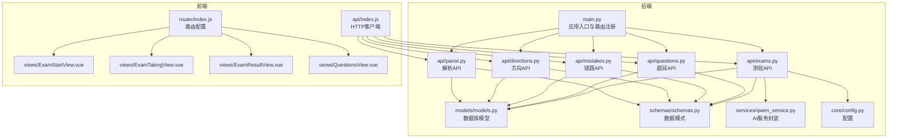
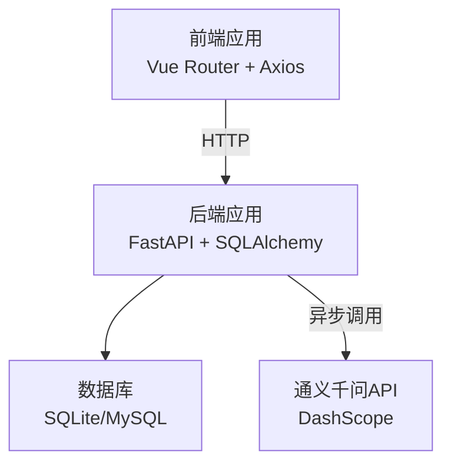
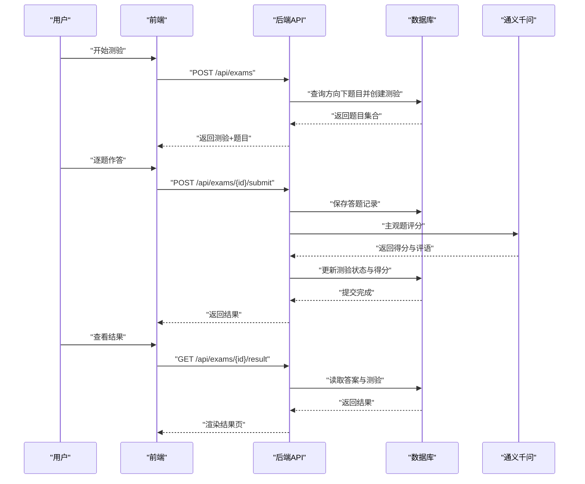
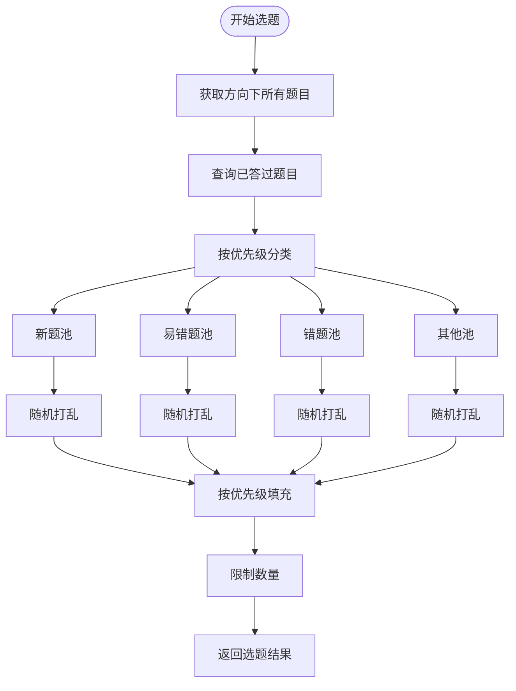
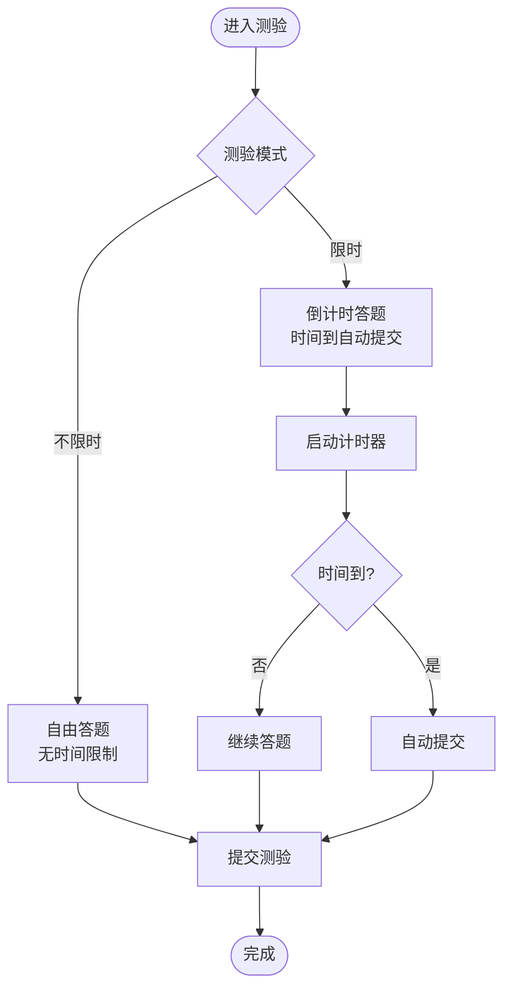
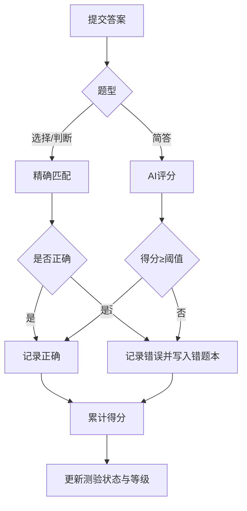
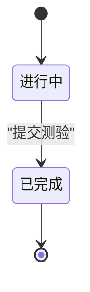
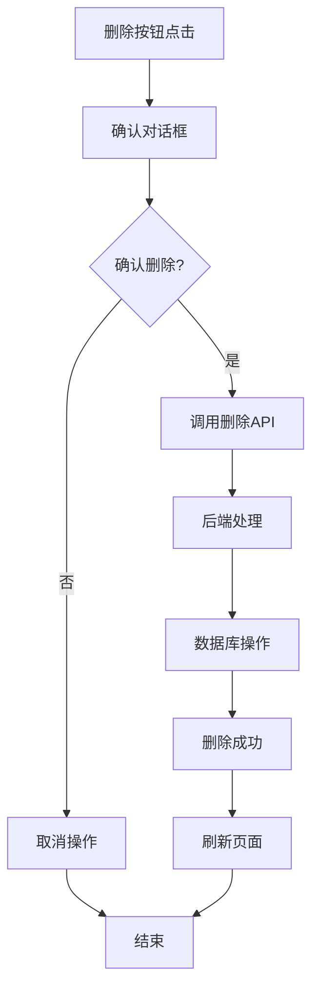
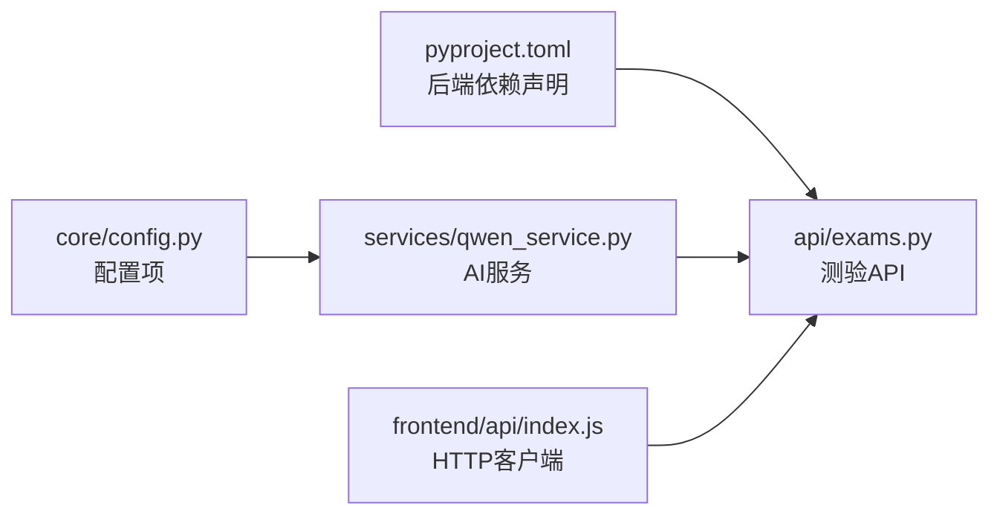
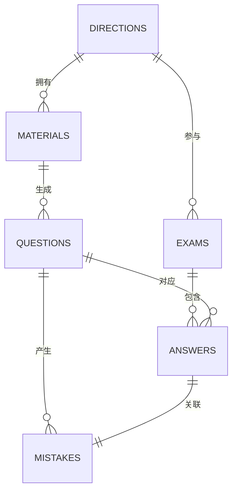

# 测验评估系统

<cite>
**本文引用的文件**
- [backend/app/main.py](file://backend/app/main.py)
- [backend/app/api/exams.py](file://backend/app/api/exams.py)
- [backend/app/api/questions.py](file://backend/app/api/questions.py)
- [backend/app/api/mistakes.py](file://backend/app/api/mistakes.py)
- [backend/app/api/directions.py](file://backend/app/api/directions.py)
- [backend/app/api/parse.py](file://backend/app/api/parse.py)
- [backend/app/models/models.py](file://backend/app/models/models.py)
- [backend/app/schemas/schemas.py](file://backend/app/schemas/schemas.py)
- [backend/app/services/qwen_service.py](file://backend/app/services/qwen_service.py)
- [backend/app/core/config.py](file://backend/app/core/config.py)
- [frontend/src/router/index.js](file://frontend/src/router/index.js)
- [frontend/src/views/ExamStartView.vue](file://frontend/src/views/ExamStartView.vue)
- [frontend/src/views/ExamTakingView.vue](file://frontend/src/views/ExamTakingView.vue)
- [frontend/src/views/ExamResultView.vue](file://frontend/src/views/ExamResultView.vue)
- [frontend/src/views/QuestionsView.vue](file://frontend/src/views/QuestionsView.vue)
- [frontend/src/api/index.js](file://frontend/src/api/index.js)
- [backend/pyproject.toml](file://backend/pyproject.toml)
</cite>

## 更新摘要
**变更内容**
- 新增删除功能的完整实现，包括后端删除端点和前端删除按钮
- 改进问题选择算法，实现按优先级的智能选题机制
- 增强用户界面，提供完整的删除确认和操作反馈
- 扩展API接口文档，涵盖所有删除相关功能

## 目录
1. [引言](#引言)
2. [项目结构](#项目结构)
3. [核心组件](#核心组件)
4. [架构总览](#架构总览)
5. [详细组件分析](#详细组件分析)
6. [依赖分析](#依赖分析)
7. [性能考量](#性能考量)
8. [故障排查指南](#故障排查指南)
9. [结论](#结论)
10. [附录](#附录)

## 引言
本文件为"测验评估系统"的综合技术文档，覆盖在线测验的完整生命周期管理：测验创建、题目选择、实时答题、自动评分、结果展示与错题管理。系统支持定时与非定时两种模式，自动评分包含客观题精确匹配与主观题基于大模型的AI辅助评分；同时提供成绩统计、结果分析与学习报告能力。文档还包含前后端API接口说明、与题目管理及错题管理的集成关系、用户体验优化与移动端适配建议。

**更新** 新增删除功能实现和改进的问题选择算法，提供更完整的数据管理能力。

## 项目结构
后端采用FastAPI + SQLAlchemy架构，前端使用Vue 3 + Vue Router构建单页应用。系统按功能模块组织，后端API路由集中注册，模型与Schema清晰分离职责，服务层封装外部AI能力。

```mermaid
graph TB
subgraph "后端"
M["main.py<br/>应用入口与路由注册"]
EX["api/exams.py<br/>测验API"]
Q["api/questions.py<br/>题目API"]
MK["api/mistakes.py<br/>错题API"]
DIR["api/directions.py<br/>方向API"]
PAR["api/parse.py<br/>解析API"]
MD["models/models.py<br/>数据库模型"]
SCH["schemas/schemas.py<br/>数据模式"]
SV["services/qwen_service.py<br/>AI服务封装"]
CFG["core/config.py<br/>配置"]
end
subgraph "前端"
RT["router/index.js<br/>路由配置"]
API["api/index.js<br/>HTTP客户端"]
V1["views/ExamStartView.vue"]
V2["views/ExamTakingView.vue"]
V3["views/ExamResultView.vue"]
V4["views/QuestionsView.vue"]
end
M --> EX
M --> Q
M --> MK
M --> DIR
M --> PAR
EX --> MD
Q --> MD
MK --> MD
DIR --> MD
PAR --> MD
EX --> SCH
Q --> SCH
MK --> SCH
DIR --> SCH
PAR --> SCH
EX --> SV
EX --> CFG
RT --> V1
RT --> V2
RT --> V3
RT --> V4
API --> EX
API --> Q
API --> MK
API --> DIR
API --> PAR
```

**图表来源**
- [backend/app/main.py](file://backend/app/main.py#L1-L66)
- [backend/app/api/exams.py](file://backend/app/api/exams.py#L1-L405)
- [backend/app/api/questions.py](file://backend/app/api/questions.py#L1-L90)
- [backend/app/api/mistakes.py](file://backend/app/api/mistakes.py#L1-L110)
- [backend/app/api/directions.py](file://backend/app/api/directions.py#L1-L51)
- [backend/app/api/parse.py](file://backend/app/api/parse.py#L1-L177)
- [backend/app/models/models.py](file://backend/app/models/models.py#L1-L223)
- [backend/app/schemas/schemas.py](file://backend/app/schemas/schemas.py#L1-L265)
- [backend/app/services/qwen_service.py](file://backend/app/services/qwen_service.py#L1-L156)
- [backend/app/core/config.py](file://backend/app/core/config.py#L1-L34)
- [frontend/src/router/index.js](file://frontend/src/router/index.js#L1-L47)
- [frontend/src/api/index.js](file://frontend/src/api/index.js#L1-L97)
- [frontend/src/views/ExamStartView.vue](file://frontend/src/views/ExamStartView.vue#L1-L395)
- [frontend/src/views/ExamTakingView.vue](file://frontend/src/views/ExamTakingView.vue#L1-L516)
- [frontend/src/views/ExamResultView.vue](file://frontend/src/views/ExamResultView.vue#L1-L159)
- [frontend/src/views/QuestionsView.vue](file://frontend/src/views/QuestionsView.vue#L1-L554)

**章节来源**
- [backend/app/main.py](file://backend/app/main.py#L1-L66)
- [frontend/src/router/index.js](file://frontend/src/router/index.js#L1-L47)

## 核心组件
- 后端应用入口与路由注册：统一创建FastAPI实例、配置CORS、注册各模块路由并在启动时初始化数据库与上传目录。
- 测验模块：提供测验创建、详情查询、提交答题、查询结果等接口；内置自动评分与等级转换。
- 题目模块：提供题目增删改查、按方向筛选、评价功能。
- 错题模块：提供错题列表、详情、状态更新与删除。
- 学习方向模块：提供学习方向的增删改查功能。
- 解析任务模块：提供解析任务的管理功能。
- 数据模型：定义学习方向、资料、题目、测验、答题记录、错题、解析任务等实体及其关系。
- 数据模式：定义请求/响应的Pydantic模型，确保接口契约一致。
- AI服务：封装通义千问API，提供知识点抽取、题目生成、主观题评分能力。
- 前端视图与路由：提供测验开始、答题、结果展示页面，配合API完成完整流程。

**更新** 新增删除功能的完整实现，包括题目、测验、错题、学习方向和解析任务的删除能力。

**章节来源**
- [backend/app/main.py](file://backend/app/main.py#L1-L66)
- [backend/app/api/exams.py](file://backend/app/api/exams.py#L1-L405)
- [backend/app/api/questions.py](file://backend/app/api/questions.py#L1-L90)
- [backend/app/api/mistakes.py](file://backend/app/api/mistakes.py#L1-L110)
- [backend/app/api/directions.py](file://backend/app/api/directions.py#L1-L51)
- [backend/app/api/parse.py](file://backend/app/api/parse.py#L1-L177)
- [backend/app/models/models.py](file://backend/app/models/models.py#L1-L223)
- [backend/app/schemas/schemas.py](file://backend/app/schemas/schemas.py#L1-L265)
- [backend/app/services/qwen_service.py](file://backend/app/services/qwen_service.py#L1-L156)
- [frontend/src/views/ExamStartView.vue](file://frontend/src/views/ExamStartView.vue#L1-L395)
- [frontend/src/views/ExamTakingView.vue](file://frontend/src/views/ExamTakingView.vue#L1-L516)
- [frontend/src/views/ExamResultView.vue](file://frontend/src/views/ExamResultView.vue#L1-L159)
- [frontend/src/views/QuestionsView.vue](file://frontend/src/views/QuestionsView.vue#L1-L554)

## 架构总览
系统采用前后端分离架构，后端提供RESTful API，前端通过Axios发起请求。AI评分通过异步HTTP客户端调用DashScope兼容接口，支持长耗时任务与错误处理。

```mermaid
graph TB
FE["前端应用<br/>Vue Router + Axios"]
BE["后端应用<br/>FastAPI + SQLAlchemy"]
DB["数据库<br/>SQLite/MySQL"]
AI["通义千问API<br/>DashScope"]
FE --> |HTTP| BE
BE --> DB
BE --> |异步调用| AI
```

**图表来源**
- [frontend/src/api/index.js](file://frontend/src/api/index.js#L1-L97)
- [backend/app/api/exams.py](file://backend/app/api/exams.py#L254-L283)
- [backend/app/services/qwen_service.py](file://backend/app/services/qwen_service.py#L18-L36)
- [backend/app/core/config.py](file://backend/app/core/config.py#L16-L22)

## 详细组件分析

### 测验生命周期与自动评分机制
- 测验创建：根据学习方向随机抽取指定数量题目，生成测验并返回题目集合。
- 实时答题：前端展示题目与选项，支持单选、多选、判断与简答；非定时模式可自由切换题目；定时模式倒计时至零自动提交。
- 提交评分：客观题精确匹配，主观题调用AI服务进行评分与反馈；记录答题、正确性、得分与AI评语；未通过自动加入错题本。
- 结果查询：完成后可查询总题数、正确数、得分与等级，以及逐题对比与解析。

```mermaid
sequenceDiagram
participant U as "用户"
participant FE as "前端"
participant API as "后端API"
participant DB as "数据库"
participant AI as "通义千问"
U->>FE : "开始测验"
FE->>API : "POST /api/exams"
API->>DB : "查询方向下题目并创建测验"
DB-->>API : "返回题目集合"
API-->>FE : "返回测验+题目"
U->>FE : "逐题作答"
FE->>API : "POST /api/exams/{id}/submit"
API->>DB : "保存答题记录"
API->>AI : "主观题评分"
AI-->>API : "返回得分与评语"
API->>DB : "更新测验状态与得分"
DB-->>API : "提交完成"
API-->>FE : "返回结果"
U->>FE : "查看结果"
FE->>API : "GET /api/exams/{id}/result"
API->>DB : "读取答案与测验"
DB-->>API : "返回结果"
API-->>FE : "渲染结果页"
```

**图表来源**
- [frontend/src/views/ExamStartView.vue](file://frontend/src/views/ExamStartView.vue#L140-L151)
- [frontend/src/views/ExamTakingView.vue](file://frontend/src/views/ExamTakingView.vue#L208-L235)
- [backend/app/api/exams.py](file://backend/app/api/exams.py#L182-L214)
- [backend/app/api/exams.py](file://backend/app/api/exams.py#L254-L283)
- [backend/app/api/exams.py](file://backend/app/api/exams.py#L286-L305)
- [backend/app/services/qwen_service.py](file://backend/app/services/qwen_service.py#L115-L151)

**章节来源**
- [backend/app/api/exams.py](file://backend/app/api/exams.py#L182-L214)
- [backend/app/api/exams.py](file://backend/app/api/exams.py#L254-L283)
- [backend/app/api/exams.py](file://backend/app/api/exams.py#L286-L305)
- [backend/app/services/qwen_service.py](file://backend/app/services/qwen_service.py#L115-L151)

### 改进的问题选择算法
系统实现了智能的题目选择算法，按优先级自动分配题目，确保学习效果最大化：

- **优先级排序**：新题 > 易错题 > 错题 > 其他
- **新题**：从未在任何测验答题记录中出现过的题目
- **易错题**：在错题本中标记为error_prone的题目
- **错题**：在错题本中但非易错的题目
- **其他**：已答过但不在错题本中的题目

```mermaid
flowchart TD
Start(["开始选题"]) --> GetAll["获取方向下所有题目"]
GetAll --> GetAnswered["查询已答过题目"]
GetAnswered --> Classify["按优先级分类"]
Classify --> New["新题池"]
Classify --> ErrorProne["易错题池"]
Classify --> Mistake["错题池"]
Classify --> Other["其他池"]
New --> Shuffle1["随机打乱"]
ErrorProne --> Shuffle2["随机打乱"]
Mistake --> Shuffle3["随机打乱"]
Other --> Shuffle4["随机打乱"]
Shuffle1 --> Fill["按优先级填充"]
Shuffle2 --> Fill
Shuffle3 --> Fill
Shuffle4 --> Fill
Fill --> Limit["限制数量"]
Limit --> Result["返回选题结果"]
```

**图表来源**
- [backend/app/api/exams.py](file://backend/app/api/exams.py#L84-L161)

**章节来源**
- [backend/app/api/exams.py](file://backend/app/api/exams.py#L84-L161)

### 定时测验与非定时测验的实现差异
- 非定时测验：自由浏览题目，无时间限制，适合自测与复习。
- 定时测验：设置时长，前端倒计时，时间到自动提交；后端仅在提交时校验状态，不强制前端拦截。

```mermaid
flowchart TD
Start(["进入测验"]) --> Mode{"测验模式"}
Mode --> |不限时| Untimed["自由答题<br/>无时间限制"]
Mode --> |限时| Timed["倒计时答题<br/>时间到自动提交"]
Untimed --> Submit["提交测验"]
Timed --> Timer["启动计时器"]
Timer --> TimeUp{"时间到?"}
TimeUp --> |是| AutoSubmit["自动提交"]
TimeUp --> |否| Continue["继续答题"]
Continue --> Submit
AutoSubmit --> Submit
Submit --> End(["完成"])
```

**图表来源**
- [frontend/src/views/ExamStartView.vue](file://frontend/src/views/ExamStartView.vue#L18-L31)
- [frontend/src/views/ExamTakingView.vue](file://frontend/src/views/ExamTakingView.vue#L172-L194)
- [frontend/src/views/ExamTakingView.vue](file://frontend/src/views/ExamTakingView.vue#L208-L235)
- [backend/app/api/exams.py](file://backend/app/api/exams.py#L194-L200)

**章节来源**
- [frontend/src/views/ExamStartView.vue](file://frontend/src/views/ExamStartView.vue#L18-L31)
- [frontend/src/views/ExamTakingView.vue](file://frontend/src/views/ExamTakingView.vue#L172-L194)
- [frontend/src/views/ExamTakingView.vue](file://frontend/src/views/ExamTakingView.vue#L208-L235)
- [backend/app/api/exams.py](file://backend/app/api/exams.py#L194-L200)

### 自动评分机制
- 客观题：对选择题与判断题进行字符串精确匹配，满分100分。
- 主观题：调用AI服务评估，返回得分、评语与命中/遗漏要点，按阈值判定正确与否并记录AI反馈。
- 错题处理：未通过的题目自动写入错题本，便于后续复习。

```mermaid
flowchart TD
A["提交答案"] --> B{"题型"}
B --> |选择/判断| C["精确匹配"]
B --> |简答| D["AI评分"]
C --> E{"是否正确"}
D --> F{"得分≥阈值"}
E --> |是| G["记录正确"]
E --> |否| H["记录错误并写入错题本"]
F --> |是| G
F --> |否| H
G --> I["累计得分"]
H --> I
I --> J["更新测验状态与等级"]
```

**图表来源**
- [backend/app/api/exams.py](file://backend/app/api/exams.py#L282-L295)
- [backend/app/api/exams.py](file://backend/app/api/exams.py#L298-L305)
- [backend/app/services/qwen_service.py](file://backend/app/services/qwen_service.py#L115-L151)

**章节来源**
- [backend/app/api/exams.py](file://backend/app/api/exams.py#L282-L295)
- [backend/app/api/exams.py](file://backend/app/api/exams.py#L298-L305)
- [backend/app/services/qwen_service.py](file://backend/app/services/qwen_service.py#L115-L151)

### 测验状态管理与时间控制
- 状态枚举：进行中/已完成；创建时默认进行中，提交后更新为已完成并记录完成时间。
- 时间控制：非定时模式不存储time_limit；限时模式在前端倒计时，后端仅在提交时校验状态。

```mermaid
stateDiagram-v2
[*] --> 进行中
进行中 --> 已完成 : "提交测验"
已完成 --> [*]
```

**图表来源**
- [backend/app/models/models.py](file://backend/app/models/models.py#L42-L46)
- [backend/app/api/exams.py](file://backend/app/api/exams.py#L265-L267)

**章节来源**
- [backend/app/models/models.py](file://backend/app/models/models.py#L42-L46)
- [backend/app/api/exams.py](file://backend/app/api/exams.py#L265-L267)

### 成绩统计、结果分析与学习报告
- 成绩统计：总题数、正确数、得分、等级（按配置启用）。
- 结果分析：逐题对比用户答案与标准答案，展示AI评语与解析。
- 学习报告：结合错题本与历史测验，形成薄弱点与复习建议（当前实现聚焦于结果页展示，报告生成可扩展）。

**章节来源**
- [backend/app/api/exams.py](file://backend/app/api/exams.py#L286-L305)
- [frontend/src/views/ExamResultView.vue](file://frontend/src/views/ExamResultView.vue#L30-L76)

### 删除功能的完整实现
系统提供了完整的删除功能，支持多种实体的删除操作：

- **题目删除**：删除单个题目，立即生效
- **测验删除**：删除测验及其关联的所有答题记录
- **错题删除**：删除错题记录
- **学习方向删除**：删除学习方向及相关联的资料和题目
- **解析任务删除**：删除解析任务

```mermaid
flowchart TD
DeleteUI["删除按钮点击"] --> Confirm["确认对话框"]
Confirm --> Yes{"确认删除?"}
Yes --> |是| CallAPI["调用删除API"]
Yes --> |否| Cancel["取消操作"]
CallAPI --> Backend["后端处理"]
Backend --> DB["数据库操作"]
DB --> Success["删除成功"]
Success --> Reload["刷新页面"]
Cancel --> End["结束"]
Reload --> End
```

**图表来源**
- [frontend/src/views/QuestionsView.vue](file://frontend/src/views/QuestionsView.vue#L264-L272)
- [frontend/src/views/ExamResultView.vue](file://frontend/src/views/ExamResultView.vue#L143-L151)
- [backend/app/api/questions.py](file://backend/app/api/questions.py#L80-L89)
- [backend/app/api/exams.py](file://backend/app/api/exams.py#L393-L404)

**章节来源**
- [frontend/src/views/QuestionsView.vue](file://frontend/src/views/QuestionsView.vue#L264-L272)
- [frontend/src/views/ExamResultView.vue](file://frontend/src/views/ExamResultView.vue#L143-L151)
- [backend/app/api/questions.py](file://backend/app/api/questions.py#L80-L89)
- [backend/app/api/exams.py](file://backend/app/api/exams.py#L393-L404)
- [backend/app/api/mistakes.py](file://backend/app/api/mistakes.py#L100-L109)
- [backend/app/api/directions.py](file://backend/app/api/directions.py#L41-L50)
- [backend/app/api/parse.py](file://backend/app/api/parse.py#L78-L84)

### 与题目管理、错题管理的集成
- 题目来源：测验创建时按方向随机抽取题目；答题时可复用题目集合。
- 错题联动：提交后未通过的题目自动写入错题本，支持标记掌握与复习次数统计。

**章节来源**
- [backend/app/api/exams.py](file://backend/app/api/exams.py#L182-L189)
- [backend/app/api/exams.py](file://backend/app/api/exams.py#L298-L305)
- [backend/app/api/mistakes.py](file://backend/app/api/mistakes.py#L11-L30)

### 用户体验优化与移动端适配
- 响应式布局：测验开始、答题、结果页均针对小屏设备优化，按钮与导航自适应。
- 交互细节：进度条、题目导航点、计时器高亮提示，提升答题体验。
- 删除确认：所有删除操作都提供确认对话框，防止误操作。
- 移动端适配：在断点内调整卡片间距、按钮宽度与字体大小，保证可读性与触控友好。

**更新** 新增删除功能的用户界面增强，包括确认对话框和操作反馈。

**章节来源**
- [frontend/src/views/ExamStartView.vue](file://frontend/src/views/ExamStartView.vue#L362-L394)
- [frontend/src/views/ExamTakingView.vue](file://frontend/src/views/ExamTakingView.vue#L490-L514)
- [frontend/src/views/ExamResultView.vue](file://frontend/src/views/ExamResultView.vue#L403-L441)
- [frontend/src/views/QuestionsView.vue](file://frontend/src/views/QuestionsView.vue#L264-L272)

## 依赖分析
- 后端依赖：FastAPI、SQLAlchemy、Pydantic、Pydantic Settings、httpx、dotenv等。
- 外部服务：通义千问DashScope兼容接口，需配置API Key与模型参数。
- 前端依赖：Vue 3、Vue Router、Axios，路由与视图组件清晰分离。

```mermaid
graph LR
PY["pyproject.toml<br/>后端依赖声明"]
CFG["core/config.py<br/>配置项"]
SVC["services/qwen_service.py<br/>AI服务"]
API["api/exams.py<br/>测验API"]
FE["frontend/api/index.js<br/>HTTP客户端"]
PY --> API
CFG --> SVC
SVC --> API
FE --> API
```

**图表来源**
- [backend/pyproject.toml](file://backend/pyproject.toml#L7-L22)
- [backend/app/core/config.py](file://backend/app/core/config.py#L16-L22)
- [backend/app/services/qwen_service.py](file://backend/app/services/qwen_service.py#L13-L16)
- [frontend/src/api/index.js](file://frontend/src/api/index.js#L1-L9)

**章节来源**
- [backend/pyproject.toml](file://backend/pyproject.toml#L1-L29)
- [backend/app/core/config.py](file://backend/app/core/config.py#L1-L34)
- [backend/app/services/qwen_service.py](file://backend/app/services/qwen_service.py#L1-L156)
- [frontend/src/api/index.js](file://frontend/src/api/index.js#L1-L97)

## 性能考量
- AI评分延迟：主观题评分可能较慢，前端已设置较长超时；建议在提交前进行本地校验与确认，减少无效请求。
- 数据库并发：使用SQLAlchemy ORM，注意批量插入与事务边界；提交评分时一次性flush/commit，避免频繁IO。
- 前端渲染：结果页一次性加载题目与答案，建议在大数据量时采用分页或懒加载策略。
- 删除操作：删除操作涉及多表关联，后端已优化删除顺序，确保数据一致性。

**更新** 新增删除操作的性能考量，包括多表关联删除的优化。

## 故障排查指南
- AI服务异常：检查配置中的DashScope密钥与基础URL，确认网络可达；查看服务日志与异常堆栈。
- 测验提交失败：确认测验状态未完成；检查答案格式与必填字段；查看后端HTTP异常信息。
- 前端请求超时：适当提高Axios超时时间；检查后端接口耗时与AI评分耗时。
- 数据库连接问题：确认数据库URL与权限；首次启动会自动建表与创建上传目录。
- 删除失败：检查外键约束和关联数据；确认删除权限；查看后端异常日志。

**更新** 新增删除功能相关的故障排查指南。

**章节来源**
- [backend/app/core/config.py](file://backend/app/core/config.py#L16-L22)
- [backend/app/api/exams.py](file://backend/app/api/exams.py#L194-L200)
- [frontend/src/api/index.js](file://frontend/src/api/index.js#L3-L9)

## 结论
本系统提供了完整的在线测验生命周期管理，涵盖创建、答题、评分与结果展示，并通过AI服务实现主观题智能评分。前后端职责清晰、接口规范明确，具备良好的扩展性与移动端适配能力。新增的删除功能提供了完整的数据管理能力，改进的问题选择算法提升了学习效果。建议后续增强防作弊机制、学习报告自动化与错题复习提醒等功能，进一步完善学习闭环。

**更新** 新增删除功能和改进的问题选择算法，显著增强了系统的数据管理和学习效果优化能力。

## 附录

### API接口文档

#### 测验相关接口
- 获取测验列表
  - 方法：GET
  - 路径：/api/exams
  - 查询参数：direction_id（可选）、status（可选）
  - 响应：测验列表

- 创建测验
  - 方法：POST
  - 路径：/api/exams
  - 请求体：方向ID、模式（timed/untimed）、时长（限时时）、评分类型（hundred/grade）、题目数量
  - 响应：测验详情（含题目）

- 获取测验详情
  - 方法：GET
  - 路径：/api/exams/{exam_id}
  - 响应：测验详情（含题目）

- 提交测验
  - 方法：POST
  - 路径：/api/exams/{exam_id}/submit
  - 请求体：答案数组（包含题目ID与用户答案）
  - 响应：测验结果（总题数、正确数、得分、等级、逐题答案）

- 查询测验结果
  - 方法：GET
  - 路径：/api/exams/{exam_id}/result
  - 响应：测验结果（同上）

- 删除测验
  - 方法：DELETE
  - 路径：/api/exams/{exam_id}
  - 响应：删除成功消息

#### 题目相关接口
- 获取题目列表
  - 方法：GET
  - 路径：/api/questions
  - 查询参数：material_id（可选）、direction_id（可选）、question_type（可选）
  - 响应：题目列表

- 获取题目详情
  - 方法：GET
  - 路径：/api/questions/{question_id}
  - 响应：题目详情

- 更新题目
  - 方法：PATCH
  - 路径：/api/questions/{question_id}
  - 请求体：可选字段（内容、选项、答案、解析、难度）
  - 响应：更新后的题目

- 评价题目
  - 方法：PATCH
  - 路径：/api/questions/{question_id}/rate
  - 请求体：rating（good/bad）
  - 响应：更新后的题目

- 删除题目
  - 方法：DELETE
  - 路径：/api/questions/{question_id}
  - 响应：删除成功消息

#### 错题相关接口
- 获取错题列表
  - 方法：GET
  - 路径：/api/mistakes
  - 查询参数：direction_id（可选）、mastered（可选）
  - 响应：错题列表（含题目详情）

- 获取错题详情
  - 方法：GET
  - 路径：/api/mistakes/{mistake_id}
  - 响应：错题详情

- 更新错题
  - 方法：PATCH
  - 路径：/api/mistakes/{mistake_id}
  - 请求体：mastered（可选）、review_count（可选，不传则自动+1）
  - 响应：更新后的错题

- 删除错题
  - 方法：DELETE
  - 路径：/api/mistakes/{mistake_id}
  - 响应：删除成功消息

#### 学习方向相关接口
- 获取学习方向列表
  - 方法：GET
  - 路径：/api/directions
  - 响应：学习方向列表

- 创建学习方向
  - 方法：POST
  - 路径：/api/directions
  - 请求体：名称、描述
  - 响应：创建的学习方向

- 获取学习方向详情
  - 方法：GET
  - 路径：/api/directions/{direction_id}
  - 响应：学习方向详情

- 更新学习方向
  - 方法：PATCH
  - 路径：/api/directions/{direction_id}
  - 请求体：可选字段（名称、描述）
  - 响应：更新后的学习方向

- 删除学习方向
  - 方法：DELETE
  - 路径：/api/directions/{direction_id}
  - 响应：删除成功消息

#### 解析任务相关接口
- 获取解析任务列表
  - 方法：GET
  - 路径：/api/parse/tasks
  - 查询参数：direction_id（可选）、status（可选）
  - 响应：解析任务列表

- 获取解析任务详情
  - 方法：GET
  - 路径：/api/parse/tasks/{task_id}
  - 响应：解析任务详情

- 更新解析任务方向
  - 方法：PATCH
  - 路径：/api/parse/tasks/{task_id}
  - 请求体：direction_id
  - 响应：更新后的解析任务

- 删除解析任务
  - 方法：DELETE
  - 路径：/api/parse/tasks/{task_id}
  - 响应：删除成功消息

- 将解析任务转换为资料并生成题目
  - 方法：POST
  - 路径：/api/parse/tasks/{task_id}/generate-questions
  - 响应：生成的资料（含题目）

**更新** 新增删除相关的API接口文档，包括测验、题目、错题、学习方向和解析任务的删除功能。

**章节来源**
- [backend/app/api/exams.py](file://backend/app/api/exams.py#L164-L214)
- [backend/app/api/exams.py](file://backend/app/api/exams.py#L217-L251)
- [backend/app/api/exams.py](file://backend/app/api/exams.py#L254-L305)
- [backend/app/api/exams.py](file://backend/app/api/exams.py#L393-L404)
- [backend/app/api/questions.py](file://backend/app/api/questions.py#L11-L30)
- [backend/app/api/questions.py](file://backend/app/api/questions.py#L33-L39)
- [backend/app/api/questions.py](file://backend/app/api/questions.py#L42-L60)
- [backend/app/api/questions.py](file://backend/app/api/questions.py#L63-L77)
- [backend/app/api/questions.py](file://backend/app/api/questions.py#L80-L89)
- [backend/app/api/mistakes.py](file://backend/app/api/mistakes.py#L11-L30)
- [backend/app/api/mistakes.py](file://backend/app/api/mistakes.py#L33-L44)
- [backend/app/api/mistakes.py](file://backend/app/api/mistakes.py#L47-L77)
- [backend/app/api/mistakes.py](file://backend/app/api/mistakes.py#L80-L89)
- [backend/app/api/mistakes.py](file://backend/app/api/mistakes.py#L100-L109)
- [backend/app/api/directions.py](file://backend/app/api/directions.py#L11-L20)
- [backend/app/api/directions.py](file://backend/app/api/directions.py#L23-L30)
- [backend/app/api/directions.py](file://backend/app/api/directions.py#L33-L40)
- [backend/app/api/directions.py](file://backend/app/api/directions.py#L41-L50)
- [backend/app/api/parse.py](file://backend/app/api/parse.py#L77-L84)
- [backend/app/api/parse.py](file://backend/app/api/parse.py#L87-L103)
- [backend/app/api/parse.py](file://backend/app/api/parse.py#L106-L177)

### 数据模型关系

```mermaid
erDiagram
DIRECTIONS ||--o{ MATERIALS : "拥有"
MATERIALS ||--o{ QUESTIONS : "生成"
DIRECTIONS ||--o{ EXAMS : "参与"
EXAMS ||--o{ ANSWERS : "包含"
QUESTIONS ||--o{ ANSWERS : "对应"
QUESTIONS ||--o{ MISTAKES : "产生"
ANSWERS ||--|| MISTAKES : "关联"
```

**图表来源**
- [backend/app/models/models.py](file://backend/app/models/models.py#L63-L168)

**章节来源**
- [backend/app/models/models.py](file://backend/app/models/models.py#L63-L168)