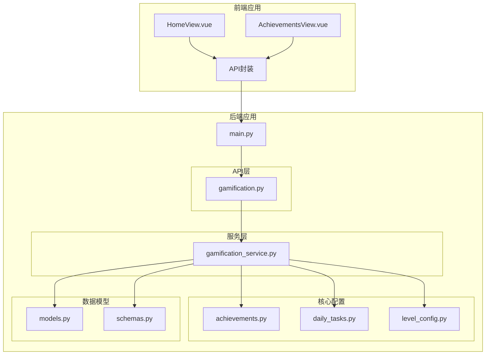
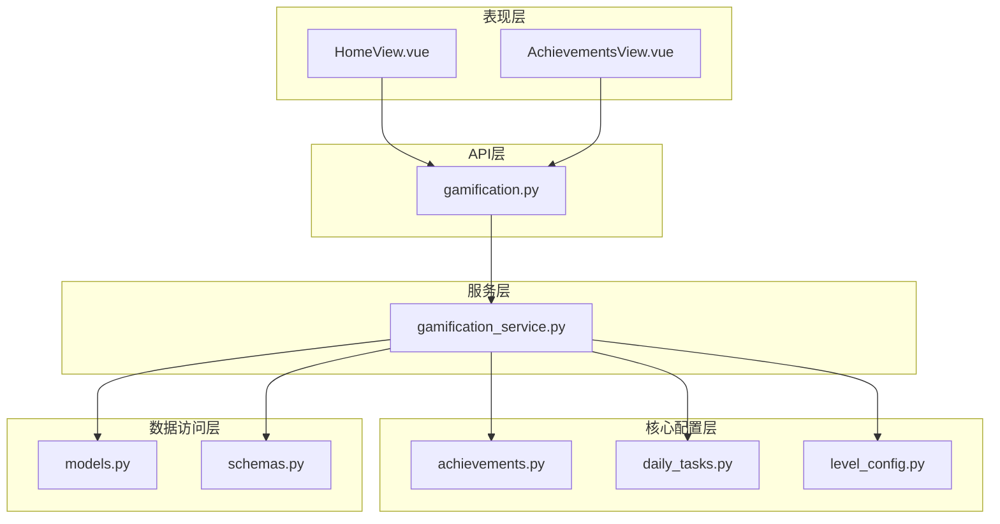
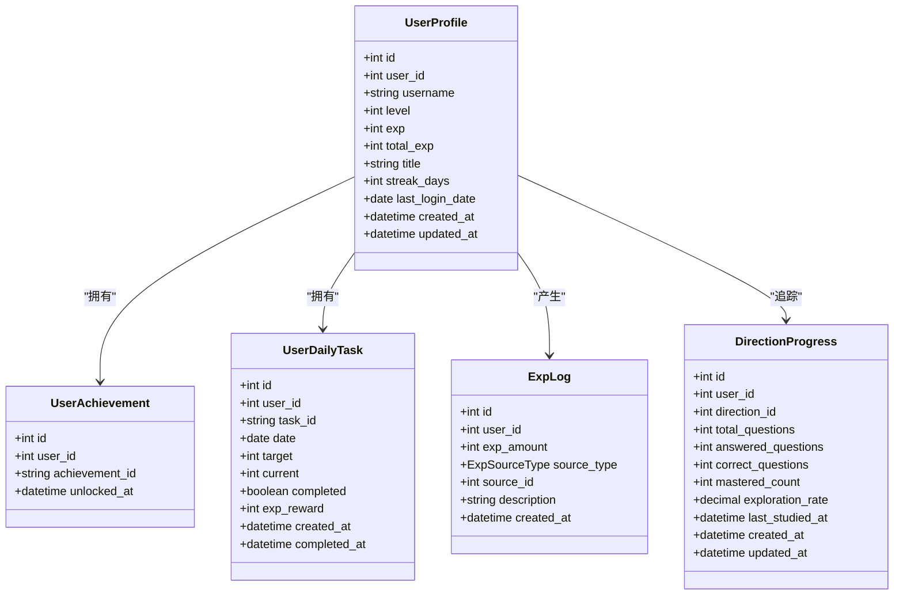
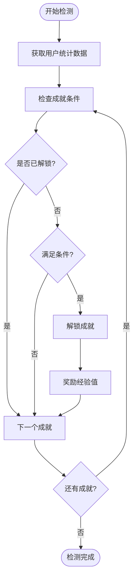
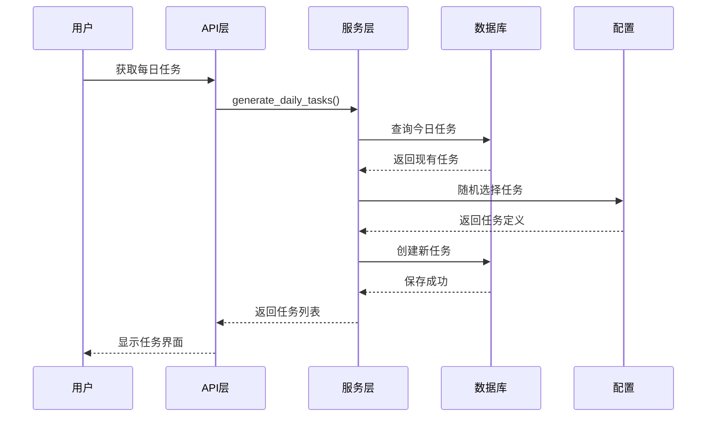
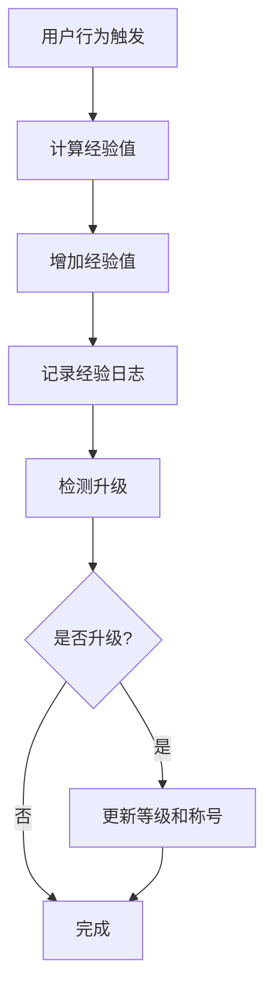
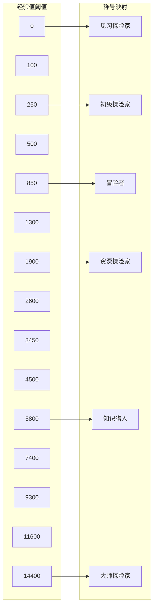
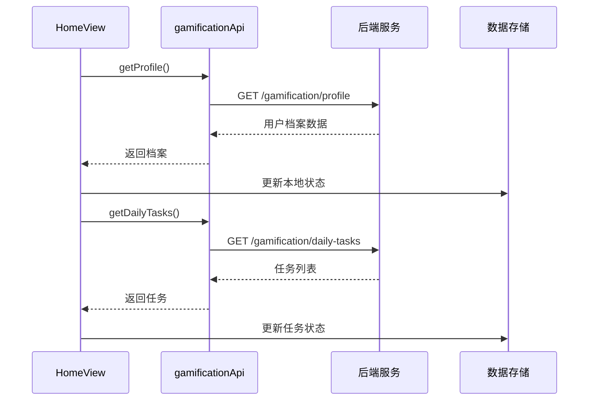
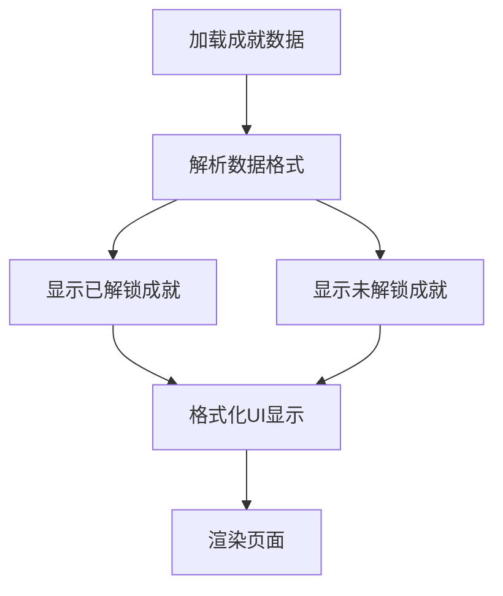
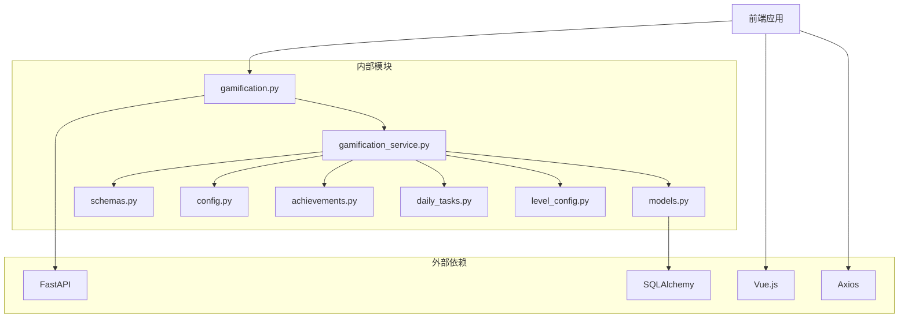

# 游戏化系统

<cite>
**本文档引用的文件**
- [backend/app/api/gamification.py](file://backend/app/api/gamification.py)
- [backend/app/services/gamification_service.py](file://backend/app/services/gamification_service.py)
- [backend/app/core/achievements.py](file://backend/app/core/achievements.py)
- [backend/app/core/daily_tasks.py](file://backend/app/core/daily_tasks.py)
- [backend/app/core/level_config.py](file://backend/app/core/level_config.py)
- [backend/app/models/models.py](file://backend/app/models/models.py)
- [backend/app/schemas/schemas.py](file://backend/app/schemas/schemas.py)
- [backend/app/main.py](file://backend/app/main.py)
- [frontend/src/views/AchievementsView.vue](file://frontend/src/views/AchievementsView.vue)
- [frontend/src/views/HomeView.vue](file://frontend/src/views/HomeView.vue)
- [frontend/src/api/index.js](file://frontend/src/api/index.js)
- [backend/app/core/config.py](file://backend/app/core/config.py)
- [backend/pyproject.toml](file://backend/pyproject.toml)
- [frontend/package.json](file://frontend/package.json)
</cite>

## 目录
1. [简介](#简介)
2. [项目结构](#项目结构)
3. [核心组件](#核心组件)
4. [架构概览](#架构概览)
5. [详细组件分析](#详细组件分析)
6. [依赖关系分析](#依赖关系分析)
7. [性能考虑](#性能考虑)
8. [故障排除指南](#故障排除指南)
9. [结论](#结论)

## 简介

个人学习管理软件的游戏化系统是一个完整的激励机制框架，旨在通过经验值、等级、成就和每日任务等元素提升用户的学习体验和参与度。该系统采用单用户设计，为每个用户提供了丰富的游戏化体验，包括角色扮演、进度追踪和社交激励等功能。

系统基于FastAPI构建后端服务，使用SQLite作为数据库存储，Vue.js作为前端框架，实现了完整的前后端分离架构。游戏化系统的核心功能包括经验值管理、等级晋升、成就解锁、每日任务系统和学习进度追踪等。

## 项目结构

该项目采用典型的前后端分离架构，游戏化系统主要分布在后端的API层和服务层中：

**图表来源**
- [backend/app/main.py](file://backend/app/main.py#L1-L68)
- [backend/app/api/gamification.py](file://backend/app/api/gamification.py#L1-L129)
- [backend/app/services/gamification_service.py](file://backend/app/services/gamification_service.py#L1-L482)

**章节来源**
- [backend/app/main.py](file://backend/app/main.py#L1-L68)
- [backend/app/api/gamification.py](file://backend/app/api/gamification.py#L1-L129)

## 核心组件

游戏化系统包含以下核心组件：

### 用户档案系统
- **用户档案表**: 存储用户的等级、经验值、称号和连续学习天数
- **经验值管理**: 实现经验值的增减、记录和等级检测
- **称号系统**: 基于等级的动态称号生成

### 成就系统
- **成就定义**: 包含12种不同类型的成就，涵盖测验、错题、资料、探索和连续学习
- **条件检测**: 自动检测用户达成成就的条件
- **奖励机制**: 解锁成就时的经验值奖励

### 每日任务系统
- **任务池管理**: 5种不同类型的任务，随机生成每日任务
- **进度追踪**: 实时跟踪用户完成任务的进度
- **奖励分配**: 完成任务获得经验值奖励

### 等级配置系统
- **经验阈值**: 定义每个等级所需的经验值门槛
- **称号映射**: 等级与称号的对应关系
- **等级计算**: 根据累计经验值计算当前等级

**章节来源**
- [backend/app/models/models.py](file://backend/app/models/models.py#L238-L321)
- [backend/app/core/achievements.py](file://backend/app/core/achievements.py#L1-L121)
- [backend/app/core/daily_tasks.py](file://backend/app/core/daily_tasks.py#L1-L53)
- [backend/app/core/level_config.py](file://backend/app/core/level_config.py#L1-L59)

## 架构概览

游戏化系统采用分层架构设计，确保了良好的代码组织和可维护性：

**图表来源**
- [backend/app/api/gamification.py](file://backend/app/api/gamification.py#L21-L21)
- [backend/app/services/gamification_service.py](file://backend/app/services/gamification_service.py#L1-L17)

系统采用RESTful API设计原则，所有游戏化相关的操作都通过HTTP接口提供。前端通过Axios库调用后端API，实现数据的双向交互。

## 详细组件分析

### 用户档案管理系统

用户档案系统是游戏化系统的基础，负责存储和管理用户的基本信息和游戏进度。

**图表来源**
- [backend/app/models/models.py](file://backend/app/models/models.py#L238-L321)

用户档案系统的关键特性包括：

- **单用户设计**: 系统固定使用用户ID 1，简化了游戏化逻辑
- **自动创建**: 首次访问时自动创建用户档案
- **状态持久化**: 所有游戏化状态都持久化到数据库
- **实时更新**: 用户操作会立即反映在档案中

**章节来源**
- [backend/app/models/models.py](file://backend/app/models/models.py#L238-L321)
- [backend/app/services/gamification_service.py](file://backend/app/services/gamification_service.py#L21-L37)

### 成就系统分析

成就系统是游戏化的核心激励机制，包含12种不同类型的成就，每种成就都有特定的解锁条件和奖励。

**图表来源**
- [backend/app/services/gamification_service.py](file://backend/app/services/gamification_service.py#L182-L206)

成就系统按类别组织：

#### 测验类成就
- **初试身手**: 完成第一次测验 (50经验)
- **勤学不辍**: 完成10次测验 (100经验)
- **满分学霸**: 获得一次满分(100分) (100经验)
- **身经百战**: 完成50次测验 (200经验)

#### 错题类成就
- **知错能改**: 掌握第一道错题 (50经验)
- **错题猎人**: 掌握50道错题 (200经验)

#### 资料类成就
- **知识收集者**: 上传第一份学习资料 (50经验)

#### 探索类成就
- **多面手**: 探索3个不同的学习方向 (100经验)
- **全知之眼**: 在所有方向达到90%探索率 (200经验)

#### 连续学习类成就
- **七日修行**: 连续学习7天 (100经验)
- **坚持不懈**: 连续学习30天 (200经验)

**章节来源**
- [backend/app/core/achievements.py](file://backend/app/core/achievements.py#L1-L121)
- [backend/app/services/gamification_service.py](file://backend/app/services/gamification_service.py#L182-L224)

### 每日任务系统

每日任务系统为用户提供日常学习目标，通过随机生成的任务增加学习的趣味性和持续性。

**图表来源**
- [backend/app/services/gamification_service.py](file://backend/app/services/gamification_service.py#L229-L262)

每日任务系统包含以下5种类型：

#### 测验相关任务
- **每日挑战**: 完成1次测验 (+30经验)
- **追求完美**: 获得一次80分以上成绩 (+50经验)

#### 错题相关任务
- **错题复习**: 掌握3道错题 (+40经验)

#### 资料相关任务
- **知识积累**: 上传1份学习资料 (+30经验)

#### 题目相关任务
- **题海战术**: 答对10道题目 (+40经验)

**章节来源**
- [backend/app/core/daily_tasks.py](file://backend/app/core/daily_tasks.py#L1-L53)
- [backend/app/services/gamification_service.py](file://backend/app/services/gamification_service.py#L229-L292)

### 经验值管理系统

经验值管理系统是整个游戏化系统的核心，负责经验值的计算、记录和等级检测。

**图表来源**
- [backend/app/services/gamification_service.py](file://backend/app/services/gamification_service.py#L42-L97)

经验值的计算规则：

#### 测验经验值
- **基础经验**: 50分
- **分数加成**: 每1分获得0.5经验 (最高50分)
- **连续学习加成**: 每天最多50经验

#### 其他行为经验值
- **掌握错题**: 20经验
- **上传资料**: 30经验 (处理成功额外+20经验)
- **每日任务**: 30-50经验不等
- **成就解锁**: 50-200经验不等

**章节来源**
- [backend/app/services/gamification_service.py](file://backend/app/services/gamification_service.py#L42-L106)
- [backend/app/models/models.py](file://backend/app/models/models.py#L227-L236)

### 等级和称号系统

等级系统通过累积经验值来提升用户等级，并解锁相应的称号。

**图表来源**
- [backend/app/core/level_config.py](file://backend/app/core/level_config.py#L4-L32)

**章节来源**
- [backend/app/core/level_config.py](file://backend/app/core/level_config.py#L1-L59)

### 前端集成分析

前端通过Vue.js组件实现游戏化功能的可视化展示：

#### 主页集成
主页集成了用户档案显示和每日任务展示功能：

**图表来源**
- [frontend/src/views/HomeView.vue](file://frontend/src/views/HomeView.vue#L314-L334)
- [frontend/src/api/index.js](file://frontend/src/api/index.js#L72-L81)

#### 成就页面集成
成就页面提供完整的成就展示和管理功能：

**图表来源**
- [frontend/src/views/AchievementsView.vue](file://frontend/src/views/AchievementsView.vue#L117-L129)

**章节来源**
- [frontend/src/views/HomeView.vue](file://frontend/src/views/HomeView.vue#L1-L800)
- [frontend/src/views/AchievementsView.vue](file://frontend/src/views/AchievementsView.vue#L1-L382)
- [frontend/src/api/index.js](file://frontend/src/api/index.js#L72-L81)

## 依赖关系分析

游戏化系统的依赖关系体现了清晰的分层架构：

**图表来源**
- [backend/pyproject.toml](file://backend/pyproject.toml#L7-L23)
- [frontend/package.json](file://frontend/package.json#L11-L17)

**章节来源**
- [backend/pyproject.toml](file://backend/pyproject.toml#L1-L30)
- [frontend/package.json](file://frontend/package.json#L1-L23)

## 性能考虑

游戏化系统在设计时充分考虑了性能优化：

### 数据库优化
- **索引策略**: 在常用查询字段上建立索引，如用户ID、任务日期等
- **查询优化**: 使用批量查询减少数据库往返次数
- **缓存机制**: 对静态配置数据进行内存缓存

### API性能
- **异步处理**: 大量使用异步操作避免阻塞
- **批量操作**: 支持批量任务更新和查询
- **分页机制**: 对大量数据的查询支持分页

### 前端性能
- **懒加载**: 非关键资源按需加载
- **虚拟滚动**: 大列表数据的虚拟化处理
- **状态缓存**: 本地状态缓存减少重复请求

## 故障排除指南

### 常见问题及解决方案

#### 用户档案无法创建
**症状**: 首次访问时出现数据库错误
**原因**: 数据库表未初始化
**解决**: 检查数据库连接配置，确认表结构已创建

#### 成就检测不准确
**症状**: 成就条件满足但未解锁
**原因**: 用户统计数据计算错误
**解决**: 检查`get_user_stats`函数的统计逻辑

#### 经验值计算异常
**症状**: 经验值与预期不符
**原因**: 经验值计算公式错误
**解决**: 验证`calculate_exam_exp`函数的计算逻辑

#### 前端数据不同步
**症状**: 前端显示的数据与实际不符
**原因**: API响应格式不匹配
**解决**: 检查Pydantic模型定义和API响应

**章节来源**
- [backend/app/services/gamification_service.py](file://backend/app/services/gamification_service.py#L142-L179)
- [backend/app/api/gamification.py](file://backend/app/api/gamification.py#L24-L46)

## 结论

个人学习管理软件的游戏化系统是一个设计精良、功能完整的激励机制框架。系统通过经验值、等级、成就和每日任务等元素，有效提升了用户的学习动机和参与度。

### 系统优势

1. **架构清晰**: 分层设计确保了良好的代码组织和可维护性
2. **扩展性强**: 模块化设计便于功能扩展和定制
3. **用户体验佳**: 完整的前后端集成提供了流畅的交互体验
4. **数据完整**: 全面的数据模型保证了游戏化状态的持久化

### 技术特色

- **单用户设计**: 简化了业务逻辑，便于系统管理和维护
- **实时反馈**: 用户操作能够即时反映在游戏化状态中
- **丰富内容**: 多样化的成就和任务类型保持了系统的长期吸引力
- **性能优化**: 考虑了数据库查询和API响应的性能优化

### 发展建议

1. **多用户支持**: 可以考虑扩展为多用户系统
2. **社交功能**: 添加排行榜和好友系统增强社交互动
3. **移动端适配**: 优化移动端的用户体验
4. **数据分析**: 添加更详细的学习行为分析功能

游戏化系统为个人学习管理提供了强大的激励机制，通过技术手段将学习过程转化为有趣的游戏体验，有效提升了用户的学习效果和满意度。