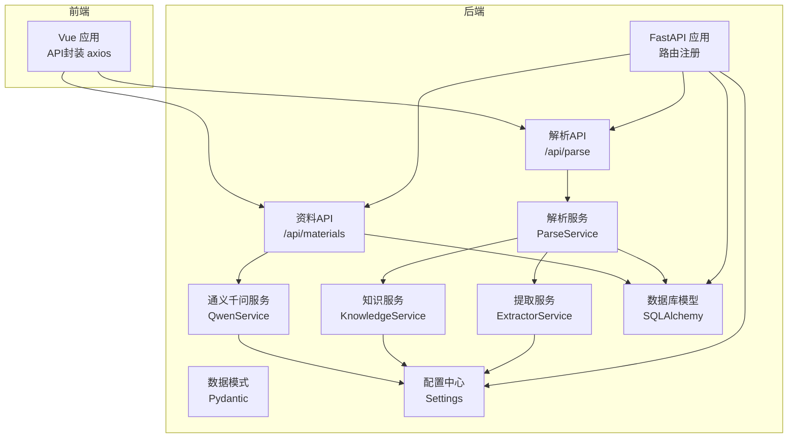
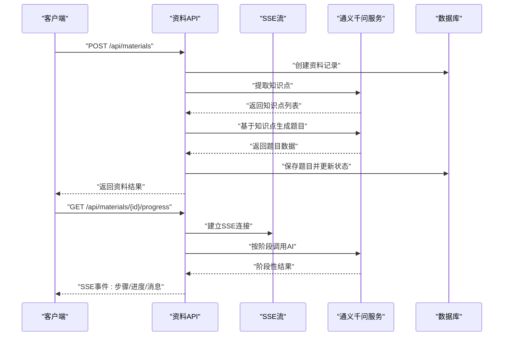
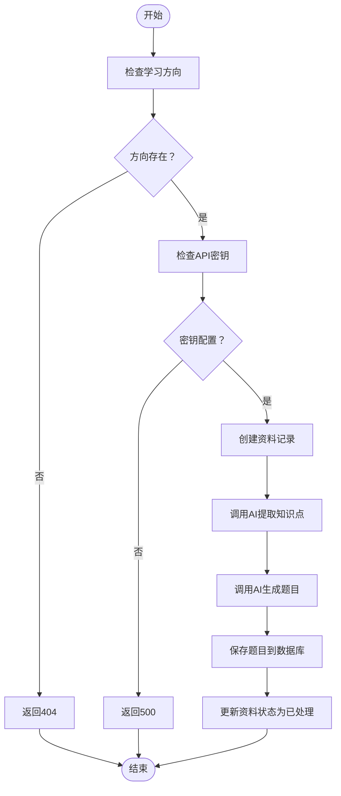
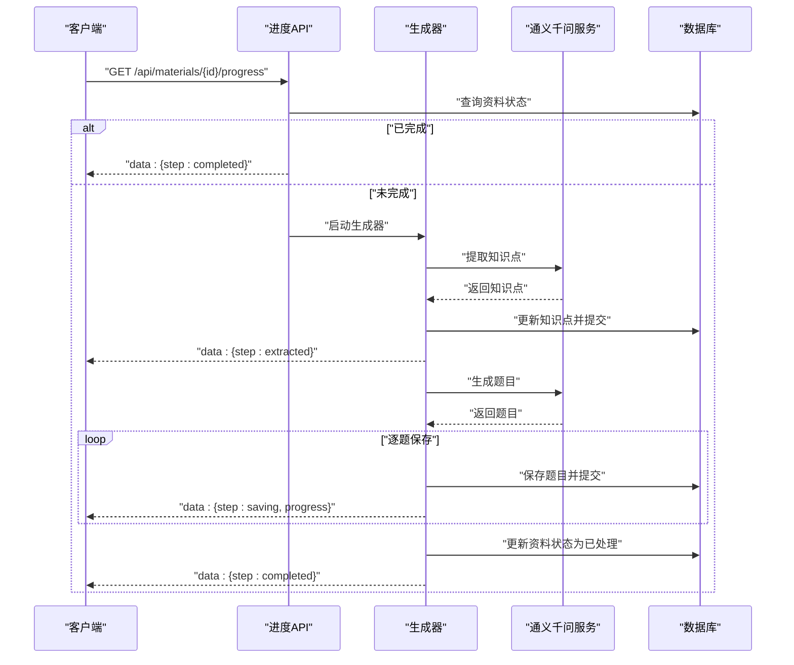
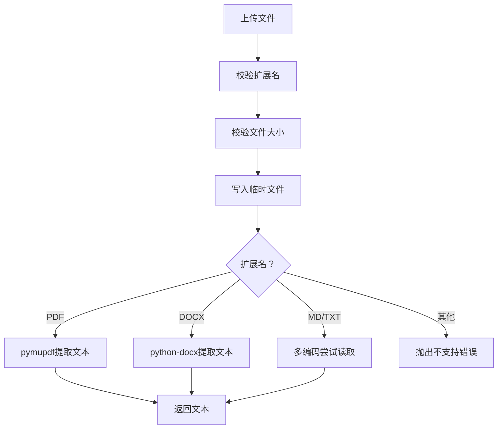
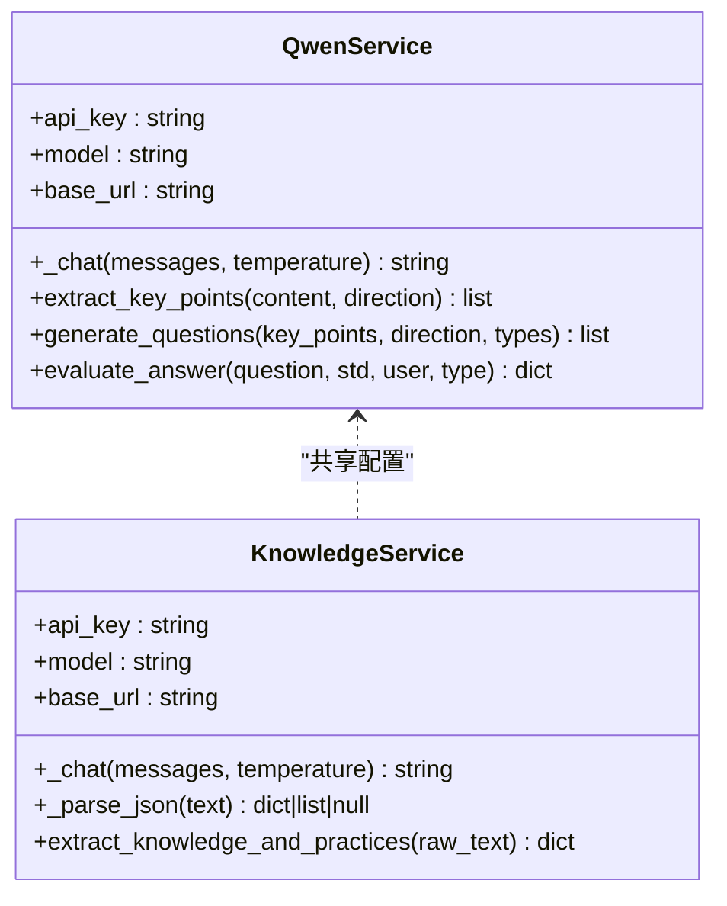
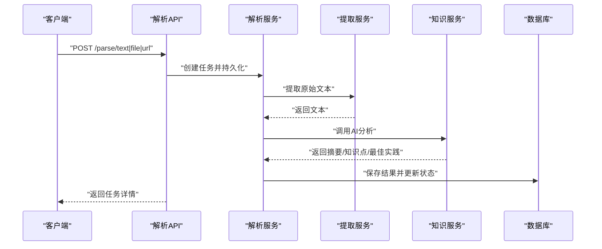
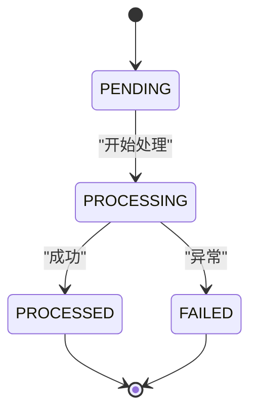
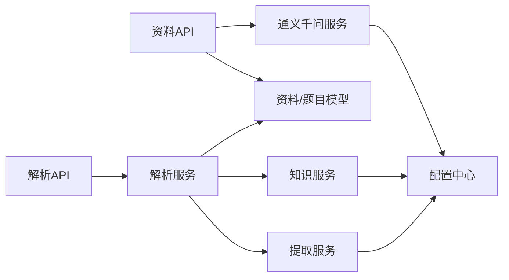

# 资料管理系统

<cite>
**本文引用的文件**
- [backend/app/main.py](file://backend/app/main.py)
- [backend/app/api/materials.py](file://backend/app/api/materials.py)
- [backend/app/api/parse.py](file://backend/app/api/parse.py)
- [backend/app/services/parse_service.py](file://backend/app/services/parse_service.py)
- [backend/app/services/extractor_service.py](file://backend/app/services/extractor_service.py)
- [backend/app/services/qwen_service.py](file://backend/app/services/qwen_service.py)
- [backend/app/services/knowledge_service.py](file://backend/app/services/knowledge_service.py)
- [backend/app/models/models.py](file://backend/app/models/models.py)
- [backend/app/schemas/schemas.py](file://backend/app/schemas/schemas.py)
- [backend/app/core/config.py](file://backend/app/core/config.py)
- [backend/pyproject.toml](file://backend/pyproject.toml)
- [backend/.env.example](file://backend/.env.example)
- [backend/test_api.py](file://backend/test_api.py)
- [backend/test_full_flow.py](file://backend/test_full_flow.py)
- [frontend/src/api/index.js](file://frontend/src/api/index.js)
</cite>

## 目录
1. [简介](#简介)
2. [项目结构](#项目结构)
3. [核心组件](#核心组件)
4. [架构总览](#架构总览)
5. [详细组件分析](#详细组件分析)
6. [依赖关系分析](#依赖关系分析)
7. [性能考量](#性能考量)
8. [故障排查指南](#故障排查指南)
9. [结论](#结论)
10. [附录](#附录)

## 简介
本系统是一个个人学习资料管理平台，提供资料上传、解析、AI知识点提取与题目生成的完整能力。系统支持多格式文件（PDF、Word、Markdown、纯文本）与网页链接解析；通过通义千问API实现Prompt工程与流式处理；采用SSE（Server-Sent Events）向前端实时推送处理进度；具备资料状态管理、错误恢复与重试机制；提供RESTful API用于资料上传、进度查询与删除等操作。

## 项目结构
后端采用FastAPI + SQLAlchemy架构，按功能模块划分：
- 应用入口与路由注册：app/main.py
- API层：app/api/materials.py、app/api/parse.py
- 服务层：app/services/parse_service.py、app/services/extractor_service.py、app/services/qwen_service.py、app/services/knowledge_service.py
- 模型与Schema：app/models/models.py、app/schemas/schemas.py
- 配置与环境：app/core/config.py、backend/.env.example
- 依赖声明：backend/pyproject.toml
- 前端API封装：frontend/src/api/index.js
- 测试用例：backend/test_api.py、backend/test_full_flow.py

图表来源
- [backend/app/main.py](file://backend/app/main.py#L1-L66)
- [backend/app/api/materials.py](file://backend/app/api/materials.py#L1-L203)
- [backend/app/api/parse.py](file://backend/app/api/parse.py#L1-L77)
- [backend/app/services/parse_service.py](file://backend/app/services/parse_service.py#L1-L163)
- [backend/app/services/extractor_service.py](file://backend/app/services/extractor_service.py#L1-L123)
- [backend/app/services/qwen_service.py](file://backend/app/services/qwen_service.py#L1-L156)
- [backend/app/services/knowledge_service.py](file://backend/app/services/knowledge_service.py#L1-L114)
- [backend/app/models/models.py](file://backend/app/models/models.py#L1-L223)
- [backend/app/schemas/schemas.py](file://backend/app/schemas/schemas.py#L1-L265)
- [backend/app/core/config.py](file://backend/app/core/config.py#L1-L34)

章节来源
- [backend/app/main.py](file://backend/app/main.py#L1-L66)
- [backend/pyproject.toml](file://backend/pyproject.toml#L1-L29)

## 核心组件
- 应用入口与CORS：注册路由、创建数据库表与上传目录、健康检查
- 资料API：上传资料、同步处理（知识点提取+题目生成）、SSE进度流、删除资料
- 解析API：文本/文件/URL解析，返回解析任务与结果
- 服务层：
  - 解析服务：协调文本提取与AI分析，维护任务状态
  - 提取服务：多格式文件与网页正文抽取
  - 通义千问服务：封装DashScope API，提供知识点与题目生成
  - 知识服务：从原始文本提炼知识点、最佳实践与摘要
- 数据模型：资料、题目、测验、答题、错题、解析任务、知识点、最佳实践等
- Schema：Pydantic模型，约束输入输出
- 配置中心：API密钥、模型、上传目录、文件大小限制等

章节来源
- [backend/app/api/materials.py](file://backend/app/api/materials.py#L1-L203)
- [backend/app/api/parse.py](file://backend/app/api/parse.py#L1-L77)
- [backend/app/services/parse_service.py](file://backend/app/services/parse_service.py#L1-L163)
- [backend/app/services/extractor_service.py](file://backend/app/services/extractor_service.py#L1-L123)
- [backend/app/services/qwen_service.py](file://backend/app/services/qwen_service.py#L1-L156)
- [backend/app/services/knowledge_service.py](file://backend/app/services/knowledge_service.py#L1-L114)
- [backend/app/models/models.py](file://backend/app/models/models.py#L1-L223)
- [backend/app/schemas/schemas.py](file://backend/app/schemas/schemas.py#L1-L265)
- [backend/app/core/config.py](file://backend/app/core/config.py#L1-L34)

## 架构总览
系统采用“API层-服务层-模型层”的分层架构，结合SSE实现实时进度反馈，结合异步HTTP客户端调用外部AI服务，确保高并发下的稳定性与可扩展性。

图表来源
- [backend/app/api/materials.py](file://backend/app/api/materials.py#L27-L80)
- [backend/app/services/qwen_service.py](file://backend/app/services/qwen_service.py#L37-L114)
- [backend/app/models/models.py](file://backend/app/models/models.py#L78-L114)

## 详细组件分析

### 资料上传与处理（同步流程）
- 输入校验：学习方向存在性、API密钥配置
- 同步处理：先提取知识点，再生成题目，最后保存题目并更新资料状态
- 异常处理：捕获异常并回滚状态，保证一致性

图表来源
- [backend/app/api/materials.py](file://backend/app/api/materials.py#L82-L161)

章节来源
- [backend/app/api/materials.py](file://backend/app/api/materials.py#L82-L161)

### SSE进度流（异步反馈）
- 进度事件：step（提取中/已提取/生成中/已生成/保存中/保存进度/完成/错误）、progress（百分比）、message（提示）、data（附加数据）
- 已完成状态：直接返回完成事件
- 错误处理：设置资料状态为失败并返回错误事件

图表来源
- [backend/app/api/materials.py](file://backend/app/api/materials.py#L27-L80)

章节来源
- [backend/app/api/materials.py](file://backend/app/api/materials.py#L164-L185)

### 多格式文件支持与解析机制
- 支持格式：PDF、DOCX、MD、TXT
- 文件大小限制：通过配置控制
- 提取策略：
  - PDF：使用pymupdf逐页提取文本
  - DOCX：使用python-docx读取段落
  - MD/TXT：尝试UTF-8、GBK、GB2312、Latin-1编码
  - URL：使用BeautifulSoup + lxml抓取正文，移除脚本与样式标签
- 错误处理：格式不支持、空内容、编码失败均抛出明确错误

图表来源
- [backend/app/services/extractor_service.py](file://backend/app/services/extractor_service.py#L30-L92)

章节来源
- [backend/app/services/extractor_service.py](file://backend/app/services/extractor_service.py#L1-L123)
- [backend/app/core/config.py](file://backend/app/core/config.py#L21-L24)

### AI知识点提取与题目生成（Prompt工程与API集成）
- 知识点提取：面向特定方向的教师角色，要求返回JSON数组，包含名称、描述、重要度
- 题目生成：基于知识点集合，要求覆盖多种题型、难度分布均匀，返回JSON数组，包含类型、难度、内容、选项、答案、解析、对应知识点
- 评分服务：评估主观题答案，返回分数、评语、命中/遗漏要点
- 容错处理：对AI返回的非JSON内容进行截取与解析，失败时返回默认结构

图表来源
- [backend/app/services/qwen_service.py](file://backend/app/services/qwen_service.py#L1-L156)
- [backend/app/services/knowledge_service.py](file://backend/app/services/knowledge_service.py#L1-L114)
- [backend/app/core/config.py](file://backend/app/core/config.py#L16-L24)

章节来源
- [backend/app/services/qwen_service.py](file://backend/app/services/qwen_service.py#L37-L152)
- [backend/app/services/knowledge_service.py](file://backend/app/services/knowledge_service.py#L51-L109)

### 知识解析任务（文本/文件/URL）
- 任务状态：PENDING → PROCESSING → COMPLETED/FAILED
- 任务详情：包含摘要、知识点、最佳实践
- 删除任务：级联删除知识点与最佳实践

图表来源
- [backend/app/api/parse.py](file://backend/app/api/parse.py#L17-L46)
- [backend/app/services/parse_service.py](file://backend/app/services/parse_service.py#L57-L132)
- [backend/app/services/extractor_service.py](file://backend/app/services/extractor_service.py#L93-L118)
- [backend/app/services/knowledge_service.py](file://backend/app/services/knowledge_service.py#L51-L109)

章节来源
- [backend/app/api/parse.py](file://backend/app/api/parse.py#L1-L77)
- [backend/app/services/parse_service.py](file://backend/app/services/parse_service.py#L1-L163)

### 资料状态管理与错误恢复
- 状态枚举：PENDING、PROCESSED、FAILED
- 进度流中若发生异常，资料状态被设置为FAILED
- 前端可通过SSE持续监听进度，或轮询获取最终状态

图表来源
- [backend/app/models/models.py](file://backend/app/models/models.py#L9-L14)
- [backend/app/api/materials.py](file://backend/app/api/materials.py#L74-L79)

章节来源
- [backend/app/models/models.py](file://backend/app/models/models.py#L1-L223)
- [backend/app/api/materials.py](file://backend/app/api/materials.py#L164-L185)

### API接口文档

- 获取资料列表
  - 方法：GET
  - 路径：/api/materials
  - 查询参数：direction_id（可选）
  - 返回：资料列表

- 上传并处理资料
  - 方法：POST
  - 路径：/api/materials
  - 请求体：MaterialCreate（包含title、content、direction_id）
  - 返回：MaterialResponse
  - 行为：同步处理（知识点提取+题目生成）

- 获取资料处理进度（SSE）
  - 方法：GET
  - 路径：/api/materials/{material_id}/progress
  - 返回：text/event-stream
  - 事件：step、progress、message、data（当有数据时）

- 删除资料
  - 方法：DELETE
  - 路径：/api/materials/{material_id}
  - 返回：删除成功消息

- 解析文本
  - 方法：POST
  - 路径：/api/parse/text
  - 请求体：ParseTextRequest（title、text、direction_id）
  - 返回：ParseTaskResponse

- 解析文件
  - 方法：POST
  - 路径：/api/parse/file
  - 表单：title、direction_id、file
  - 返回：ParseTaskResponse

- 解析URL
  - 方法：POST
  - 路径：/api/parse/url
  - 请求体：ParseUrlRequest（title、url、direction_id）
  - 返回：ParseTaskResponse

- 获取解析任务列表
  - 方法：GET
  - 路径：/api/parse/tasks
  - 查询参数：skip、limit、direction_id
  - 返回：任务列表

- 获取解析任务详情
  - 方法：GET
  - 路径：/api/parse/tasks/{task_id}
  - 返回：ParseTaskResponse

- 删除解析任务
  - 方法：DELETE
  - 路径：/api/parse/tasks/{task_id}
  - 返回：删除成功消息

章节来源
- [backend/app/api/materials.py](file://backend/app/api/materials.py#L15-L203)
- [backend/app/api/parse.py](file://backend/app/api/parse.py#L1-L77)
- [backend/app/schemas/schemas.py](file://backend/app/schemas/schemas.py#L36-L265)

## 依赖关系分析

图表来源
- [backend/app/api/materials.py](file://backend/app/api/materials.py#L1-L203)
- [backend/app/api/parse.py](file://backend/app/api/parse.py#L1-L77)
- [backend/app/services/parse_service.py](file://backend/app/services/parse_service.py#L1-L163)
- [backend/app/services/extractor_service.py](file://backend/app/services/extractor_service.py#L1-L123)
- [backend/app/services/qwen_service.py](file://backend/app/services/qwen_service.py#L1-L156)
- [backend/app/services/knowledge_service.py](file://backend/app/services/knowledge_service.py#L1-L114)
- [backend/app/core/config.py](file://backend/app/core/config.py#L1-L34)

章节来源
- [backend/app/models/models.py](file://backend/app/models/models.py#L1-L223)
- [backend/app/schemas/schemas.py](file://backend/app/schemas/schemas.py#L1-L265)
- [backend/pyproject.toml](file://backend/pyproject.toml#L1-L29)

## 性能考量
- 并发与异步：使用异步HTTP客户端调用外部API，减少阻塞；SSE流式推送降低前端等待时间
- 文件处理：临时文件写入磁盘后解析，避免内存峰值；对PDF/DOCX/文本分别采用高效解析策略
- 数据库事务：批量保存题目时注意事务边界，必要时分批提交以控制锁粒度
- 缓存与配置：LRU缓存配置实例，减少重复加载；合理设置超时与重试策略
- 前端超时：Axios超时设为3分钟，适配AI处理耗时

章节来源
- [backend/app/services/qwen_service.py](file://backend/app/services/qwen_service.py#L18-L35)
- [backend/app/services/knowledge_service.py](file://backend/app/services/knowledge_service.py#L19-L36)
- [backend/app/services/extractor_service.py](file://backend/app/services/extractor_service.py#L38-L56)
- [frontend/src/api/index.js](file://frontend/src/api/index.js#L3-L9)

## 故障排查指南
- API密钥未配置：资料上传会返回500，需检查环境变量与配置
- 文件格式不支持：提取服务会抛出不支持的扩展名错误
- 文件过大：超过配置的最大文件大小限制会触发错误
- URL抓取失败：网络异常或页面无正文内容会导致解析失败
- SSE连接中断：前端需实现重连与断点续传逻辑（基于已处理进度）
- 数据库异常：统一捕获异常并回滚状态，确保一致性

章节来源
- [backend/app/api/materials.py](file://backend/app/api/materials.py#L94-L96)
- [backend/app/services/extractor_service.py](file://backend/app/services/extractor_service.py#L23-L37)
- [backend/app/services/extractor_service.py](file://backend/app/services/extractor_service.py#L93-L118)
- [backend/app/api/materials.py](file://backend/app/api/materials.py#L74-L79)

## 结论
本系统围绕“资料上传—AI解析—题目生成—实时反馈—状态管理”构建了完整的知识管理闭环。通过模块化的服务设计、清晰的API边界与完善的错误处理机制，既满足当前功能需求，也为后续扩展（如异步队列、缓存、监控）提供了良好基础。

## 附录

### 配置项说明
- 应用配置：app_name、debug
- 数据库：database_url（SQLite/MySQL）
- 通义千问：qwen_api_key、qwen_model、qwen_base_url
- 知识解析：upload_dir、max_file_size

章节来源
- [backend/app/core/config.py](file://backend/app/core/config.py#L6-L34)
- [backend/.env.example](file://backend/.env.example#L1-L14)

### 依赖库概览
- web框架：FastAPI、Uvicorn
- ORM：SQLAlchemy
- 数据库：PyMySQL（MySQL）、SQLite（测试）
- 加解密：Cryptography
- 类型系统：Pydantic、Pydantic-Settings
- 环境变量：python-dotenv
- HTTP客户端：httpx
- 文件上传：python-multipart
- 文本提取：PyMuPDF、python-docx、beautifulsoup4、lxml

章节来源
- [backend/pyproject.toml](file://backend/pyproject.toml#L7-L22)

### 测试参考
- 单元测试：验证知识点提取与题目生成流程
- 端到端流程：模拟完整处理链路

章节来源
- [backend/test_api.py](file://backend/test_api.py#L1-L30)
- [backend/test_full_flow.py](file://backend/test_full_flow.py#L1-L56)