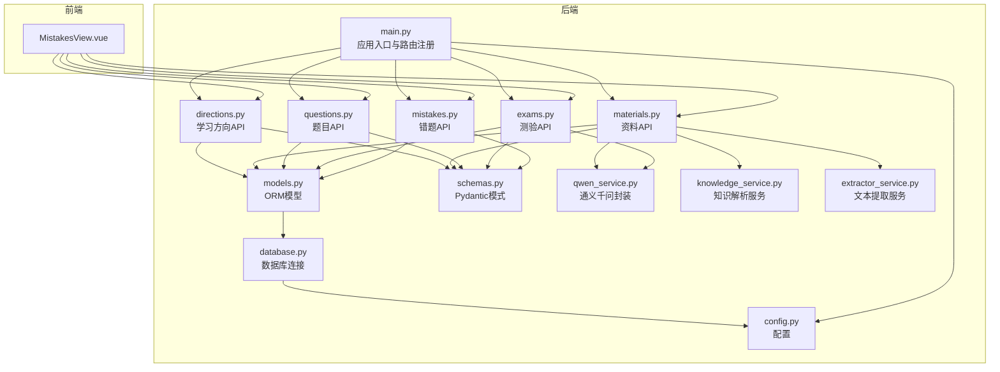
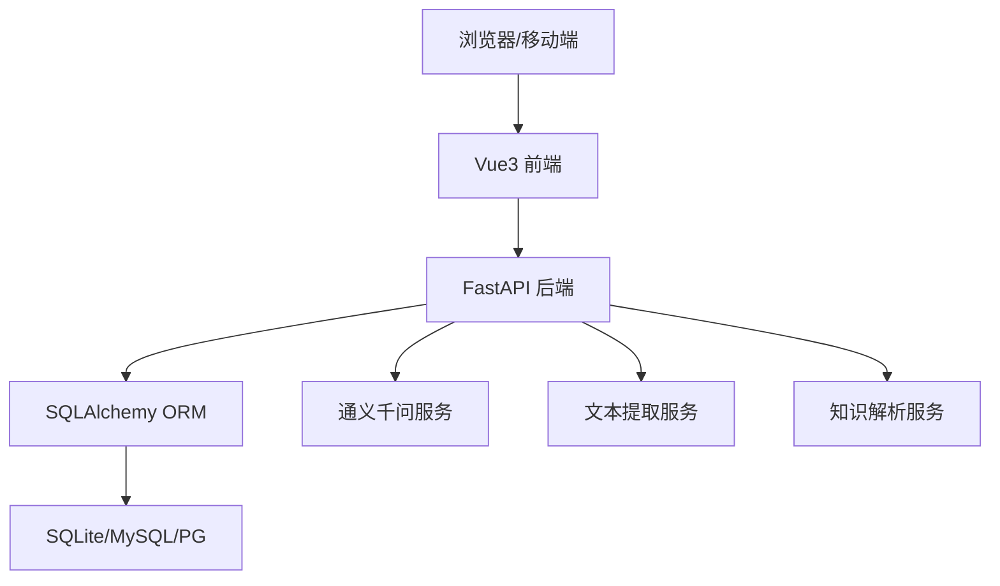
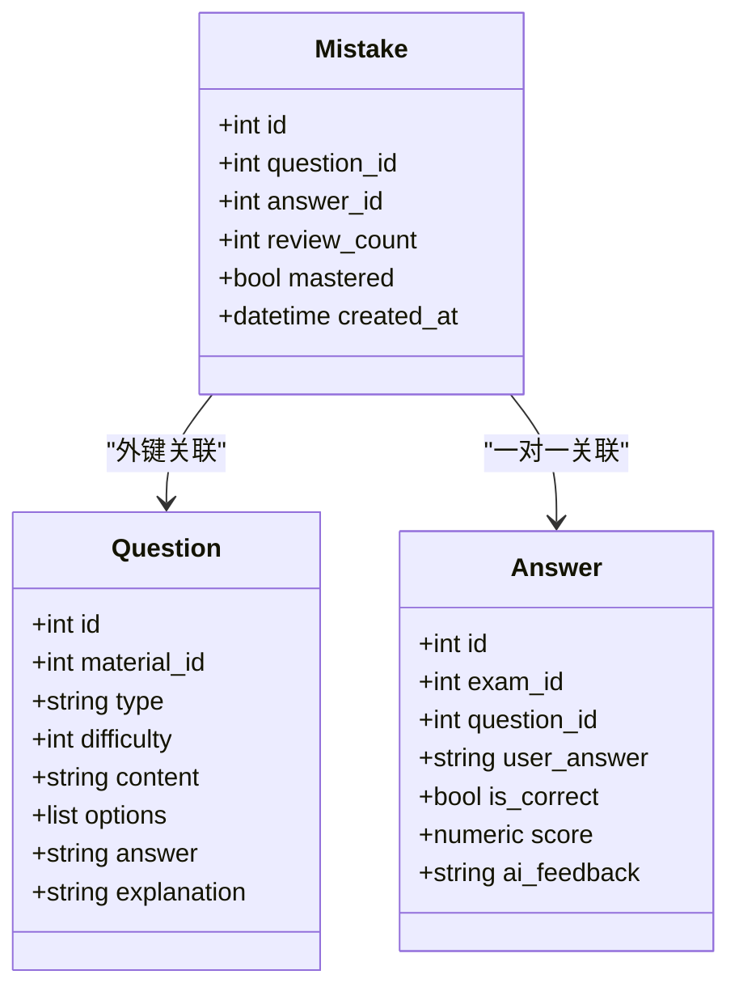
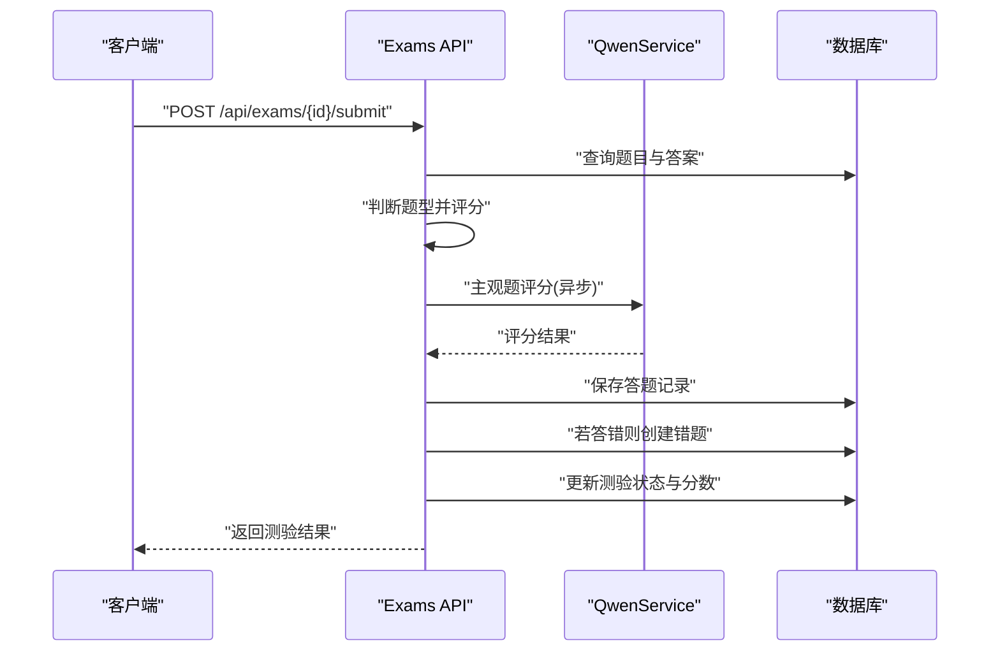
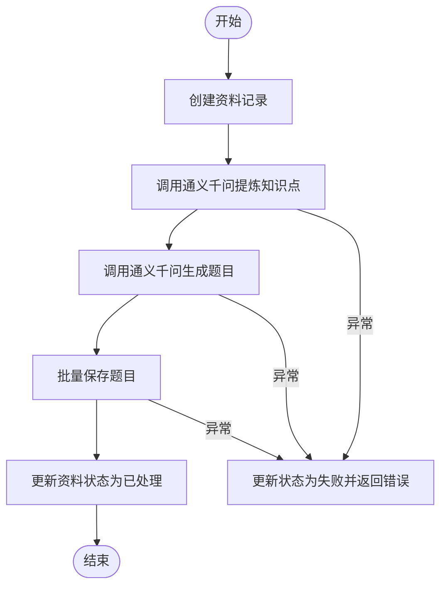
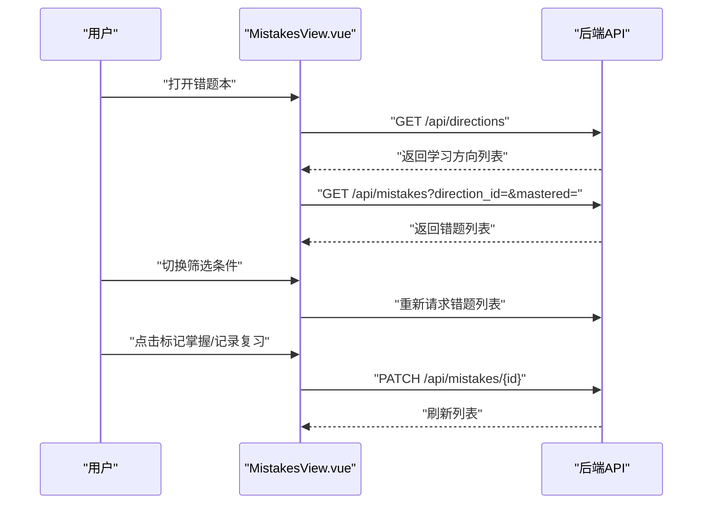
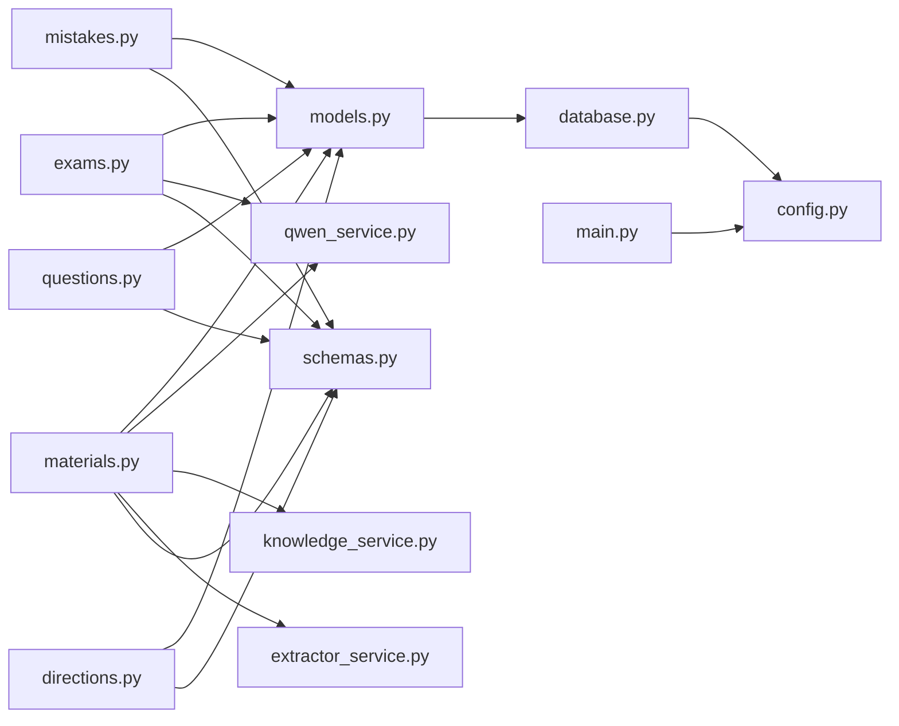

# 错题管理系统

<cite>
**本文引用的文件**
- [backend/app/main.py](file://backend/app/main.py)
- [backend/app/api/mistakes.py](file://backend/app/api/mistakes.py)
- [backend/app/api/exams.py](file://backend/app/api/exams.py)
- [backend/app/api/questions.py](file://backend/app/api/questions.py)
- [backend/app/api/materials.py](file://backend/app/api/materials.py)
- [backend/app/api/directions.py](file://backend/app/api/directions.py)
- [backend/app/models/models.py](file://backend/app/models/models.py)
- [backend/app/schemas/schemas.py](file://backend/app/schemas/schemas.py)
- [backend/app/core/database.py](file://backend/app/core/database.py)
- [backend/app/core/config.py](file://backend/app/core/config.py)
- [backend/app/services/qwen_service.py](file://backend/app/services/qwen_service.py)
- [backend/app/services/knowledge_service.py](file://backend/app/services/knowledge_service.py)
- [backend/app/services/extractor_service.py](file://backend/app/services/extractor_service.py)
- [frontend/src/views/MistakesView.vue](file://frontend/src/views/MistakesView.vue)
</cite>

## 目录
1. [简介](#简介)
2. [项目结构](#项目结构)
3. [核心组件](#核心组件)
4. [架构总览](#架构总览)
5. [详细组件分析](#详细组件分析)
6. [依赖关系分析](#依赖关系分析)
7. [性能考虑](#性能考虑)
8. [故障排查指南](#故障排查指南)
9. [结论](#结论)
10. [附录](#附录)

## 简介
本系统是一个面向个人学习的错题管理系统，围绕“错题识别、记录、管理与复习”构建，覆盖测验错误自动收录、手动添加、错题状态管理、复习计数、分类与标签、统计分析与学习效果评估等能力。系统通过与题目管理、测验系统、知识解析服务的协同，实现从资料到题目的自动生成、从测验到错题的自动识别、从错题到复习计划的智能管理。

## 项目结构
后端采用 FastAPI + SQLAlchemy 架构，前端为 Vue3 单页应用。核心模块包括：
- API 层：提供错题、测验、题目、资料、学习方向等接口
- 业务层：封装通义千问服务、文本提取服务、知识解析服务
- 数据层：基于 SQLAlchemy 的 ORM 模型与数据库连接
- 前端视图：错题本页面，支持筛选、标记掌握状态、记录复习

图表来源
- [backend/app/main.py](file://backend/app/main.py#L1-L66)
- [backend/app/api/mistakes.py](file://backend/app/api/mistakes.py#L1-L90)
- [backend/app/api/exams.py](file://backend/app/api/exams.py#L1-L240)
- [backend/app/api/questions.py](file://backend/app/api/questions.py#L1-L90)
- [backend/app/api/materials.py](file://backend/app/api/materials.py#L1-L203)
- [backend/app/api/directions.py](file://backend/app/api/directions.py#L1-L51)
- [backend/app/models/models.py](file://backend/app/models/models.py#L1-L223)
- [backend/app/schemas/schemas.py](file://backend/app/schemas/schemas.py#L1-L265)
- [backend/app/core/database.py](file://backend/app/core/database.py#L1-L38)
- [backend/app/core/config.py](file://backend/app/core/config.py#L1-L34)
- [backend/app/services/qwen_service.py](file://backend/app/services/qwen_service.py#L1-L156)
- [backend/app/services/knowledge_service.py](file://backend/app/services/knowledge_service.py#L1-L114)
- [backend/app/services/extractor_service.py](file://backend/app/services/extractor_service.py#L1-L123)

章节来源
- [backend/app/main.py](file://backend/app/main.py#L1-L66)
- [backend/app/core/database.py](file://backend/app/core/database.py#L1-L38)
- [backend/app/core/config.py](file://backend/app/core/config.py#L1-L34)

## 核心组件
- 错题模型与API
  - 错题模型包含题目ID、答题记录ID、复习次数、掌握状态、创建时间等字段；通过关系映射关联题目与答题记录。
  - 错题API提供列表查询（支持按学习方向与掌握状态过滤）、详情查询、状态更新（可手动设置掌握状态或自动递增复习次数）、删除。
- 测验与错题识别
  - 测验提交时，系统根据题目类型与标准答案对比客观题，主观题交由通义千问服务评分；若答错则自动创建错题记录。
- 题目与资料
  - 题目API支持按资料ID、学习方向、题型过滤查询；支持更新与删除；提供题目评价接口。
  - 资料API支持上传资料后立即同步处理（提炼知识点、生成题目），并提供SSE进度流。
- 学习方向与知识解析
  - 学习方向API用于创建/查询/删除学习方向。
  - 知识解析服务封装通义千问接口，负责知识点与最佳实践的抽取、题目生成与主观题评分。
- 前端错题本
  - 提供错题列表、筛选（方向/掌握状态）、查看答案、标记掌握状态、记录复习等功能。

章节来源
- [backend/app/models/models.py](file://backend/app/models/models.py#L155-L169)
- [backend/app/api/mistakes.py](file://backend/app/api/mistakes.py#L11-L90)
- [backend/app/api/exams.py](file://backend/app/api/exams.py#L127-L217)
- [backend/app/api/questions.py](file://backend/app/api/questions.py#L11-L90)
- [backend/app/api/materials.py](file://backend/app/api/materials.py#L82-L162)
- [backend/app/api/directions.py](file://backend/app/api/directions.py#L11-L51)
- [backend/app/services/qwen_service.py](file://backend/app/services/qwen_service.py#L37-L152)
- [frontend/src/views/MistakesView.vue](file://frontend/src/views/MistakesView.vue#L1-L409)

## 架构总览
系统采用分层架构：
- 表现层：Vue3 前端通过 Axios 调用后端 API
- 控制层：FastAPI 路由与依赖注入
- 业务层：封装外部服务（通义千问、文本提取、知识解析）
- 数据层：SQLAlchemy ORM + 数据库连接池

图表来源
- [backend/app/main.py](file://backend/app/main.py#L19-L42)
- [backend/app/core/database.py](file://backend/app/core/database.py#L20-L28)
- [backend/app/services/qwen_service.py](file://backend/app/services/qwen_service.py#L10-L17)
- [backend/app/services/extractor_service.py](file://backend/app/services/extractor_service.py#L20-L28)
- [backend/app/services/knowledge_service.py](file://backend/app/services/knowledge_service.py#L11-L18)

## 详细组件分析

### 错题模型与API
- 数据模型
  - 错题表包含外键指向题目与答题记录，便于回溯来源；提供复习次数与掌握状态字段，支撑复习与统计。
- API 功能
  - 列表查询：支持按学习方向与掌握状态过滤，按创建时间倒序。
  - 详情查询：返回错题及关联题目信息。
  - 更新：支持手动设置掌握状态；未显式传入复习次数时自动递增。
  - 删除：删除错题记录。

图表来源
- [backend/app/models/models.py](file://backend/app/models/models.py#L155-L169)
- [backend/app/models/models.py](file://backend/app/models/models.py#L95-L114)
- [backend/app/models/models.py](file://backend/app/models/models.py#L136-L153)

章节来源
- [backend/app/models/models.py](file://backend/app/models/models.py#L155-L169)
- [backend/app/api/mistakes.py](file://backend/app/api/mistakes.py#L11-L90)

### 测验提交与错题自动识别流程
- 流程说明
  - 客户端提交答案后，后端根据题型分别处理：客观题精确匹配，主观题调用通义千问服务评分。
  - 若答错，自动创建错题记录并关联答题记录与题目。
  - 最终计算总分、等级并更新测验状态为完成。

图表来源
- [backend/app/api/exams.py](file://backend/app/api/exams.py#L127-L217)
- [backend/app/services/qwen_service.py](file://backend/app/services/qwen_service.py#L115-L152)

章节来源
- [backend/app/api/exams.py](file://backend/app/api/exams.py#L127-L217)
- [backend/app/services/qwen_service.py](file://backend/app/services/qwen_service.py#L115-L152)

### 资料处理与题目生成流程
- 流程说明
  - 上传资料后，系统立即同步处理：提炼知识点、生成题目、保存至数据库。
  - 提供 SSE 进度流，展示各阶段进度与结果。
  - 失败时更新资料状态为失败。

图表来源
- [backend/app/api/materials.py](file://backend/app/api/materials.py#L82-L162)
- [backend/app/services/qwen_service.py](file://backend/app/services/qwen_service.py#L37-L114)

章节来源
- [backend/app/api/materials.py](file://backend/app/api/materials.py#L82-L162)
- [backend/app/services/qwen_service.py](file://backend/app/services/qwen_service.py#L37-L114)

### 前端错题本交互
- 功能概览
  - 支持按学习方向与掌握状态筛选错题列表。
  - 查看题目详情、展开/收起答案与解析。
  - 标记掌握状态、记录复习次数。
  - 初始化加载学习方向与错题列表。

图表来源
- [frontend/src/views/MistakesView.vue](file://frontend/src/views/MistakesView.vue#L75-L149)
- [backend/app/api/mistakes.py](file://backend/app/api/mistakes.py#L47-L78)
- [backend/app/api/directions.py](file://backend/app/api/directions.py#L11-L14)

章节来源
- [frontend/src/views/MistakesView.vue](file://frontend/src/views/MistakesView.vue#L1-L409)
- [backend/app/api/mistakes.py](file://backend/app/api/mistakes.py#L11-L90)
- [backend/app/api/directions.py](file://backend/app/api/directions.py#L11-L51)

## 依赖关系分析
- 组件耦合
  - API 层依赖模型层与模式层，保证数据结构与业务逻辑分离。
  - 业务层依赖外部服务（通义千问、文本提取、知识解析），通过服务封装降低耦合。
  - 数据层统一通过数据库连接与会话管理，支持 SQLite/MySQL/PG。
- 外部依赖
  - 通义千问：用于知识点提炼、题目生成、主观题评分。
  - 文本提取：支持 PDF、DOCX、MD、TXT 文件与网页 URL 的正文提取。
  - 知识解析：封装 JSON 结构化输出与容错处理。

图表来源
- [backend/app/api/mistakes.py](file://backend/app/api/mistakes.py#L1-L90)
- [backend/app/api/exams.py](file://backend/app/api/exams.py#L1-L240)
- [backend/app/api/questions.py](file://backend/app/api/questions.py#L1-L90)
- [backend/app/api/materials.py](file://backend/app/api/materials.py#L1-L203)
- [backend/app/api/directions.py](file://backend/app/api/directions.py#L1-L51)
- [backend/app/models/models.py](file://backend/app/models/models.py#L1-L223)
- [backend/app/schemas/schemas.py](file://backend/app/schemas/schemas.py#L1-L265)
- [backend/app/core/database.py](file://backend/app/core/database.py#L1-L38)
- [backend/app/core/config.py](file://backend/app/core/config.py#L1-L34)
- [backend/app/services/qwen_service.py](file://backend/app/services/qwen_service.py#L1-L156)
- [backend/app/services/knowledge_service.py](file://backend/app/services/knowledge_service.py#L1-L114)
- [backend/app/services/extractor_service.py](file://backend/app/services/extractor_service.py#L1-L123)
- [backend/app/main.py](file://backend/app/main.py#L1-L66)

章节来源
- [backend/app/models/models.py](file://backend/app/models/models.py#L1-L223)
- [backend/app/schemas/schemas.py](file://backend/app/schemas/schemas.py#L1-L265)
- [backend/app/core/database.py](file://backend/app/core/database.py#L1-L38)
- [backend/app/core/config.py](file://backend/app/core/config.py#L1-L34)
- [backend/app/services/qwen_service.py](file://backend/app/services/qwen_service.py#L1-L156)
- [backend/app/services/knowledge_service.py](file://backend/app/services/knowledge_service.py#L1-L114)
- [backend/app/services/extractor_service.py](file://backend/app/services/extractor_service.py#L1-L123)

## 性能考虑
- 数据库连接与会话
  - SQLite：禁用线程检查以适配单线程环境；生产环境建议使用 MySQL/PG 并启用连接池预热与回收策略。
  - 使用独立会话工厂与依赖注入，确保每次请求获取独立会话并正确关闭。
- 查询优化
  - 错题列表查询使用联结加载题目信息，减少 N+1 查询；支持按方向与掌握状态过滤，必要时可增加索引。
  - 资料处理流程采用批量保存题目，避免逐条提交带来的事务开销。
- 外部服务调用
  - 通义千问服务设置合理超时与温度参数；主观题评分异步处理，避免阻塞主线程。
  - 文本提取服务对文件大小与编码进行校验，防止异常输入导致资源浪费。
- 前端交互
  - 错题列表支持筛选与懒加载，减少一次性渲染压力；SSE 进度流按阶段推送，提升用户体验。

章节来源
- [backend/app/core/database.py](file://backend/app/core/database.py#L9-L28)
- [backend/app/api/mistakes.py](file://backend/app/api/mistakes.py#L18-L30)
- [backend/app/api/materials.py](file://backend/app/api/materials.py#L106-L138)
- [backend/app/services/qwen_service.py](file://backend/app/services/qwen_service.py#L18-L35)
- [backend/app/services/extractor_service.py](file://backend/app/services/extractor_service.py#L35-L36)

## 故障排查指南
- 常见问题
  - 错题不存在：更新或删除错题时若未找到记录，返回 404。
  - 资料处理失败：当提炼知识点或生成题目异常时，资料状态更新为失败并返回错误信息。
  - API 密钥未配置：资料处理前检查通义千问 API 密钥，未配置时返回 500。
  - 文件格式不支持：文本提取服务仅支持指定扩展名，不支持时抛出错误。
- 排查步骤
  - 检查后端日志与数据库状态（资料状态、错题记录）。
  - 确认外部服务可达性与认证信息。
  - 在前端控制台查看网络请求与响应状态码。

章节来源
- [backend/app/api/mistakes.py](file://backend/app/api/mistakes.py#L42-L44)
- [backend/app/api/mistakes.py](file://backend/app/api/mistakes.py#L80-L89)
- [backend/app/api/materials.py](file://backend/app/api/materials.py#L94-L96)
- [backend/app/api/materials.py](file://backend/app/api/materials.py#L144-L159)
- [backend/app/services/extractor_service.py](file://backend/app/services/extractor_service.py#L23-L28)

## 结论
本系统通过完善的模型设计、清晰的 API 分层与外部服务封装，实现了从资料到题目的自动化生成、从测验到错题的自动识别、以及从错题到复习管理的闭环。前端提供直观的交互体验，配合后端的性能优化与错误处理机制，能够满足个人学习场景下的错题管理需求。后续可在复习提醒、遗忘曲线与智能复习计划方面进一步增强，以实现更精细化的学习辅助。

## 附录

### API 接口文档（节选）
- 获取错题列表
  - 方法：GET
  - 路径：/api/mistakes
  - 查询参数：direction_id（整数，可选）、mastered（布尔，可选）
  - 响应：错题列表（包含关联题目信息）
- 获取错题详情
  - 方法：GET
  - 路径：/api/mistakes/{mistake_id}
  - 响应：错题详情（包含关联题目信息）
- 更新错题状态
  - 方法：PATCH
  - 路径：/api/mistakes/{mistake_id}
  - 请求体：可选字段 mastered（布尔）、review_count（整数）
  - 行为：若未提供 review_count，则自动递增；支持手动设置 mastered
  - 响应：更新后的错题详情
- 删除错题
  - 方法：DELETE
  - 路径：/api/mistakes/{mistake_id}
  - 响应：{"message": "删除成功"}

章节来源
- [backend/app/api/mistakes.py](file://backend/app/api/mistakes.py#L11-L90)

### 与题目管理、测验系统的集成关系
- 题目管理
  - 错题来源于题目与答题记录；错题表通过外键关联题目与答题记录，确保溯源。
- 测验系统
  - 测验提交时自动识别错误并创建错题；主观题评分由通义千问服务完成。
- 数据同步
  - 资料处理完成后，题目批量写入数据库，保证数据一致性。

章节来源
- [backend/app/models/models.py](file://backend/app/models/models.py#L155-L169)
- [backend/app/api/exams.py](file://backend/app/api/exams.py#L183-L189)
- [backend/app/api/materials.py](file://backend/app/api/materials.py#L120-L136)

### 个性化学习路径与薄弱环节分析
- 当前实现
  - 错题按掌握状态与方向过滤，支持复习计数统计。
- 建议扩展
  - 引入复习提醒机制与遗忘曲线算法，动态生成复习计划。
  - 基于错题分布与掌握状态计算知识点掌握度，输出学习建议与薄弱环节报告。

[本节为概念性建议，无需源文件引用]