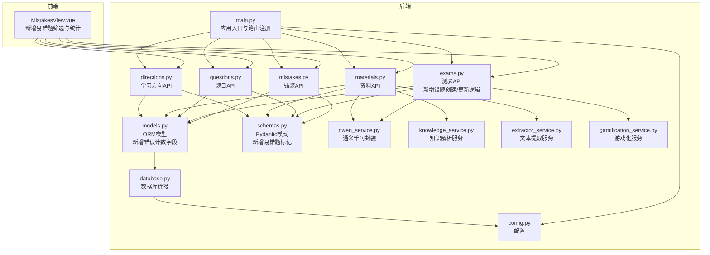
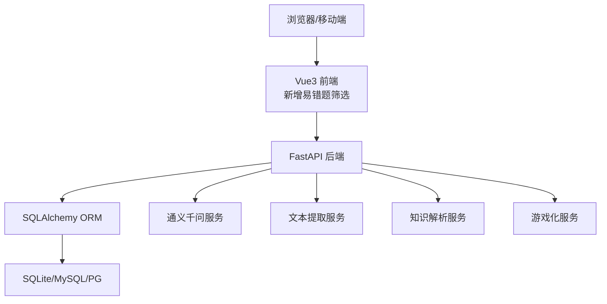
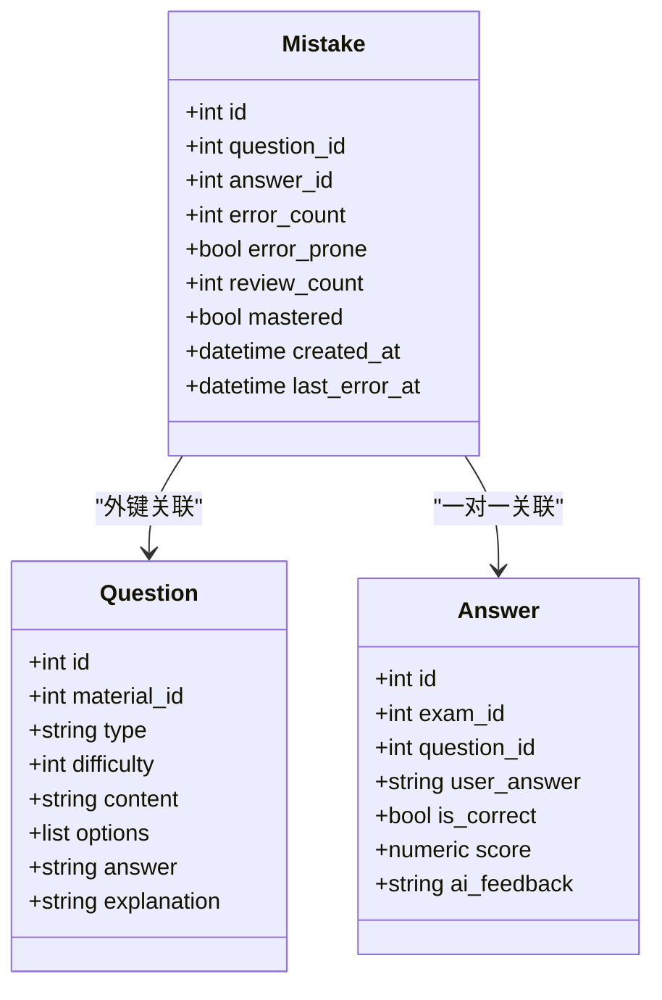
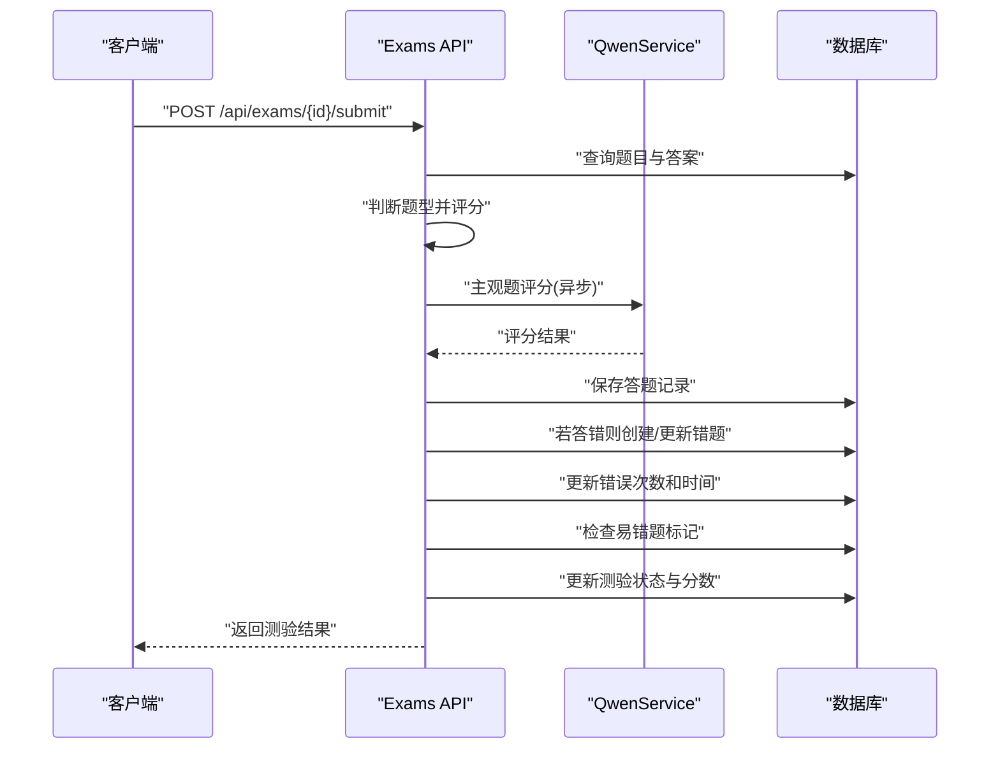
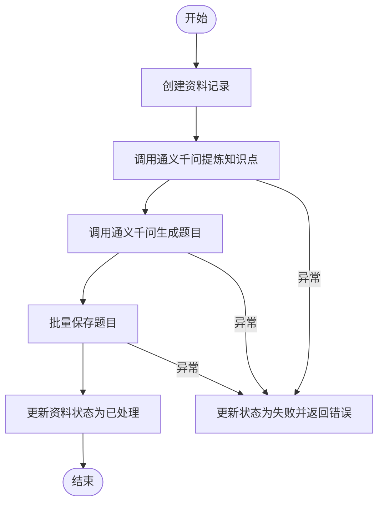
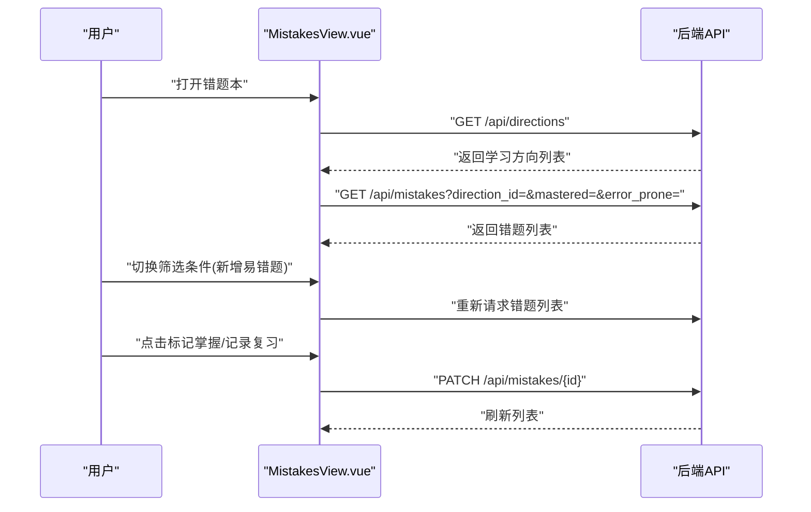
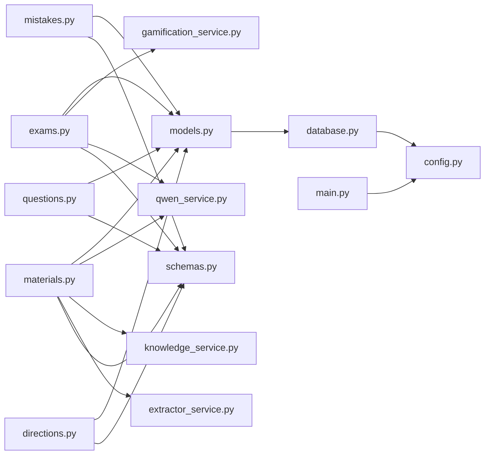

# 错题管理系统

<cite>
**本文引用的文件**
- [backend/app/main.py](file://backend/app/main.py)
- [backend/app/api/mistakes.py](file://backend/app/api/mistakes.py)
- [backend/app/api/exams.py](file://backend/app/api/exams.py)
- [backend/app/api/questions.py](file://backend/app/api/questions.py)
- [backend/app/api/materials.py](file://backend/app/api/materials.py)
- [backend/app/api/directions.py](file://backend/app/api/directions.py)
- [backend/app/models/models.py](file://backend/app/models/models.py)
- [backend/app/schemas/schemas.py](file://backend/app/schemas/schemas.py)
- [backend/app/core/database.py](file://backend/app/core/database.py)
- [backend/app/core/config.py](file://backend/app/core/config.py)
- [backend/app/services/qwen_service.py](file://backend/app/services/qwen_service.py)
- [backend/app/services/knowledge_service.py](file://backend/app/services/knowledge_service.py)
- [backend/app/services/extractor_service.py](file://backend/app/services/extractor_service.py)
- [backend/app/services/gamification_service.py](file://backend/app/services/gamification_service.py)
- [frontend/src/views/MistakesView.vue](file://frontend/src/views/MistakesView.vue)
</cite>

## 目录
1. [简介](#简介)
2. [项目结构](#项目结构)
3. [核心组件](#核心组件)
4. [架构总览](#架构总览)
5. [详细组件分析](#详细组件分析)
6. [依赖关系分析](#依赖关系分析)
7. [性能考虑](#性能考虑)
8. [故障排查指南](#故障排查指南)
9. [结论](#结论)
10. [附录](#附录)

## 简介
本系统是一个面向个人学习的错题管理系统，围绕"错题识别、记录、管理与复习"构建，覆盖测验错误自动收录、手动添加、错题状态管理、复习计数、分类与标签、统计分析与学习效果评估等能力。系统通过与题目管理、测验系统、知识解析服务的协同，实现从资料到题目的自动生成、从测验到错题的自动识别、从错题到复习计划的智能管理。

**更新** 系统现已新增错误计数功能、易错题标记和最后出错时间功能，显著提升了错题跟踪的精确性和智能化水平。用户可以通过错误次数统计、易错题筛选和时间追踪来更好地理解自己的学习薄弱环节。

## 项目结构
后端采用 FastAPI + SQLAlchemy 架构，前端为 Vue3 单页应用。核心模块包括：
- API 层：提供错题、测验、题目、资料、学习方向等接口
- 业务层：封装通义千问服务、文本提取服务、知识解析服务、游戏化服务
- 数据层：基于 SQLAlchemy 的 ORM 模型与数据库连接
- 前端视图：错题本页面，支持筛选、标记掌握状态、记录复习、易错题标记

```mermaid
graph TB
subgraph "前端"
FE_Mistakes["MistakesView.vue<br/>新增易错题筛选与统计"]
end
subgraph "后端"
API_Main["main.py<br/>应用入口与路由注册"]
API_Mistakes["mistakes.py<br/>错题API"]
API_Exams["exams.py<br/>测验API<br/>新增错题创建/更新逻辑"]
API_Questions["questions.py<br/>题目API"]
API_Materials["materials.py<br/>资料API"]
API_Directions["directions.py<br/>学习方向API"]
Models["models.py<br/>ORM模型<br/>新增错误计数字段"]
Schemas["schemas.py<br/>Pydantic模式<br/>新增易错题标记"]
DB["database.py<br/>数据库连接"]
CFG["config.py<br/>配置"]
QwenSvc["qwen_service.py<br/>通义千问封装"]
KNSvc["knowledge_service.py<br/>知识解析服务"]
EXTSvc["extractor_service.py<br/>文本提取服务"]
GFSvc["gamification_service.py<br/>游戏化服务"]
end
FE_Mistakes --> API_Mistakes
FE_Mistakes --> API_Exams
FE_Mistakes --> API_Questions
FE_Mistakes --> API_Materials
FE_Mistakes --> API_Directions
API_Main --> API_Mistakes
API_Main --> API_Exams
API_Main --> API_Questions
API_Main --> API_Materials
API_Main --> API_Directions
API_Mistakes --> Models
API_Exams --> Models
API_Exams --> GFSvc
API_Questions --> Models
API_Materials --> Models
API_Directions --> Models
Models --> DB
API_Mistakes --> Schemas
API_Exams --> Schemas
API_Questions --> Schemas
API_Materials --> Schemas
API_Directions --> Schemas
API_Exams --> QwenSvc
API_Materials --> QwenSvc
API_Materials --> KNSvc
API_Materials --> EXTSvc
API_Main --> CFG
DB --> CFG
```

**图表来源**
- [backend/app/main.py](file://backend/app/main.py#L1-L66)
- [backend/app/api/mistakes.py](file://backend/app/api/mistakes.py#L1-L110)
- [backend/app/api/exams.py](file://backend/app/api/exams.py#L1-L318)
- [backend/app/api/questions.py](file://backend/app/api/questions.py#L1-L90)
- [backend/app/api/materials.py](file://backend/app/api/materials.py#L1-L203)
- [backend/app/api/directions.py](file://backend/app/api/directions.py#L1-L51)
- [backend/app/models/models.py](file://backend/app/models/models.py#L155-L171)
- [backend/app/schemas/schemas.py](file://backend/app/schemas/schemas.py#L172-L196)
- [backend/app/core/database.py](file://backend/app/core/database.py#L1-L38)
- [backend/app/core/config.py](file://backend/app/core/config.py#L1-L34)
- [backend/app/services/qwen_service.py](file://backend/app/services/qwen_service.py#L1-L156)
- [backend/app/services/knowledge_service.py](file://backend/app/services/knowledge_service.py#L1-L114)
- [backend/app/services/extractor_service.py](file://backend/app/services/extractor_service.py#L1-L123)
- [backend/app/services/gamification_service.py](file://backend/app/services/gamification_service.py#L431-L455)

**章节来源**
- [backend/app/main.py](file://backend/app/main.py#L1-L66)
- [backend/app/core/database.py](file://backend/app/core/database.py#L1-L38)
- [backend/app/core/config.py](file://backend/app/core/config.py#L1-L34)

## 核心组件
- 错题模型与API
  - 错题模型包含题目ID、答题记录ID、错误次数、易错题标记、复习次数、掌握状态、创建时间和最后出错时间等字段；通过关系映射关联题目与答题记录。
  - 错题API提供列表查询（支持按学习方向、掌握状态和易错题标记过滤）、详情查询、状态更新（可手动设置掌握状态或自动递增复习次数）、删除。
- 测验与错题识别
  - 测验提交时，系统根据题目类型与标准答案对比客观题，主观题交由通义千问服务评分；若答错则自动创建或更新错题记录，包含错误计数、易错题标记和最后出错时间。
- 题目与资料
  - 题目API支持按资料ID、学习方向、题型过滤查询；支持更新与删除；提供题目评价接口。
  - 资料API支持上传资料后立即同步处理（提炼知识点、生成题目），并提供SSE进度流。
- 学习方向与知识解析
  - 学习方向API用于创建/查询/删除学习方向。
  - 知识解析服务封装通义千问接口，负责知识点与最佳实践的抽取、题目生成与主观题评分。
- 前端错题本
  - 提供错题列表、筛选（方向/掌握状态/易错题）、查看答案、标记掌握状态、记录复习、错误次数统计等功能。

**更新** 新增易错题标记功能，当同一题目错误次数达到2次及以上时自动标记为易错题，并在前端显示红色标签和错误次数统计。

**章节来源**
- [backend/app/models/models.py](file://backend/app/models/models.py#L155-L171)
- [backend/app/api/mistakes.py](file://backend/app/api/mistakes.py#L11-L110)
- [backend/app/api/exams.py](file://backend/app/api/exams.py#L18-L41)
- [backend/app/api/questions.py](file://backend/app/api/questions.py#L11-L90)
- [backend/app/api/materials.py](file://backend/app/api/materials.py#L82-L162)
- [backend/app/api/directions.py](file://backend/app/api/directions.py#L11-L51)
- [backend/app/services/qwen_service.py](file://backend/app/services/qwen_service.py#L37-L152)
- [frontend/src/views/MistakesView.vue](file://frontend/src/views/MistakesView.vue#L15-L214)

## 架构总览
系统采用分层架构：
- 表现层：Vue3 前端通过 Axios 调用后端 API，支持易错题筛选和实时统计
- 控制层：FastAPI 路由与依赖注入
- 业务层：封装外部服务（通义千问、文本提取、知识解析、游戏化）
- 数据层：SQLAlchemy ORM + 数据库连接池

```mermaid
graph TB
Client["浏览器/移动端"] --> Frontend["Vue3 前端<br/>新增易错题筛选"]
Frontend --> FastAPI["FastAPI 后端"]
FastAPI --> DB["SQLAlchemy ORM"]
FastAPI --> Qwen["通义千问服务"]
FastAPI --> Extractor["文本提取服务"]
FastAPI --> Knowledge["知识解析服务"]
FastAPI --> Gamification["游戏化服务"]
DB --> SQLite["SQLite/MySQL/PG"]
```

**图表来源**
- [backend/app/main.py](file://backend/app/main.py#L19-L42)
- [backend/app/core/database.py](file://backend/app/core/database.py#L20-L28)
- [backend/app/services/qwen_service.py](file://backend/app/services/qwen_service.py#L10-L17)
- [backend/app/services/extractor_service.py](file://backend/app/services/extractor_service.py#L20-L28)
- [backend/app/services/knowledge_service.py](file://backend/app/services/knowledge_service.py#L11-L18)
- [backend/app/services/gamification_service.py](file://backend/app/services/gamification_service.py#L431-L455)

## 详细组件分析

### 错题模型与API
- 数据模型
  - 错题表包含外键指向题目与答题记录，便于回溯来源；提供错误次数、易错题标记、复习次数与掌握状态字段，支撑复习与统计。
  - 新增 `error_count` 字段记录错误次数，`error_prone` 字段标记易错题，`last_error_at` 字段记录最后出错时间。
- API 功能
  - 列表查询：支持按学习方向、掌握状态和易错题标记过滤，按创建时间倒序。
  - 详情查询：返回错题及关联题目信息。
  - 更新：支持手动设置掌握状态；未显式传入复习次数时自动递增。
  - 删除：删除错题记录。

```mermaid
classDiagram
class Mistake {
+int id
+int question_id
+int answer_id
+int error_count
+bool error_prone
+int review_count
+bool mastered
+datetime created_at
+datetime last_error_at
}
class Question {
+int id
+int material_id
+string type
+int difficulty
+string content
+list options
+string answer
+string explanation
}
class Answer {
+int id
+int exam_id
+int question_id
+string user_answer
+bool is_correct
+numeric score
+string ai_feedback
}
Mistake --> Question : "外键关联"
Mistake --> Answer : "一对一关联"
```

**图表来源**
- [backend/app/models/models.py](file://backend/app/models/models.py#L155-L171)
- [backend/app/models/models.py](file://backend/app/models/models.py#L95-L114)
- [backend/app/models/models.py](file://backend/app/models/models.py#L136-L153)

**章节来源**
- [backend/app/models/models.py](file://backend/app/models/models.py#L155-L171)
- [backend/app/api/mistakes.py](file://backend/app/api/mistakes.py#L11-L110)

### 测验提交与错题自动识别流程
- 流程说明
  - 客户端提交答案后，后端根据题型分别处理：客观题精确匹配，主观题调用通义千问服务评分。
  - 若答错，自动创建或更新错题记录：增加错误次数、更新最后出错时间、检查是否达到易错题标准。
  - 支持从已掌握状态自动恢复为未掌握状态，确保学习过程的真实性。
  - 最终计算总分、等级并更新测验状态为完成。

```mermaid
sequenceDiagram
participant Client as "客户端"
participant Exams as "Exams API"
participant Qwen as "QwenService"
participant DB as "数据库"
Client->>Exams : "POST /api/exams/{id}/submit"
Exams->>DB : "查询题目与答案"
Exams->>Exams : "判断题型并评分"
Exams->>Qwen : "主观题评分(异步)"
Qwen-->>Exams : "评分结果"
Exams->>DB : "保存答题记录"
Exams->>DB : "若答错则创建/更新错题"
Exams->>DB : "更新错误次数和时间"
Exams->>DB : "检查易错题标记"
Exams->>DB : "更新测验状态与分数"
Exams-->>Client : "返回测验结果"
```

**图表来源**
- [backend/app/api/exams.py](file://backend/app/api/exams.py#L18-L41)
- [backend/app/api/exams.py](file://backend/app/api/exams.py#L253-L256)
- [backend/app/services/qwen_service.py](file://backend/app/services/qwen_service.py#L115-L152)

**章节来源**
- [backend/app/api/exams.py](file://backend/app/api/exams.py#L18-L41)
- [backend/app/api/exams.py](file://backend/app/api/exams.py#L253-L256)
- [backend/app/services/qwen_service.py](file://backend/app/services/qwen_service.py#L115-L152)

### 资料处理与题目生成流程
- 流程说明
  - 上传资料后，系统立即同步处理：提炼知识点、生成题目、保存至数据库。
  - 提供 SSE 进度流，展示各阶段进度与结果。
  - 失败时更新资料状态为失败。

```mermaid
flowchart TD
Start(["开始"]) --> CreateMaterial["创建资料记录"]
CreateMaterial --> ExtractKeyPoints["调用通义千问提炼知识点"]
ExtractKeyPoints --> GenQuestions["调用通义千问生成题目"]
GenQuestions --> SaveQuestions["批量保存题目"]
SaveQuestions --> UpdateStatus["更新资料状态为已处理"]
UpdateStatus --> End(["结束"])
ExtractKeyPoints --> |异常| Fail["更新状态为失败并返回错误"]
GenQuestions --> |异常| Fail
SaveQuestions --> |异常| Fail
```

**图表来源**
- [backend/app/api/materials.py](file://backend/app/api/materials.py#L82-L162)
- [backend/app/services/qwen_service.py](file://backend/app/services/qwen_service.py#L37-L114)

**章节来源**
- [backend/app/api/materials.py](file://backend/app/api/materials.py#L82-L162)
- [backend/app/services/qwen_service.py](file://backend/app/services/qwen_service.py#L37-L114)

### 前端错题本交互
- 功能概览
  - 支持按学习方向、掌握状态和易错题标记筛选错题列表。
  - 查看题目详情、展开/收起答案与解析。
  - 标记掌握状态、记录复习次数、显示错误次数统计。
  - 新增易错题筛选器，支持快速定位高频错误题目。
  - 易错题显示红色标签和错误次数统计，直观反映学习难点。

```mermaid
sequenceDiagram
participant User as "用户"
participant View as "MistakesView.vue"
participant API as "后端API"
User->>View : "打开错题本"
View->>API : "GET /api/directions"
API-->>View : "返回学习方向列表"
View->>API : "GET /api/mistakes?direction_id=&mastered=&error_prone="
API-->>View : "返回错题列表"
User->>View : "切换筛选条件(新增易错题)"
View->>API : "重新请求错题列表"
User->>View : "点击标记掌握/记录复习"
View->>API : "PATCH /api/mistakes/{id}"
API-->>View : "刷新列表"
```

**图表来源**
- [frontend/src/views/MistakesView.vue](file://frontend/src/views/MistakesView.vue#L15-L214)
- [backend/app/api/mistakes.py](file://backend/app/api/mistakes.py#L11-L31)
- [backend/app/api/directions.py](file://backend/app/api/directions.py#L11-L14)

**章节来源**
- [frontend/src/views/MistakesView.vue](file://frontend/src/views/MistakesView.vue#L15-L214)
- [backend/app/api/mistakes.py](file://backend/app/api/mistakes.py#L11-L110)
- [backend/app/api/directions.py](file://backend/app/api/directions.py#L11-L51)

## 依赖关系分析
- 组件耦合
  - API 层依赖模型层与模式层，保证数据结构与业务逻辑分离。
  - 业务层依赖外部服务（通义千问、文本提取、知识解析、游戏化），通过服务封装降低耦合。
  - 数据层统一通过数据库连接与会话管理，支持 SQLite/MySQL/PG。
- 外部依赖
  - 通义千问：用于知识点提炼、题目生成、主观题评分。
  - 文本提取：支持 PDF、DOCX、MD、TXT 文件与网页 URL 的正文提取。
  - 知识解析：封装 JSON 结构化输出与容错处理。
  - 游戏化服务：提供经验值奖励、成就解锁、每日任务等功能。

```mermaid
graph LR
API_Mistakes["mistakes.py"] --> Models["models.py"]
API_Exams["exams.py"] --> Models
API_Exams --> GFSvc["gamification_service.py"]
API_Questions["questions.py"] --> Models
API_Materials["materials.py"] --> Models
API_Directions["directions.py"] --> Models
API_Exams --> QwenSvc["qwen_service.py"]
API_Materials --> QwenSvc
API_Materials --> KNSvc["knowledge_service.py"]
API_Materials --> EXTSvc["extractor_service.py"]
Models --> DB["database.py"]
API_Mistakes --> Schemas["schemas.py"]
API_Exams --> Schemas
API_Questions --> Schemas
API_Materials --> Schemas
API_Directions --> Schemas
API_Main["main.py"] --> CFG["config.py"]
DB --> CFG
```

**图表来源**
- [backend/app/api/mistakes.py](file://backend/app/api/mistakes.py#L1-L110)
- [backend/app/api/exams.py](file://backend/app/api/exams.py#L1-L318)
- [backend/app/api/questions.py](file://backend/app/api/questions.py#L1-L90)
- [backend/app/api/materials.py](file://backend/app/api/materials.py#L1-L203)
- [backend/app/api/directions.py](file://backend/app/api/directions.py#L1-L51)
- [backend/app/models/models.py](file://backend/app/models/models.py#L1-L324)
- [backend/app/schemas/schemas.py](file://backend/app/schemas/schemas.py#L1-L375)
- [backend/app/core/database.py](file://backend/app/core/database.py#L1-L38)
- [backend/app/core/config.py](file://backend/app/core/config.py#L1-L34)
- [backend/app/services/qwen_service.py](file://backend/app/services/qwen_service.py#L1-L156)
- [backend/app/services/knowledge_service.py](file://backend/app/services/knowledge_service.py#L1-L114)
- [backend/app/services/extractor_service.py](file://backend/app/services/extractor_service.py#L1-L123)
- [backend/app/services/gamification_service.py](file://backend/app/services/gamification_service.py#L431-L455)
- [backend/app/main.py](file://backend/app/main.py#L1-L66)

**章节来源**
- [backend/app/models/models.py](file://backend/app/models/models.py#L1-L324)
- [backend/app/schemas/schemas.py](file://backend/app/schemas/schemas.py#L1-L375)
- [backend/app/core/database.py](file://backend/app/core/database.py#L1-L38)
- [backend/app/core/config.py](file://backend/app/core/config.py#L1-L34)
- [backend/app/services/qwen_service.py](file://backend/app/services/qwen_service.py#L1-L156)
- [backend/app/services/knowledge_service.py](file://backend/app/services/knowledge_service.py#L1-L114)
- [backend/app/services/extractor_service.py](file://backend/app/services/extractor_service.py#L1-L123)
- [backend/app/services/gamification_service.py](file://backend/app/services/gamification_service.py#L431-L455)

## 性能考虑
- 数据库连接与会话
  - SQLite：禁用线程检查以适配单线程环境；生产环境建议使用 MySQL/PG 并启用连接池预热与回收策略。
  - 使用独立会话工厂与依赖注入，确保每次请求获取独立会话并正确关闭。
- 查询优化
  - 错题列表查询使用联结加载题目信息，减少 N+1 查询；支持按方向、掌握状态和易错题标记过滤，必要时可增加索引。
  - 资料处理流程采用批量保存题目，避免逐条提交带来的事务开销。
  - 新增的错误计数查询可通过索引优化，特别是按 `error_count` 和 `error_prone` 字段的查询。
- 外部服务调用
  - 通义千问服务设置合理超时与温度参数；主观题评分异步处理，避免阻塞主线程。
  - 文本提取服务对文件大小与编码进行校验，防止异常输入导致资源浪费。
- 前端交互
  - 错题列表支持筛选与懒加载，减少一次性渲染压力；SSE 进度流按阶段推送，提升用户体验。
  - 新增的易错题筛选器通过前端过滤实现，避免不必要的后端查询。

**更新** 新增错误计数和易错题标记的性能优化建议，包括索引优化和前端过滤策略。

**章节来源**
- [backend/app/core/database.py](file://backend/app/core/database.py#L9-L28)
- [backend/app/api/mistakes.py](file://backend/app/api/mistakes.py#L18-L30)
- [backend/app/api/materials.py](file://backend/app/api/materials.py#L106-L138)
- [backend/app/services/qwen_service.py](file://backend/app/services/qwen_service.py#L18-L35)
- [backend/app/services/extractor_service.py](file://backend/app/services/extractor_service.py#L35-L36)

## 故障排查指南
- 常见问题
  - 错题不存在：更新或删除错题时若未找到记录，返回 404。
  - 资料处理失败：当提炼知识点或生成题目异常时，资料状态更新为失败并返回错误信息。
  - API 密钥未配置：资料处理前检查通义千问 API 密钥，未配置时返回 500。
  - 文件格式不支持：文本提取服务仅支持指定扩展名，不支持时抛出错误。
  - 错题创建异常：测验提交时若错题创建失败，检查数据库连接和外键约束。
- 排查步骤
  - 检查后端日志与数据库状态（资料状态、错题记录）。
  - 确认外部服务可达性与认证信息。
  - 在前端控制台查看网络请求与响应状态码。
  - 验证易错题标记逻辑：确认错误次数达到2次以上时是否正确标记。

**更新** 新增错题创建异常和易错题标记逻辑的故障排查指导。

**章节来源**
- [backend/app/api/mistakes.py](file://backend/app/api/mistakes.py#L42-L44)
- [backend/app/api/mistakes.py](file://backend/app/api/mistakes.py#L80-L89)
- [backend/app/api/materials.py](file://backend/app/api/materials.py#L94-L96)
- [backend/app/api/materials.py](file://backend/app/api/materials.py#L144-L159)
- [backend/app/services/extractor_service.py](file://backend/app/services/extractor_service.py#L23-L28)
- [backend/app/api/exams.py](file://backend/app/api/exams.py#L18-L41)

## 结论
本系统通过完善的模型设计、清晰的 API 分层与外部服务封装，实现了从资料到题目的自动化生成、从测验到错题的自动识别、以及从错题到复习管理的闭环。新增的错误计数功能、易错题标记和最后出错时间显著提升了错题跟踪的精确性和智能化水平，帮助用户更好地识别和解决学习薄弱环节。

前端提供直观的交互体验，包括易错题筛选器和错误次数统计，配合后端的性能优化与错误处理机制，能够满足个人学习场景下的错题管理需求。后续可在复习提醒、遗忘曲线与智能复习计划方面进一步增强，以实现更精细化的学习辅助。

**更新** 系统现已具备更强大的错题跟踪能力，通过错误计数、易错题标记和时间追踪功能，为用户提供更精准的学习分析和个性化的复习建议。

## 附录

### API 接口文档（节选）
- 获取错题列表
  - 方法：GET
  - 路径：/api/mistakes
  - 查询参数：direction_id（整数，可选）、mastered（布尔，可选）、error_prone（布尔，可选）
  - 响应：错题列表（包含关联题目信息、错误次数、易错题标记）
- 获取错题详情
  - 方法：GET
  - 路径：/api/mistakes/{mistake_id}
  - 响应：错题详情（包含关联题目信息、错误次数、易错题标记）
- 更新错题状态
  - 方法：PATCH
  - 路径：/api/mistakes/{mistake_id}
  - 请求体：可选字段 mastered（布尔）、review_count（整数）、error_prone（布尔）
  - 行为：若未提供 review_count，则自动递增；支持手动设置 mastered；error_prone 字段用于强制标记易错题状态
  - 响应：更新后的错题详情
- 删除错题
  - 方法：DELETE
  - 路径：/api/mistakes/{mistake_id}
  - 响应：{"message": "删除成功"}

**更新** 新增 error_prone 参数用于强制设置易错题标记状态。

**章节来源**
- [backend/app/api/mistakes.py](file://backend/app/api/mistakes.py#L11-L110)
- [backend/app/schemas/schemas.py](file://backend/app/schemas/schemas.py#L190-L196)

### 与题目管理、测验系统的集成关系
- 题目管理
  - 错题来源于题目与答题记录；错题表通过外键关联题目与答题记录，确保溯源。
  - 新增的错误计数和易错题标记功能增强了题目与错题之间的关联分析能力。
- 测验系统
  - 测验提交时自动识别错误并创建或更新错题；主观题评分由通义千问服务完成。
  - 错题创建逻辑包含错误次数递增、最后出错时间更新、易错题标记检查等功能。
  - 支持从已掌握状态自动恢复为未掌握状态，确保学习过程的真实性。
- 数据同步
  - 资料处理完成后，题目批量写入数据库，保证数据一致性。

**更新** 新增测验系统中错题创建和更新逻辑的详细说明。

**章节来源**
- [backend/app/models/models.py](file://backend/app/models/models.py#L155-L171)
- [backend/app/api/exams.py](file://backend/app/api/exams.py#L18-L41)
- [backend/app/api/exams.py](file://backend/app/api/exams.py#L253-L256)
- [backend/app/api/materials.py](file://backend/app/api/materials.py#L120-L136)

### 个性化学习路径与薄弱环节分析
- 当前实现
  - 错题按掌握状态、方向和易错题标记过滤，支持错误次数统计和复习计数统计。
  - 易错题标记功能帮助用户快速识别高频错误题目，制定针对性复习计划。
  - 最后出错时间记录有助于分析学习趋势和遗忘规律。
- 建议扩展
  - 引入复习提醒机制与遗忘曲线算法，动态生成复习计划。
  - 基于错题分布与掌握状态计算知识点掌握度，输出学习建议与薄弱环节报告。
  - 结合错误次数和最后出错时间，提供智能难度调整和题目推荐功能。

**更新** 新增基于错误计数和易错题标记的个性化学习建议。

**章节来源**
- [frontend/src/views/MistakesView.vue](file://frontend/src/views/MistakesView.vue#L15-L214)
- [backend/app/models/models.py](file://backend/app/models/models.py#L155-L171)

### 错题管理功能特性
- 错误计数统计
  - 实时记录每道题目的错误次数，支持按错误次数排序和筛选
  - 为学习效果评估提供量化指标
- 易错题智能标记
  - 当错误次数达到2次及以上时自动标记为易错题
  - 支持手动取消易错题标记，保持用户自主性
  - 前端显示红色标签和错误次数统计，直观反映学习难点
- 时间追踪分析
  - 记录首次出错时间和最后出错时间
  - 支持按时间范围筛选和趋势分析
  - 为复习计划制定提供时间维度参考

**更新** 新增错题管理功能特性的详细说明。

**章节来源**
- [backend/app/models/models.py](file://backend/app/models/models.py#L162-L167)
- [frontend/src/views/MistakesView.vue](file://frontend/src/views/MistakesView.vue#L31-L33)
- [backend/app/api/exams.py](file://backend/app/api/exams.py#L24-L31)