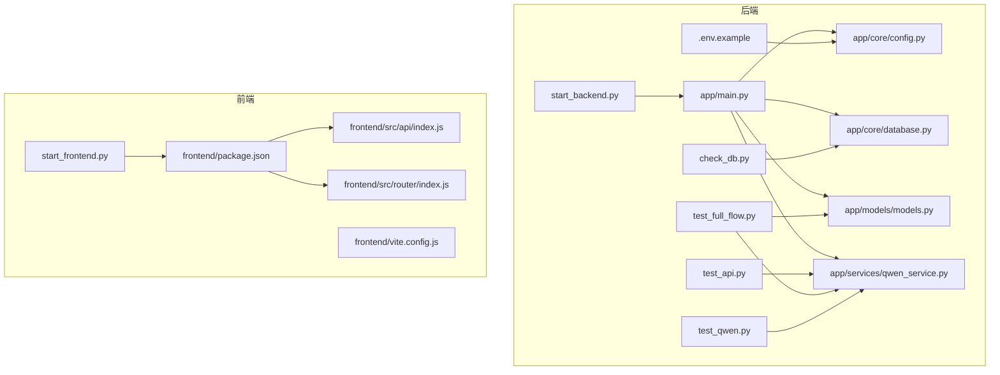
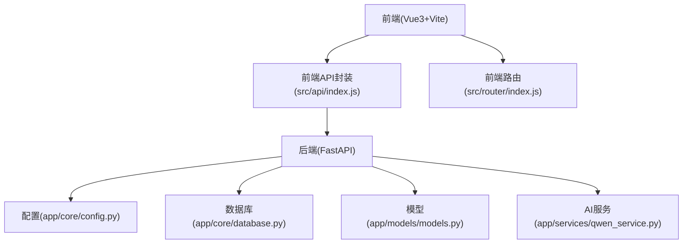
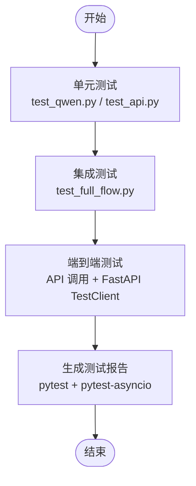
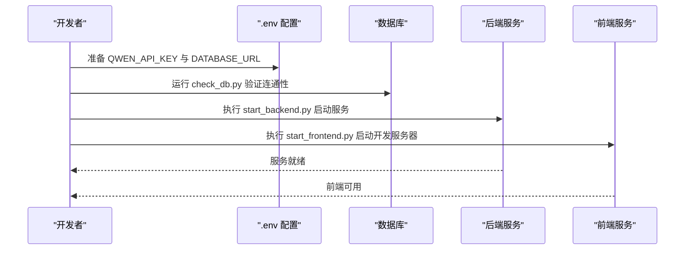
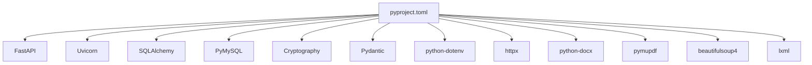

# 测试与部署

<cite>
**本文引用的文件**
- [backend/pyproject.toml](file://backend/pyproject.toml)
- [backend/test_api.py](file://backend/test_api.py)
- [backend/test_full_flow.py](file://backend/test_full_flow.py)
- [backend/test_qwen.py](file://backend/test_qwen.py)
- [backend/.env.example](file://backend/.env.example)
- [backend/check_db.py](file://backend/check_db.py)
- [backend/app/main.py](file://backend/app/main.py)
- [backend/app/services/qwen_service.py](file://backend/app/services/qwen_service.py)
- [backend/app/models/models.py](file://backend/app/models/models.py)
- [backend/app/core/database.py](file://backend/app/core/database.py)
- [backend/app/core/config.py](file://backend/app/core/config.py)
- [backend/start_backend.py](file://backend/start_backend.py)
- [backend/start_frontend.py](file://backend/start_frontend.py)
- [check_config.py](file://check_config.py)
- [frontend/package.json](file://frontend/package.json)
- [frontend/vite.config.js](file://frontend/vite.config.js)
- [frontend/src/api/index.js](file://frontend/src/api/index.js)
- [frontend/src/router/index.js](file://frontend/src/router/index.js)
</cite>

## 目录
1. [引言](#引言)
2. [项目结构](#项目结构)
3. [核心组件](#核心组件)
4. [架构总览](#架构总览)
5. [详细组件分析](#详细组件分析)
6. [依赖关系分析](#依赖关系分析)
7. [性能考虑](#性能考虑)
8. [故障排除指南](#故障排除指南)
9. [结论](#结论)
10. [附录](#附录)

## 引言
本指南围绕个人学习管理系统在后端与前端的测试与部署实践展开，覆盖单元测试、集成测试与端到端测试的策略设计、测试环境搭建、持续集成与持续部署建议、生产环境部署要求、Docker容器化部署思路、监控告警与日志记录、性能优化以及故障排除与回滚机制。文档内容基于仓库现有文件进行归纳总结，确保可操作性与可追溯性。

## 项目结构
项目采用前后端分离架构：后端为 Python + FastAPI 应用，使用 SQLAlchemy 进行数据库访问；前端为 Vue 3 + Vite 应用。测试与部署相关的关键文件分布如下：
- 后端测试与运行：test_api.py、test_full_flow.py、test_qwen.py、start_backend.py
- 配置与环境：.env.example、check_config.py、check_db.py、pyproject.toml
- 前端构建与运行：package.json、vite.config.js、src/api/index.js、src/router/index.js
- 核心应用入口：backend/app/main.py、backend/app/services/qwen_service.py、backend/app/models/models.py、backend/app/core/database.py、backend/app/core/config.py

图表来源
- [backend/app/main.py](file://backend/app/main.py)
- [backend/app/core/config.py](file://backend/app/core/config.py)
- [backend/app/core/database.py](file://backend/app/core/database.py)
- [backend/app/models/models.py](file://backend/app/models/models.py)
- [backend/app/services/qwen_service.py](file://backend/app/services/qwen_service.py)
- [backend/test_api.py](file://backend/test_api.py)
- [backend/test_full_flow.py](file://backend/test_full_flow.py)
- [backend/test_qwen.py](file://backend/test_qwen.py)
- [backend/start_backend.py](file://backend/start_backend.py)
- [backend/.env.example](file://backend/.env.example)
- [backend/check_db.py](file://backend/check_db.py)
- [frontend/package.json](file://frontend/package.json)
- [frontend/vite.config.js](file://frontend/vite.config.js)
- [frontend/src/api/index.js](file://frontend/src/api/index.js)
- [frontend/src/router/index.js](file://frontend/src/router/index.js)
- [backend/start_frontend.py](file://backend/start_frontend.py)

章节来源
- [backend/pyproject.toml](file://backend/pyproject.toml#L1-L29)
- [backend/.env.example](file://backend/.env.example#L1-L14)
- [backend/start_backend.py](file://backend/start_backend.py#L1-L17)
- [backend/start_frontend.py](file://backend/start_frontend.py#L1-L11)
- [frontend/package.json](file://frontend/package.json#L1-L23)

## 核心组件
- 后端应用入口与路由：app/main.py 提供 FastAPI 应用实例，负责注册路由与中间件。
- 配置模块：app/core/config.py 负责加载环境变量与应用配置。
- 数据库模块：app/core/database.py 提供数据库引擎与连接能力。
- 模型定义：app/models/models.py 定义数据模型与枚举类型（如题目类型）。
- AI 服务：app/services/qwen_service.py 封装通义千问接口调用，支持知识点提炼与题目生成。
- 测试脚本：test_api.py、test_full_flow.py、test_qwen.py 分别覆盖服务功能、完整流程与题目生成。
- 前端构建与运行：frontend/package.json、vite.config.js、src/api/index.js、src/router/index.js 组成前端工程。

章节来源
- [backend/app/main.py](file://backend/app/main.py)
- [backend/app/core/config.py](file://backend/app/core/config.py)
- [backend/app/core/database.py](file://backend/app/core/database.py)
- [backend/app/models/models.py](file://backend/app/models/models.py)
- [backend/app/services/qwen_service.py](file://backend/app/services/qwen_service.py)
- [backend/test_api.py](file://backend/test_api.py#L1-L30)
- [backend/test_full_flow.py](file://backend/test_full_flow.py#L1-L56)
- [backend/test_qwen.py](file://backend/test_qwen.py#L1-L23)
- [frontend/package.json](file://frontend/package.json#L1-L23)
- [frontend/vite.config.js](file://frontend/vite.config.js)
- [frontend/src/api/index.js](file://frontend/src/api/index.js)
- [frontend/src/router/index.js](file://frontend/src/router/index.js)

## 架构总览
后端采用 FastAPI + SQLAlchemy 的典型 Web 应用架构，AI 能力通过 qwen_service 对外暴露异步接口。前端通过 axios 访问后端 API，路由由 vue-router 管理。测试脚本直接调用服务层方法，模拟真实业务流程。

图表来源
- [frontend/src/api/index.js](file://frontend/src/api/index.js)
- [frontend/src/router/index.js](file://frontend/src/router/index.js)
- [backend/app/main.py](file://backend/app/main.py)
- [backend/app/core/config.py](file://backend/app/core/config.py)
- [backend/app/core/database.py](file://backend/app/core/database.py)
- [backend/app/models/models.py](file://backend/app/models/models.py)
- [backend/app/services/qwen_service.py](file://backend/app/services/qwen_service.py)

## 详细组件分析

### 测试框架与策略
- 单元测试
  - 针对 qwen_service 的功能测试：test_qwen.py 与 test_api.py 展示了知识点提炼与题目生成的最小闭环调用，适合作为单元测试的参考模板。
  - 建议：使用 pytest 与 pytest-asyncio 运行异步测试，将 test_qwen.py 与 test_api.py 改写为 pytest 形式的断言用例，便于 CI 集成。
- 集成测试
  - test_full_flow.py 演示了从知识点提炼到题目生成再到本地模型对象创建的完整链路，可作为集成测试的骨架，验证服务层与模型层协作。
- 端到端测试
  - 建议：在现有 test_api.py 基础上增加对后端 API 接口的调用（例如通过 httpx 或 FastAPI TestClient），覆盖完整的请求-响应路径，验证路由、序列化与异常处理。

图表来源
- [backend/test_qwen.py](file://backend/test_qwen.py#L1-L23)
- [backend/test_api.py](file://backend/test_api.py#L1-L30)
- [backend/test_full_flow.py](file://backend/test_full_flow.py#L1-L56)
- [backend/pyproject.toml](file://backend/pyproject.toml#L24-L28)

章节来源
- [backend/test_qwen.py](file://backend/test_qwen.py#L1-L23)
- [backend/test_api.py](file://backend/test_api.py#L1-L30)
- [backend/test_full_flow.py](file://backend/test_full_flow.py#L1-L56)
- [backend/pyproject.toml](file://backend/pyproject.toml#L24-L28)

### 测试环境搭建与配置
- 环境变量
  - 使用 .env.example 提供示例配置，包括通义千问 API 密钥与数据库 URL。生产环境建议通过系统环境变量注入，避免硬编码。
- 数据库检查
  - check_db.py 用于验证数据库连通性与基础查询，可作为测试前的健康检查步骤。
- 启动脚本
  - start_backend.py 使用 uv run uvicorn 启动后端服务，便于在受控环境中快速运行。
  - start_frontend.py 使用 bunx 启动 Vite 开发服务器，便于前端联调。

图表来源
- [backend/.env.example](file://backend/.env.example#L1-L14)
- [backend/check_db.py](file://backend/check_db.py#L1-L8)
- [backend/start_backend.py](file://backend/start_backend.py#L1-L17)
- [backend/start_frontend.py](file://backend/start_frontend.py#L1-L11)

章节来源
- [backend/.env.example](file://backend/.env.example#L1-L14)
- [backend/check_db.py](file://backend/check_db.py#L1-L8)
- [backend/start_backend.py](file://backend/start_backend.py#L1-L17)
- [backend/start_frontend.py](file://backend/start_frontend.py#L1-L11)

### 持续集成与持续部署（CI/CD）建议
- 测试执行
  - 在 CI 中使用 uv 与 pytest-asyncio 运行测试套件，确保单元、集成与端到端测试均通过。
- 构建与打包
  - 后端：使用 uv 构建 Python 包，结合 pyproject.toml 的依赖声明。
  - 前端：使用 npm/yarn/bun 的构建命令生成静态资源。
- 部署流水线
  - 建议分阶段：开发分支 -> 预发布 -> 生产，每次变更触发自动化测试与构建。
- 安全与密钥
  - 将 QWEN_API_KEY、DATABASE_URL 等敏感信息存储于 CI 的机密变量中，避免提交到仓库。

章节来源
- [backend/pyproject.toml](file://backend/pyproject.toml#L1-L29)
- [backend/test_api.py](file://backend/test_api.py#L1-L30)
- [backend/test_full_flow.py](file://backend/test_full_flow.py#L1-L56)
- [backend/test_qwen.py](file://backend/test_qwen.py#L1-L23)

### 生产环境部署要求
- 运行时与依赖
  - Python 版本要求：>=3.12；依赖通过 pyproject.toml 声明，使用 uv 管理。
- 环境变量
  - 必填项：QWEN_API_KEY、DATABASE_URL；可选项：APP_NAME、DEBUG。
- 数据库
  - 支持 MySQL 与 SQLite；生产环境推荐 MySQL，测试环境可使用 SQLite。
- 启动方式
  - 使用 uvicorn 启动 FastAPI 应用，绑定 0.0.0.0 与指定端口。

章节来源
- [backend/pyproject.toml](file://backend/pyproject.toml#L6-L22)
- [backend/.env.example](file://backend/.env.example#L1-L14)
- [backend/start_backend.py](file://backend/start_backend.py#L9-L16)

### Docker 容器化部署（思路与步骤）
- 镜像构建
  - 基于 Python 3.12 基础镜像，安装系统依赖，复制后端代码与依赖声明，使用 uv 安装依赖。
- 环境变量注入
  - 通过 Docker 环境变量或 .env 文件映射注入 QWEN_API_KEY、DATABASE_URL 等。
- 端口与卷
  - 暴露 8000 端口，挂载静态资源或日志目录（如需持久化）。
- 健康检查
  - 在容器内执行 check_db.py 或对 /docs 进行 GET 请求，验证服务可用性。
- 前端静态化
  - 前端构建产物可放入 Nginx 容器对外提供静态资源，或在后端统一返回静态页面（视具体部署策略而定）。

章节来源
- [backend/pyproject.toml](file://backend/pyproject.toml#L6-L22)
- [backend/.env.example](file://backend/.env.example#L1-L14)
- [backend/check_db.py](file://backend/check_db.py#L1-L8)
- [backend/start_backend.py](file://backend/start_backend.py#L9-L16)

### 监控告警、日志记录与性能优化
- 日志记录
  - 在 FastAPI 中启用 uvicorn 的日志级别，结合 Python logging 模块输出结构化日志。
- 性能优化
  - 使用连接池与异步 I/O；对 AI 接口调用设置超时与重试；缓存热点数据（如常见知识点与题目）。
- 健康检查与指标
  - 暴露 /health 接口返回服务状态；记录关键指标（请求耗时、错误率、队列长度）。

章节来源
- [backend/app/main.py](file://backend/app/main.py)
- [backend/app/core/database.py](file://backend/app/core/database.py)

### 故障排除与回滚机制
- 配置检查
  - 使用 check_config.py 自动检测 .env 与环境变量，定位缺失项。
- 数据库诊断
  - 使用 check_db.py 查询基础表，确认连接与权限。
- 回滚策略
  - 采用蓝绿/金丝雀发布，保留上一版本镜像；出现问题时快速切换流量并回滚。

章节来源
- [check_config.py](file://check_config.py#L1-L105)
- [backend/check_db.py](file://backend/check_db.py#L1-L8)

## 依赖关系分析
后端依赖通过 pyproject.toml 声明，核心包括 FastAPI、Uvicorn、SQLAlchemy、PyMySQL、Cryptography、Pydantic、python-dotenv、httpx、文件解析库等。前端依赖包括 Vue 3、Vue Router、Pinia、Axios、Vite 等。

图表来源
- [backend/pyproject.toml](file://backend/pyproject.toml#L7-L22)

章节来源
- [backend/pyproject.toml](file://backend/pyproject.toml#L1-L29)
- [frontend/package.json](file://frontend/package.json#L11-L21)

## 性能考虑
- 异步化：充分利用 async/await 与异步数据库驱动，减少阻塞。
- 缓存：对高频知识点与题目生成结果进行缓存，降低重复调用成本。
- 超时与重试：为外部 AI 服务设置合理超时与指数退避重试。
- 连接池：配置 SQLAlchemy 连接池大小，避免并发瓶颈。
- 前端性能：按需加载路由与组件，压缩静态资源，启用 CDN。

章节来源
- [backend/app/services/qwen_service.py](file://backend/app/services/qwen_service.py)
- [backend/app/core/database.py](file://backend/app/core/database.py)

## 故障排除指南
- 环境变量缺失
  - 症状：服务启动失败或运行时报错。
  - 处理：使用 check_config.py 输出提示，补充 .env 文件中的 QWEN_API_KEY 与 DATABASE_URL。
- 数据库不可达
  - 症状：查询失败或连接异常。
  - 处理：使用 check_db.py 执行基础查询，核对连接字符串与网络权限。
- 依赖冲突
  - 症状：安装或运行时报错。
  - 处理：清理虚拟环境，使用 uv 重新安装依赖，确保 Python 版本满足要求。
- 前端无法访问后端
  - 症状：跨域错误或 404。
  - 处理：确认后端监听地址与端口，检查 CORS 配置与代理设置。

章节来源
- [check_config.py](file://check_config.py#L10-L53)
- [backend/check_db.py](file://backend/check_db.py#L1-L8)
- [backend/pyproject.toml](file://backend/pyproject.toml#L6-L7)
- [backend/start_backend.py](file://backend/start_backend.py#L9-L16)

## 结论
本指南基于现有代码与配置，给出了测试与部署的系统化实践建议。通过完善 pytest 测试、建立 CI/CD 流水线、规范生产环境配置与 Docker 化部署、强化监控与日志、以及制定回滚机制，可显著提升系统的稳定性与交付效率。后续可在现有基础上扩展端到端测试与自动化部署脚本，进一步增强质量保障能力。

## 附录
- 关键文件清单与用途
  - backend/pyproject.toml：后端依赖与开发依赖声明
  - backend/test_api.py、test_full_flow.py、test_qwen.py：测试脚本
  - backend/.env.example：环境变量示例
  - backend/check_db.py：数据库连通性检查
  - backend/start_backend.py、backend/start_frontend.py：开发环境启动脚本
  - check_config.py：配置检查工具
  - frontend/package.json、vite.config.js、src/api/index.js、src/router/index.js：前端工程配置与入口

章节来源
- [backend/pyproject.toml](file://backend/pyproject.toml#L1-L29)
- [backend/test_api.py](file://backend/test_api.py#L1-L30)
- [backend/test_full_flow.py](file://backend/test_full_flow.py#L1-L56)
- [backend/test_qwen.py](file://backend/test_qwen.py#L1-L23)
- [backend/.env.example](file://backend/.env.example#L1-L14)
- [backend/check_db.py](file://backend/check_db.py#L1-L8)
- [backend/start_backend.py](file://backend/start_backend.py#L1-L17)
- [backend/start_frontend.py](file://backend/start_frontend.py#L1-L11)
- [check_config.py](file://check_config.py#L1-L105)
- [frontend/package.json](file://frontend/package.json#L1-L23)
- [frontend/vite.config.js](file://frontend/vite.config.js)
- [frontend/src/api/index.js](file://frontend/src/api/index.js)
- [frontend/src/router/index.js](file://frontend/src/router/index.js)