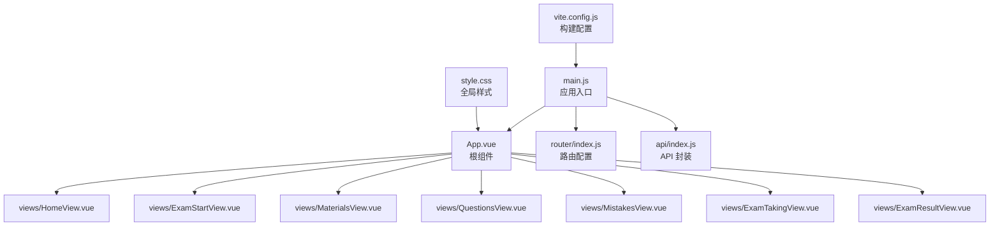
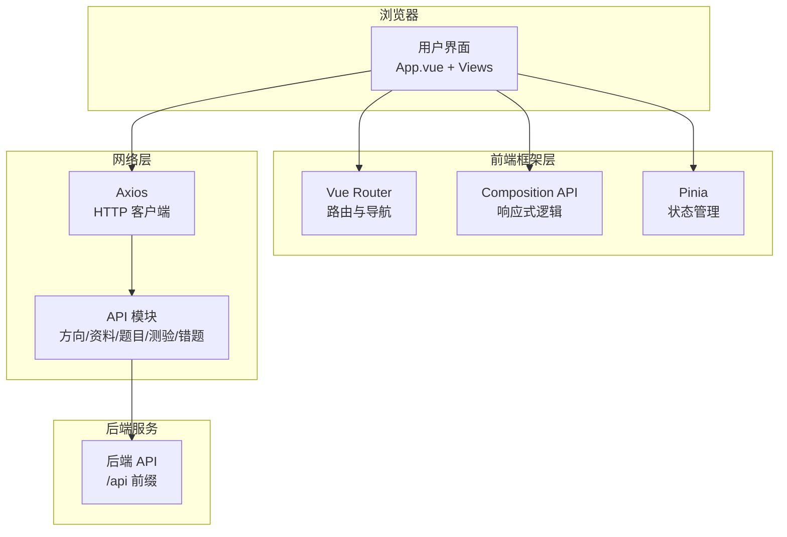
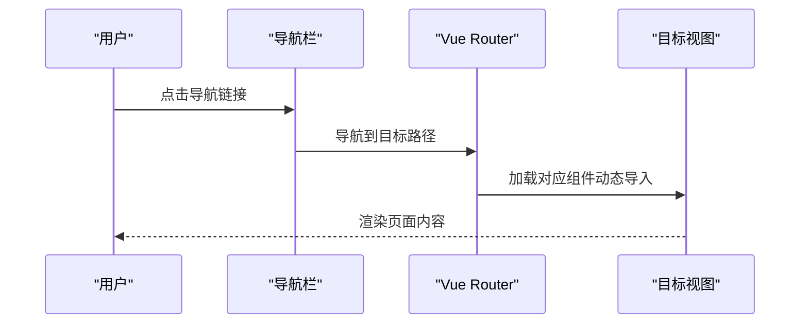
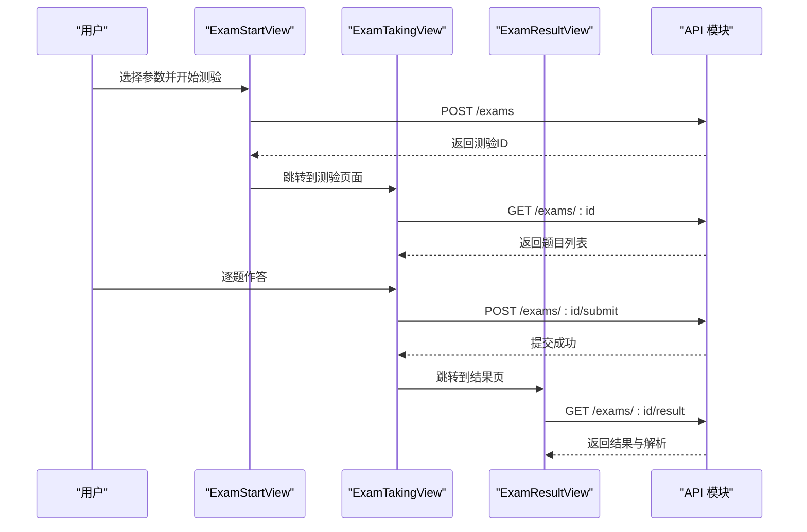
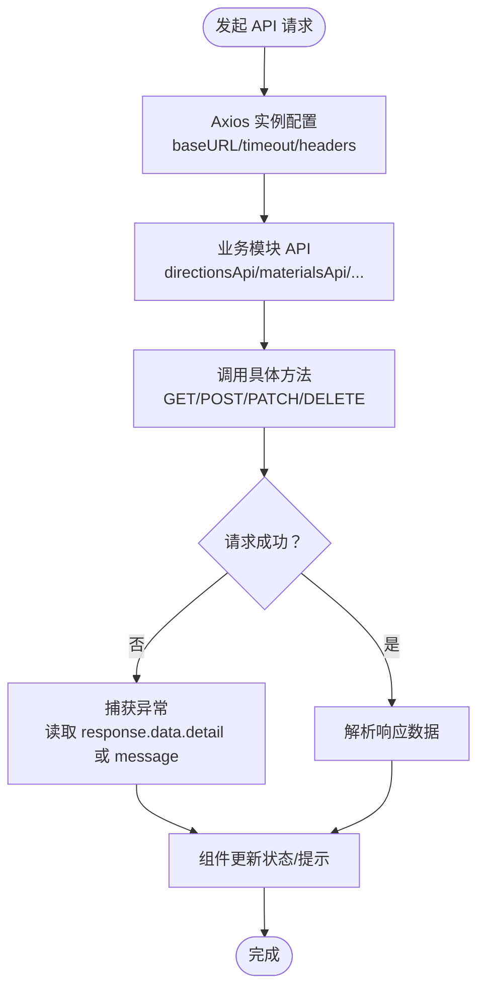
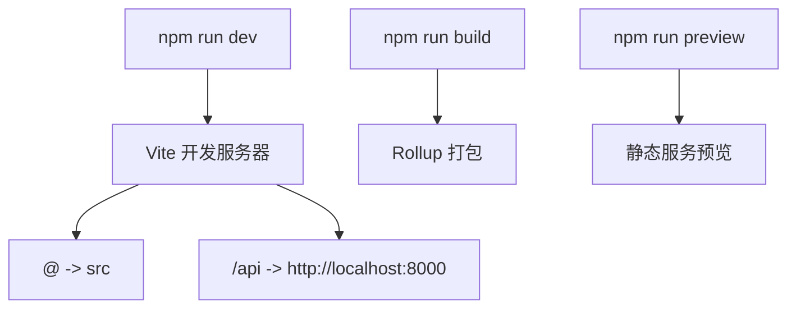
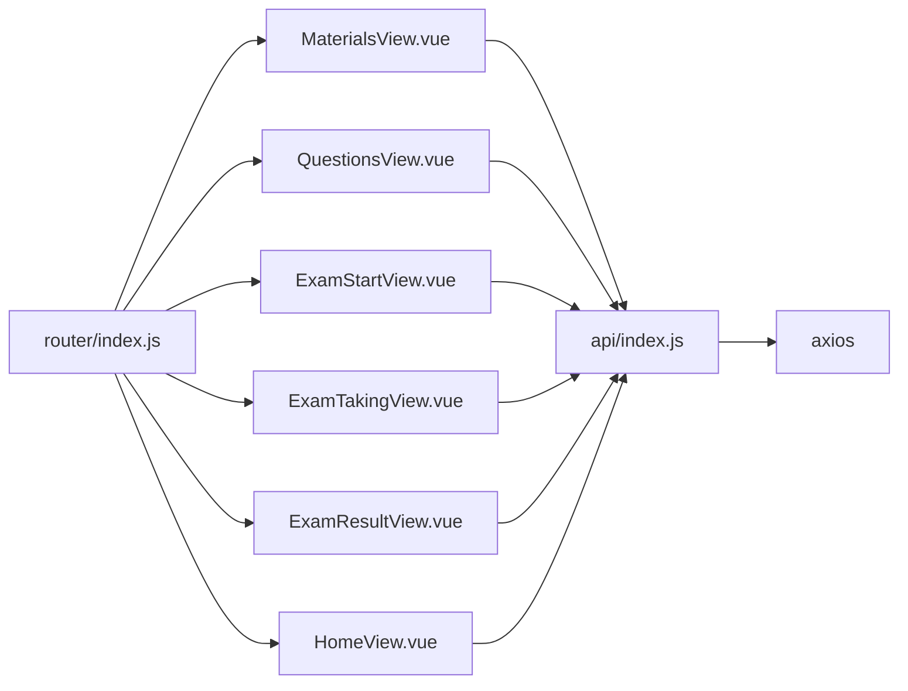

# 前端架构设计

<cite>
**本文档引用的文件**
- [frontend/src/main.js](file://frontend/src/main.js)
- [frontend/src/App.vue](file://frontend/src/App.vue)
- [frontend/src/router/index.js](file://frontend/src/router/index.js)
- [frontend/src/api/index.js](file://frontend/src/api/index.js)
- [frontend/vite.config.js](file://frontend/vite.config.js)
- [frontend/package.json](file://frontend/package.json)
- [frontend/src/style.css](file://frontend/src/style.css)
- [frontend/src/views/HomeView.vue](file://frontend/src/views/HomeView.vue)
- [frontend/src/views/ExamStartView.vue](file://frontend/src/views/ExamStartView.vue)
- [frontend/src/views/MaterialsView.vue](file://frontend/src/views/MaterialsView.vue)
- [frontend/src/views/QuestionsView.vue](file://frontend/src/views/QuestionsView.vue)
- [frontend/src/views/MistakesView.vue](file://frontend/src/views/MistakesView.vue)
- [frontend/src/views/ExamTakingView.vue](file://frontend/src/views/ExamTakingView.vue)
- [frontend/src/views/ExamResultView.vue](file://frontend/src/views/ExamResultView.vue)
</cite>

## 目录
1. [引言](#引言)
2. [项目结构](#项目结构)
3. [核心组件](#核心组件)
4. [架构总览](#架构总览)
5. [详细组件分析](#详细组件分析)
6. [依赖关系分析](#依赖关系分析)
7. [性能考虑](#性能考虑)
8. [故障排除指南](#故障排除指南)
9. [结论](#结论)

## 引言

本项目是一个基于 Vue 3 的单页应用（SPA），采用 Composition API 和现代前端技术栈，结合后端 AI 服务实现“学习资料上传 → 自动生成题目 → 在线测验 → 错题沉淀”的完整学习闭环。前端通过 Vite 构建，使用 Vue Router 实现客户端路由，通过 Axios 封装统一 API 接口，采用 Pinia 进行状态管理，配合响应式设计与动画效果提升用户体验。

## 项目结构

前端项目位于 `frontend/` 目录，采用典型的 Vue 3 单文件组件（SFC）组织方式：

- 入口与根组件
  - 应用入口：`frontend/src/main.js`
  - 根组件：`frontend/src/App.vue`
- 路由配置：`frontend/src/router/index.js`
- API 封装：`frontend/src/api/index.js`
- 视图组件：`frontend/src/views/` 下的各页面组件
- 样式与主题：`frontend/src/style.css`
- 构建配置：`frontend/vite.config.js`
- 包管理：`frontend/package.json`

**图表来源**
- [frontend/src/main.js](file://frontend/src/main.js#L1-L12)
- [frontend/src/App.vue](file://frontend/src/App.vue#L1-L202)
- [frontend/src/router/index.js](file://frontend/src/router/index.js#L1-L47)
- [frontend/src/api/index.js](file://frontend/src/api/index.js#L1-L52)
- [frontend/src/style.css](file://frontend/src/style.css#L1-L404)
- [frontend/vite.config.js](file://frontend/vite.config.js#L1-L22)

**章节来源**
- [frontend/src/main.js](file://frontend/src/main.js#L1-L12)
- [frontend/src/App.vue](file://frontend/src/App.vue#L1-L202)
- [frontend/src/router/index.js](file://frontend/src/router/index.js#L1-L47)
- [frontend/src/api/index.js](file://frontend/src/api/index.js#L1-L52)
- [frontend/vite.config.js](file://frontend/vite.config.js#L1-L22)

## 核心组件

- 应用入口与挂载
  - 使用 `createApp(App)` 创建应用实例，注册 Pinia 和 Vue Router，最后挂载到 DOM。
- 根组件与导航
  - 根组件负责全局导航栏与主内容区域，使用 `<router-view />` 渲染当前路由对应的视图。
- 路由系统
  - 客户端路由基于 History 模式，定义了首页、资料管理、题目管理、测验流程、错题本等页面。
- API 层
  - Axios 实例化配置基础路径、超时与请求头；按业务模块导出 API 方法，统一错误处理。
- 样式体系
  - 通过 CSS 变量定义主题色、阴影、圆角、动画时长等，全局样式与组件 scoped 样式结合。

**章节来源**
- [frontend/src/main.js](file://frontend/src/main.js#L1-L12)
- [frontend/src/App.vue](file://frontend/src/App.vue#L1-L202)
- [frontend/src/router/index.js](file://frontend/src/router/index.js#L1-L47)
- [frontend/src/api/index.js](file://frontend/src/api/index.js#L1-L52)
- [frontend/src/style.css](file://frontend/src/style.css#L1-L404)

## 架构总览

该前端应用遵循经典的 SPA 架构：浏览器加载单页应用 → 客户端路由接管页面切换 → 组件通过 API 层与后端交互 → 数据驱动视图渲染。路由采用代码分割（动态导入），组件按需加载，提升首屏性能。

**图表来源**
- [frontend/src/App.vue](file://frontend/src/App.vue#L1-L202)
- [frontend/src/router/index.js](file://frontend/src/router/index.js#L1-L47)
- [frontend/src/api/index.js](file://frontend/src/api/index.js#L1-L52)
- [frontend/vite.config.js](file://frontend/vite.config.js#L14-L20)

## 详细组件分析

### 路由与导航

- 路由配置
  - 使用 History 模式，定义首页、资料、题目、测验（开始/进行/结果）、错题本等路由。
  - 测验路由包含动态参数与嵌套路由，支持从开始到结果的完整流程。
- 导航设计
  - 根组件提供导航栏，使用 `<router-link>` 实现无刷新跳转，激活态样式高亮。
  - 页面切换带有淡入淡出过渡动画，增强用户体验。

**图表来源**
- [frontend/src/App.vue](file://frontend/src/App.vue#L3-L17)
- [frontend/src/router/index.js](file://frontend/src/router/index.js#L3-L39)

**章节来源**
- [frontend/src/router/index.js](file://frontend/src/router/index.js#L1-L47)
- [frontend/src/App.vue](file://frontend/src/App.vue#L1-L202)

### 视图组件与业务流程

- 首页（HomeView）
  - 展示学习方向、统计信息与快速入口卡片。
  - 支持添加学习方向、查看资料与题目数量统计。
- 资料管理（MaterialsView）
  - 支持按方向筛选、上传资料（文本/MD 文件）、SSE 实时进度展示。
  - 提供 Markdown 预览、核心知识点标签、删除资料等功能。
- 题目管理（QuestionsView）
  - 多维筛选（方向/类型/资料），支持编辑、删除、评价题目。
- 测验流程（ExamStartView → ExamTakingView → ExamResultView）
  - 开始测验：选择方向、模式、时间限制、评分方式与题目数量。
  - 进行测验：计时、题目导航、答案收集、自动提交。
  - 结果展示：分数/等级、答题详情、AI 评语与解析。
- 错题本（MistakesView）
  - 按方向与掌握状态筛选，支持查看答案、标记掌握状态、记录复习。

**图表来源**
- [frontend/src/views/ExamStartView.vue](file://frontend/src/views/ExamStartView.vue#L100-L156)
- [frontend/src/views/ExamTakingView.vue](file://frontend/src/views/ExamTakingView.vue#L102-L242)
- [frontend/src/views/ExamResultView.vue](file://frontend/src/views/ExamResultView.vue#L79-L111)
- [frontend/src/api/index.js](file://frontend/src/api/index.js#L36-L42)

**章节来源**
- [frontend/src/views/HomeView.vue](file://frontend/src/views/HomeView.vue#L1-L720)
- [frontend/src/views/MaterialsView.vue](file://frontend/src/views/MaterialsView.vue#L1-L881)
- [frontend/src/views/QuestionsView.vue](file://frontend/src/views/QuestionsView.vue#L1-L554)
- [frontend/src/views/ExamStartView.vue](file://frontend/src/views/ExamStartView.vue#L1-L395)
- [frontend/src/views/ExamTakingView.vue](file://frontend/src/views/ExamTakingView.vue#L1-L516)
- [frontend/src/views/ExamResultView.vue](file://frontend/src/views/ExamResultView.vue#L1-L442)
- [frontend/src/views/MistakesView.vue](file://frontend/src/views/MistakesView.vue#L1-L409)

### API 封装与错误处理

- Axios 配置
  - 基础路径 `/api`，超时 3 分钟（适配 AI 处理耗时），统一 JSON 请求头。
- 模块化 API
  - 按业务拆分：学习方向、资料、题目、测验、错题，每个模块导出常用 CRUD 方法。
- 错误处理
  - 组件内捕获异常，优先展示后端返回的 detail 信息，必要时回退到 message。
  - 特定场景（如 SSE 连接）提供重试与清理逻辑。

**图表来源**
- [frontend/src/api/index.js](file://frontend/src/api/index.js#L1-L52)

**章节来源**
- [frontend/src/api/index.js](file://frontend/src/api/index.js#L1-L52)

### 响应式设计与用户体验

- 设计系统
  - 使用 CSS 变量定义主题色、渐变、阴影与动画时长，保证视觉一致性。
- 响应式布局
  - 在小屏设备上调整网格、卡片与按钮布局，确保移动端可用性。
- 动画与过渡
  - 页面切换、卡片进入、模态弹窗、进度条等均配有平滑动画，提升交互质感。
- 可访问性
  - 使用语义化标签与合理的对比度，提供键盘导航与焦点可见性。

**章节来源**
- [frontend/src/style.css](file://frontend/src/style.css#L1-L404)
- [frontend/src/App.vue](file://frontend/src/App.vue#L158-L201)

### 构建配置与开发工具链

- Vite 配置
  - 插件：@vitejs/plugin-vue
  - 路径别名：`@` 指向 `src`
  - 本地开发服务器：端口 5173，代理 `/api` 到后端 8000
- 包管理
  - 依赖：vue、vue-router、pinia、axios、marked
  - 脚本：dev/build/preview

**图表来源**
- [frontend/vite.config.js](file://frontend/vite.config.js#L1-L22)
- [frontend/package.json](file://frontend/package.json#L6-L10)

**章节来源**
- [frontend/vite.config.js](file://frontend/vite.config.js#L1-L22)
- [frontend/package.json](file://frontend/package.json#L1-L23)

## 依赖关系分析

- 组件耦合
  - 视图组件通过 API 模块与后端交互，避免直接引入后端细节。
  - 根组件集中管理导航与全局样式，降低重复代码。
- 外部依赖
  - Vue 3：组件系统与响应式
  - Vue Router：客户端路由与导航
  - Pinia：轻量状态管理
  - Axios：HTTP 客户端
  - Vite：构建与开发工具链

**图表来源**
- [frontend/src/views/MaterialsView.vue](file://frontend/src/views/MaterialsView.vue#L160-L401)
- [frontend/src/views/QuestionsView.vue](file://frontend/src/views/QuestionsView.vue#L156-L288)
- [frontend/src/views/ExamStartView.vue](file://frontend/src/views/ExamStartView.vue#L99-L157)
- [frontend/src/views/ExamTakingView.vue](file://frontend/src/views/ExamTakingView.vue#L102-L242)
- [frontend/src/views/ExamResultView.vue](file://frontend/src/views/ExamResultView.vue#L79-L111)
- [frontend/src/views/HomeView.vue](file://frontend/src/views/HomeView.vue#L143-L212)
- [frontend/src/api/index.js](file://frontend/src/api/index.js#L1-L52)
- [frontend/src/router/index.js](file://frontend/src/router/index.js#L1-L47)

**章节来源**
- [frontend/src/api/index.js](file://frontend/src/api/index.js#L1-L52)
- [frontend/src/router/index.js](file://frontend/src/router/index.js#L1-L47)

## 性能考虑

- 代码分割
  - 路由级懒加载（动态导入），减少首屏体积。
- 资源优化
  - 图片与 SVG 使用 CSS 背景与渐变，减少额外请求。
- 网络优化
  - Axios 超时设置适配后端 AI 处理，避免长时间等待。
- 交互优化
  - 预览与进度条采用节流/防抖策略，避免频繁重绘。
- 构建优化
  - 生产构建自动 Tree Shaking 与压缩，减少包体积。

[本节为通用建议，无需特定文件引用]

## 故障排除指南

- 路由跳转无效
  - 检查路由配置与 `<router-link to="...">` 是否匹配。
- API 请求失败
  - 查看控制台错误信息，确认后端服务运行与代理配置。
- 测验计时异常
  - 确认测验模式与时限参数，检查定时器清理逻辑。
- SSE 进度不更新
  - 检查事件源连接与错误回调，确保组件卸载时关闭连接。

**章节来源**
- [frontend/src/views/MaterialsView.vue](file://frontend/src/views/MaterialsView.vue#L341-L399)
- [frontend/src/views/ExamTakingView.vue](file://frontend/src/views/ExamTakingView.vue#L184-L241)

## 结论

该前端架构以 Vue 3 Composition API 为核心，结合 Vue Router、Axios 与 Pinia，实现了清晰的组件层次与良好的可维护性。通过路由懒加载、样式主题化与响应式设计，提供了优秀的用户体验。建议在后续迭代中进一步完善状态持久化、国际化与测试覆盖，以支撑更复杂的业务场景。