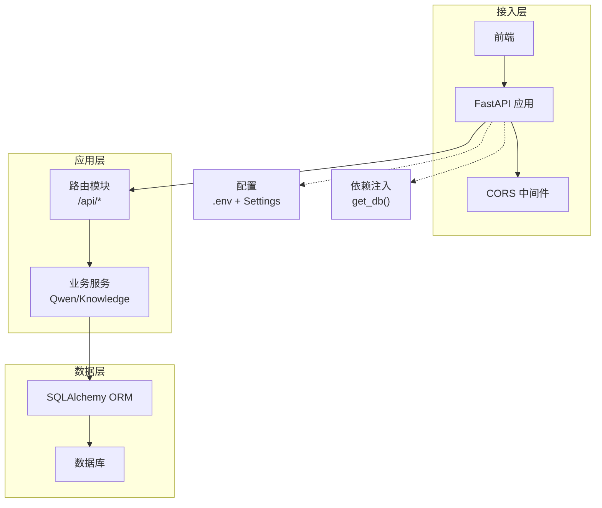
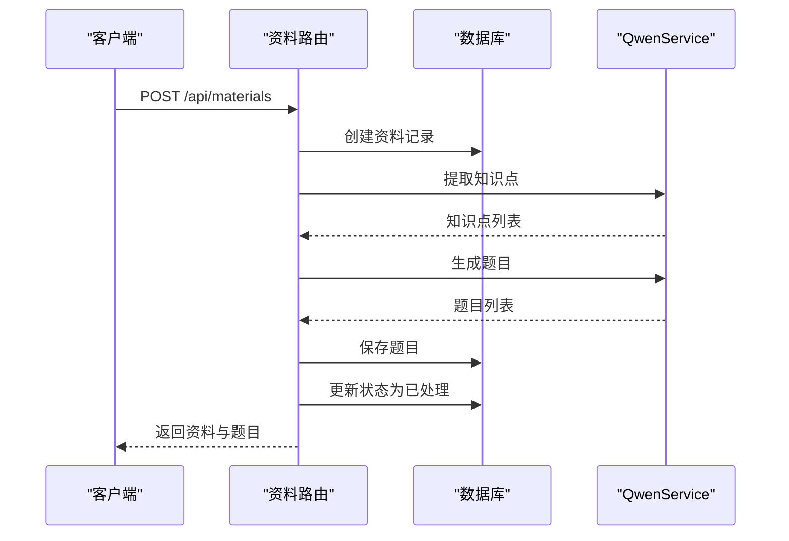
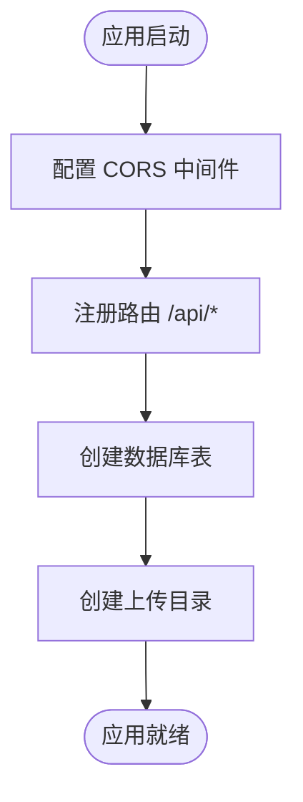
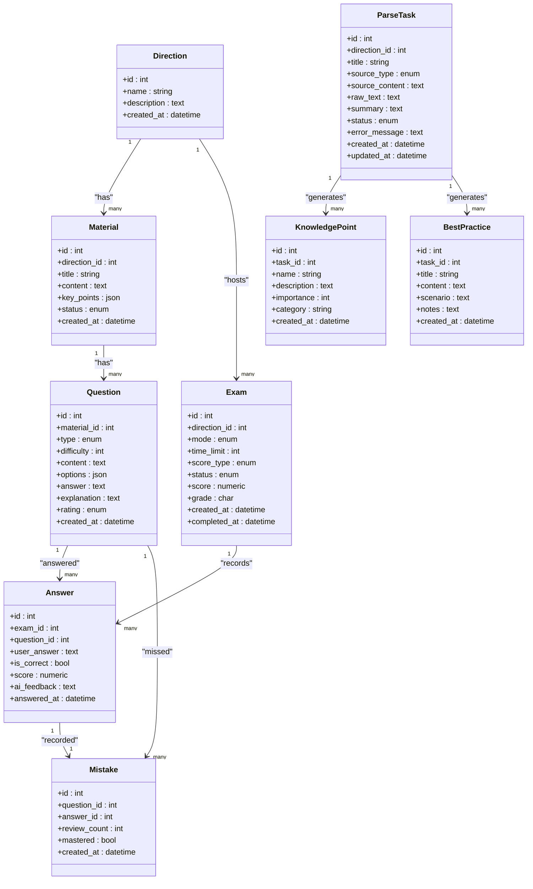
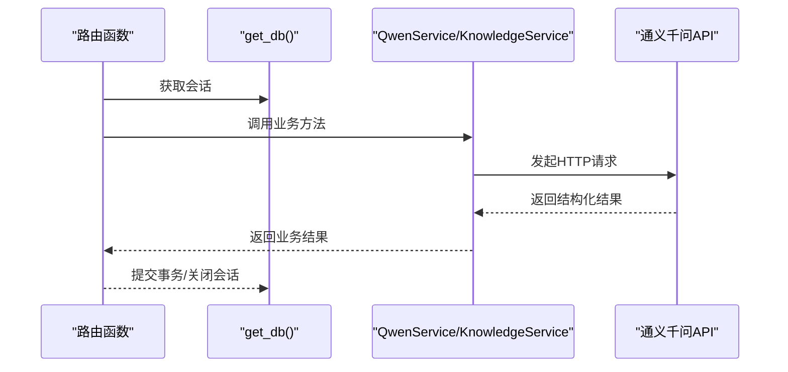
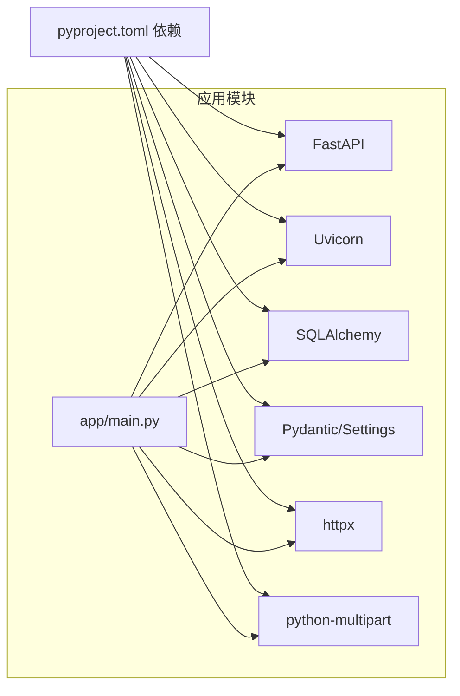

# 后端架构设计

<cite>
**本文档引用的文件**
- [backend/app/main.py](file://backend/app/main.py)
- [backend/app/core/config.py](file://backend/app/core/config.py)
- [backend/app/core/database.py](file://backend/app/core/database.py)
- [backend/app/api/__init__.py](file://backend/app/api/__init__.py)
- [backend/app/api/directions.py](file://backend/app/api/directions.py)
- [backend/app/api/materials.py](file://backend/app/api/materials.py)
- [backend/app/api/questions.py](file://backend/app/api/questions.py)
- [backend/app/api/exams.py](file://backend/app/api/exams.py)
- [backend/app/api/mistakes.py](file://backend/app/api/mistakes.py)
- [backend/app/models/models.py](file://backend/app/models/models.py)
- [backend/app/schemas/schemas.py](file://backend/app/schemas/schemas.py)
- [backend/app/services/knowledge_service.py](file://backend/app/services/knowledge_service.py)
- [backend/app/services/qwen_service.py](file://backend/app/services/qwen_service.py)
- [backend/pyproject.toml](file://backend/pyproject.toml)
- [backend/.env.example](file://backend/.env.example)
</cite>

## 目录
1. [简介](#简介)
2. [项目结构](#项目结构)
3. [核心组件](#核心组件)
4. [架构总览](#架构总览)
5. [详细组件分析](#详细组件分析)
6. [依赖关系分析](#依赖关系分析)
7. [性能考虑](#性能考虑)
8. [故障排查指南](#故障排查指南)
9. [结论](#结论)
10. [附录](#附录)

## 简介
本项目是一个基于 FastAPI 的“个人学习管理”后端系统，提供资料上传与解析、题目生成、智能评分、测验与错题管理等功能。系统采用清晰的分层架构：路由层(API)、业务层(服务)、数据访问层(ORM)与配置层，结合依赖注入、中间件与数据库连接池，确保可维护性与扩展性。

## 项目结构
后端采用按功能域划分的目录结构，主要模块如下：
- app/main.py：应用入口，注册中间件、路由与生命周期事件
- app/core：核心配置与数据库连接
- app/api：各功能模块的路由定义
- app/models：SQLAlchemy ORM 模型
- app/schemas：Pydantic 数据模式
- app/services：业务服务（如通义千问封装、知识解析服务）

```mermaid
graph TB
A["应用入口<br/>app/main.py"] --> B["核心配置<br/>app/core/config.py"]
A --> C["数据库引擎与会话<br/>app/core/database.py"]
A --> D["路由聚合<br/>app/api/__init__.py"]
D --> E["学习方向路由<br/>app/api/directions.py"]
D --> F["学习资料路由<br/>app/api/materials.py"]
D --> G["题目路由<br/>app/api/questions.py"]
D --> H["测验路由<br/>app/api/exams.py"]
D --> I["错题路由<br/>app/api/mistakes.py"]
J["ORM 模型<br/>app/models/models.py"] <- --> C
K["数据模式<br/>app/schemas/schemas.py"] <- --> J
L["通义千问服务<br/>app/services/qwen_service.py"] --> M["知识解析服务<br/>app/services/knowledge_service.py"]
```

图表来源
- [backend/app/main.py](file://backend/app/main.py#L1-L66)
- [backend/app/core/config.py](file://backend/app/core/config.py#L1-L34)
- [backend/app/core/database.py](file://backend/app/core/database.py#L1-L38)
- [backend/app/api/__init__.py](file://backend/app/api/__init__.py#L1-L17)
- [backend/app/api/directions.py](file://backend/app/api/directions.py#L1-L51)
- [backend/app/api/materials.py](file://backend/app/api/materials.py#L1-L203)
- [backend/app/api/questions.py](file://backend/app/api/questions.py#L1-L90)
- [backend/app/api/exams.py](file://backend/app/api/exams.py#L1-L240)
- [backend/app/api/mistakes.py](file://backend/app/api/mistakes.py#L1-L90)
- [backend/app/models/models.py](file://backend/app/models/models.py#L1-L223)
- [backend/app/schemas/schemas.py](file://backend/app/schemas/schemas.py#L1-L265)
- [backend/app/services/qwen_service.py](file://backend/app/services/qwen_service.py#L1-L156)
- [backend/app/services/knowledge_service.py](file://backend/app/services/knowledge_service.py#L1-L114)

章节来源
- [backend/app/main.py](file://backend/app/main.py#L1-L66)
- [backend/app/core/config.py](file://backend/app/core/config.py#L1-L34)
- [backend/app/core/database.py](file://backend/app/core/database.py#L1-L38)
- [backend/app/api/__init__.py](file://backend/app/api/__init__.py#L1-L17)

## 核心组件
- 应用入口与中间件
  - FastAPI 实例化、CORS 中间件、路由注册、启动事件（创建表与上传目录）
- 配置管理
  - 使用 pydantic-settings 加载 .env，支持应用名、数据库、通义千问 API、上传目录与文件大小限制
- 数据库连接与依赖注入
  - SQLAlchemy 引擎、会话工厂、Base 基类；依赖 get_db 提供会话注入
- 路由与控制器
  - 按功能域拆分路由模块，统一前缀 /api，使用 Pydantic 模式作为请求/响应模型
- 业务服务
  - QwenService：封装通义千问 API，支持知识点提取、题目生成、主观题评分
  - KnowledgeService：知识解析服务，用于解析任务的摘要、知识点与最佳实践
- 数据模型与模式
  - ORM 模型覆盖学习方向、资料、题目、测验、答题、错题、解析任务、知识点与最佳实践
  - Pydantic 模式定义请求/响应结构，支持 from_attributes 与枚举类型

章节来源
- [backend/app/main.py](file://backend/app/main.py#L1-L66)
- [backend/app/core/config.py](file://backend/app/core/config.py#L1-L34)
- [backend/app/core/database.py](file://backend/app/core/database.py#L1-L38)
- [backend/app/schemas/schemas.py](file://backend/app/schemas/schemas.py#L1-L265)
- [backend/app/models/models.py](file://backend/app/models/models.py#L1-L223)
- [backend/app/services/qwen_service.py](file://backend/app/services/qwen_service.py#L1-L156)
- [backend/app/services/knowledge_service.py](file://backend/app/services/knowledge_service.py#L1-L114)

## 架构总览
系统采用“路由层-服务层-数据层”的三层架构，配合依赖注入与中间件，形成清晰的职责边界与可测试性。



图表来源
- [backend/app/main.py](file://backend/app/main.py#L19-L42)
- [backend/app/core/config.py](file://backend/app/core/config.py#L6-L33)
- [backend/app/core/database.py](file://backend/app/core/database.py#L31-L37)
- [backend/app/api/directions.py](file://backend/app/api/directions.py#L1-L51)
- [backend/app/api/materials.py](file://backend/app/api/materials.py#L1-L203)
- [backend/app/api/questions.py](file://backend/app/api/questions.py#L1-L90)
- [backend/app/api/exams.py](file://backend/app/api/exams.py#L1-L240)
- [backend/app/api/mistakes.py](file://backend/app/api/mistakes.py#L1-L90)
- [backend/app/services/qwen_service.py](file://backend/app/services/qwen_service.py#L10-L155)
- [backend/app/services/knowledge_service.py](file://backend/app/services/knowledge_service.py#L11-L113)

## 详细组件分析

### 路由与控制器（RESTful 设计）
- 统一前缀与标签
  - 所有路由均以 /api 为前缀，并按功能域设置 tags，便于文档生成与维护
- 资源化设计
  - 学习方向、资料、题目、测验、错题均遵循资源命名与 CRUD 规范
- 查询参数与过滤
  - 支持多条件过滤（如方向 ID、状态、题型），提升灵活性
- SSE 流式响应
  - 资料处理进度通过 Server-Sent Events 实时推送，改善用户体验



图表来源
- [backend/app/api/materials.py](file://backend/app/api/materials.py#L82-L161)
- [backend/app/services/qwen_service.py](file://backend/app/services/qwen_service.py#L37-L114)

章节来源
- [backend/app/api/directions.py](file://backend/app/api/directions.py#L1-L51)
- [backend/app/api/materials.py](file://backend/app/api/materials.py#L1-L203)
- [backend/app/api/questions.py](file://backend/app/api/questions.py#L1-L90)
- [backend/app/api/exams.py](file://backend/app/api/exams.py#L1-L240)
- [backend/app/api/mistakes.py](file://backend/app/api/mistakes.py#L1-L90)

### 中间件与请求处理流程
- CORS 配置
  - 允许所有来源、凭证、方法与头，适用于开发环境；生产环境建议收紧
- 生命周期事件
  - startup 事件中创建数据库表与上传目录，保证运行前的基础设施就绪
- 根与健康检查
  - 根路径返回应用元信息；/health 返回健康状态



图表来源
- [backend/app/main.py](file://backend/app/main.py#L27-L49)

章节来源
- [backend/app/main.py](file://backend/app/main.py#L1-L66)

### 数据库连接管理与 ORM 映射
- 连接配置
  - 根据数据库类型动态设置连接参数；SQLite 关闭线程校验；MySQL/PG 设置连接池预热与回收
- 依赖注入
  - get_db 提供会话级依赖，确保每个请求独立会话并在结束后关闭
- 模型关系
  - 使用 SQLAlchemy relationship 建立实体间一对多/一对一关系，支持懒加载与联结加载



图表来源
- [backend/app/models/models.py](file://backend/app/models/models.py#L63-L223)

章节来源
- [backend/app/core/database.py](file://backend/app/core/database.py#L1-L38)
- [backend/app/models/models.py](file://backend/app/models/models.py#L1-L223)

### 依赖注入与业务逻辑分离
- 依赖注入
  - get_db 在路由函数中以参数形式注入，实现“按需取用”，避免全局状态
- 业务逻辑分离
  - 路由仅负责参数解析与调用服务；服务层封装外部 API 与复杂业务规则
- 单例服务
  - QwenService 与 KnowledgeService 以单例形式提供，减少重复初始化开销



图表来源
- [backend/app/core/database.py](file://backend/app/core/database.py#L31-L37)
- [backend/app/services/qwen_service.py](file://backend/app/services/qwen_service.py#L10-L155)
- [backend/app/services/knowledge_service.py](file://backend/app/services/knowledge_service.py#L11-L113)

章节来源
- [backend/app/core/database.py](file://backend/app/core/database.py#L1-L38)
- [backend/app/services/qwen_service.py](file://backend/app/services/qwen_service.py#L1-L156)
- [backend/app/services/knowledge_service.py](file://backend/app/services/knowledge_service.py#L1-L114)

### 异常处理策略与错误响应
- HTTP 异常
  - 资源不存在、重复创建、状态不合法等场景抛出 HTTPException，返回明确错误码与消息
- 服务异常捕获
  - 资料处理过程中捕获非 HTTP 异常，记录日志并回滚状态，保障数据一致性
- 错误响应格式
  - 统一使用 HTTP 状态码与标准错误消息，便于前端处理

章节来源
- [backend/app/api/directions.py](file://backend/app/api/directions.py#L20-L24)
- [backend/app/api/materials.py](file://backend/app/api/materials.py#L144-L159)
- [backend/app/api/exams.py](file://backend/app/api/exams.py#L134-L139)

### 异步处理与并发控制
- 异步能力
  - QwenService 与 KnowledgeService 使用 httpx.AsyncClient，支持异步调用外部 API
- 并发控制
  - 当前路由层未显式引入并发锁；资料处理流程为同步阻塞，适合小规模并发
- 建议
  - 大规模并发建议引入队列与后台任务（如 Celery/RQ）解耦耗时操作

章节来源
- [backend/app/services/qwen_service.py](file://backend/app/services/qwen_service.py#L18-L35)
- [backend/app/services/knowledge_service.py](file://backend/app/services/knowledge_service.py#L19-L36)
- [backend/app/api/materials.py](file://backend/app/api/materials.py#L27-L80)

### API 版本管理与文档生成
- 文档生成
  - FastAPI 默认启用 /docs（Swagger UI）与 /redoc，自动从路由注解生成接口文档
- 版本管理
  - 应用在实例化时声明版本号；当前未实现 URL 前缀版本化（如 /api/v1），建议后续引入版本前缀以兼容演进

章节来源
- [backend/app/main.py](file://backend/app/main.py#L19-L25)

## 依赖关系分析



图表来源
- [backend/pyproject.toml](file://backend/pyproject.toml#L7-L22)
- [backend/app/main.py](file://backend/app/main.py#L2-L6)

章节来源
- [backend/pyproject.toml](file://backend/pyproject.toml#L1-L29)

## 性能考虑
- 数据库连接池
  - MySQL/PG 已启用 pool_pre_ping 与 pool_recycle，有助于维持连接有效性与回收
- ORM 查询优化
  - 使用 joinedload 预加载关联，减少 N+1 查询
- 异步 I/O
  - 外部 API 调用采用异步客户端，降低等待时间
- 建议
  - 引入索引（如方向 ID、状态、创建时间）、缓存热点数据、分页查询与批量写入

## 故障排查指南
- 配置问题
  - 确认 .env 文件存在且包含 QWEN_API_KEY、DATABASE_URL、APP_NAME、DEBUG
- 数据库问题
  - 启动时自动建表；若连接失败，检查 DATABASE_URL 与驱动安装
- 资料处理失败
  - 查看服务日志；确认 QWEN_API_KEY 已配置；关注资料状态字段变化
- CORS 问题
  - 生产环境调整 allow_origins、allow_methods、allow_headers

章节来源
- [backend/.env.example](file://backend/.env.example#L1-L14)
- [backend/app/main.py](file://backend/app/main.py#L45-L49)
- [backend/app/api/materials.py](file://backend/app/api/materials.py#L94-L96)

## 结论
本项目以 FastAPI 为核心，构建了清晰的分层架构与完善的依赖注入体系。通过统一的路由前缀、Pydantic 模式与 SQLAlchemy ORM，实现了良好的可维护性与扩展性。建议后续引入版本化路由、后台任务与缓存策略，进一步提升性能与稳定性。

## 附录
- 环境变量参考
  - QWEN_API_KEY、QWEN_MODEL、DATABASE_URL、APP_NAME、DEBUG
- 依赖项
  - FastAPI、SQLAlchemy、Pydantic、httpx、python-multipart 等

章节来源
- [backend/.env.example](file://backend/.env.example#L1-L14)
- [backend/pyproject.toml](file://backend/pyproject.toml#L7-L22)