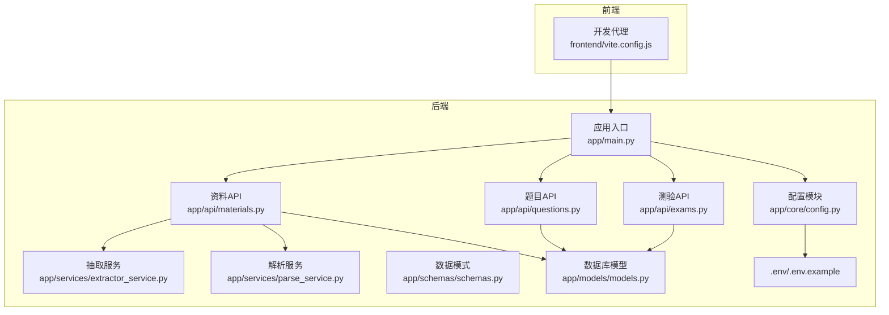
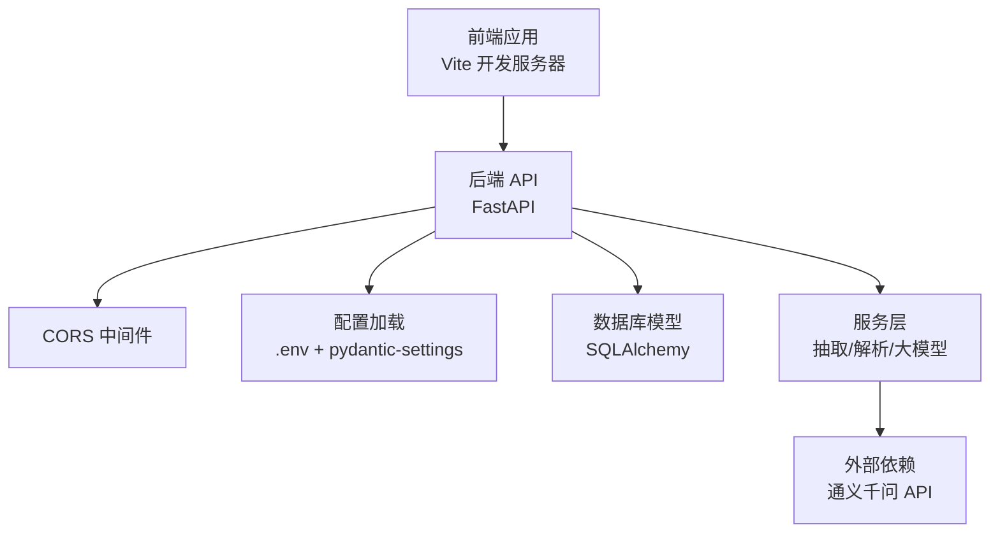
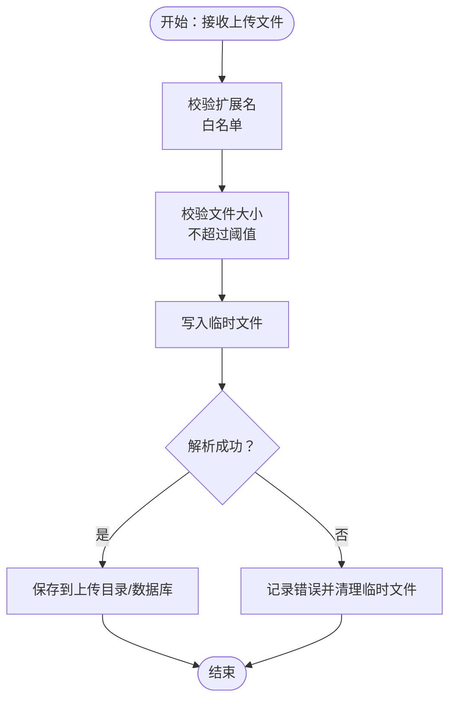
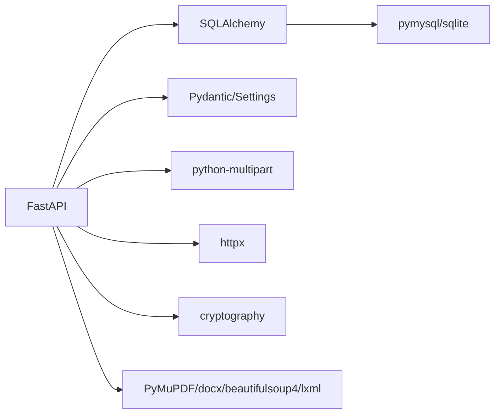

# 安全设计

<cite>
**本文引用的文件**
- [backend/app/main.py](file://backend/app/main.py)
- [backend/app/core/config.py](file://backend/app/core/config.py)
- [backend/.env](file://backend/.env)
- [backend/.env.example](file://backend/.env.example)
- [backend/pyproject.toml](file://backend/pyproject.toml)
- [backend/app/api/materials.py](file://backend/app/api/materials.py)
- [backend/app/api/questions.py](file://backend/app/api/questions.py)
- [backend/app/api/exams.py](file://backend/app/api/exams.py)
- [backend/app/services/extractor_service.py](file://backend/app/services/extractor_service.py)
- [backend/app/services/parse_service.py](file://backend/app/services/parse_service.py)
- [backend/app/models/models.py](file://backend/app/models/models.py)
- [backend/app/schemas/schemas.py](file://backend/app/schemas/schemas.py)
- [frontend/vite.config.js](file://frontend/vite.config.js)
</cite>

## 目录
1. [引言](#引言)
2. [项目结构](#项目结构)
3. [核心组件](#核心组件)
4. [架构总览](#架构总览)
5. [详细组件分析](#详细组件分析)
6. [依赖关系分析](#依赖关系分析)
7. [性能与安全权衡](#性能与安全权衡)
8. [故障排查指南](#故障排查指南)
9. [结论](#结论)
10. [附录](#附录)

## 引言
本文件面向安全工程师，系统化梳理个人学习管理系统的安全设计与实现现状，覆盖跨域与CORS策略、环境变量与敏感信息保护、API安全设计（请求验证与响应过滤）、文件上传安全与恶意文件检测、会话与身份认证、数据加密与传输安全、安全审计与日志记录等方面，并给出可操作的改进建议与最佳实践。

## 项目结构
后端基于 FastAPI，采用分层架构：入口与中间件在主应用中集中配置；API 层负责路由与业务编排；服务层封装抽取、解析与大模型交互；模型与模式定义数据结构与约束；前端通过 Vite 开发服务器代理后端接口。

图示来源
- [backend/app/main.py](file://backend/app/main.py#L1-L66)
- [backend/app/core/config.py](file://backend/app/core/config.py#L1-L34)
- [backend/app/api/materials.py](file://backend/app/api/materials.py#L1-L203)
- [backend/app/api/questions.py](file://backend/app/api/questions.py#L1-L90)
- [backend/app/api/exams.py](file://backend/app/api/exams.py#L1-L240)
- [backend/app/services/extractor_service.py](file://backend/app/services/extractor_service.py#L1-L123)
- [backend/app/services/parse_service.py](file://backend/app/services/parse_service.py#L1-L163)
- [backend/app/models/models.py](file://backend/app/models/models.py#L1-L223)
- [backend/app/schemas/schemas.py](file://backend/app/schemas/schemas.py#L1-L265)
- [frontend/vite.config.js](file://frontend/vite.config.js#L1-L21)

章节来源
- [backend/app/main.py](file://backend/app/main.py#L1-L66)
- [frontend/vite.config.js](file://frontend/vite.config.js#L1-L21)

## 核心组件
- 应用入口与CORS：集中初始化 FastAPI 应用，启用 CORS 中间件，默认允许任意来源、凭证、方法与头，便于开发但存在跨域风险。
- 配置与环境变量：使用 pydantic-settings 从 .env 加载配置，包含数据库连接、通义千问 API 密钥、上传目录与文件大小限制等。
- API 层：资料、题目、测验三大领域 API，均通过 SQLAlchemy 进行数据库访问，部分接口调用外部大模型服务。
- 服务层：抽取服务负责文件/URL 文本提取与格式校验；解析服务协调抽取与大模型分析，统一任务状态管理。
- 模型与模式：定义枚举类型、实体关系与序列化模式，确保数据一致性与接口契约。
- 前端代理：开发阶段通过 Vite 将 /api 前缀代理至后端，避免浏览器同源限制。

章节来源
- [backend/app/main.py](file://backend/app/main.py#L19-L34)
- [backend/app/core/config.py](file://backend/app/core/config.py#L6-L27)
- [backend/.env](file://backend/.env#L1-L14)
- [backend/.env.example](file://backend/.env.example#L1-L14)
- [backend/app/api/materials.py](file://backend/app/api/materials.py#L1-L203)
- [backend/app/api/questions.py](file://backend/app/api/questions.py#L1-L90)
- [backend/app/api/exams.py](file://backend/app/api/exams.py#L1-L240)
- [backend/app/services/extractor_service.py](file://backend/app/services/extractor_service.py#L1-L123)
- [backend/app/services/parse_service.py](file://backend/app/services/parse_service.py#L1-L163)
- [backend/app/models/models.py](file://backend/app/models/models.py#L1-L223)
- [backend/app/schemas/schemas.py](file://backend/app/schemas/schemas.py#L1-L265)
- [frontend/vite.config.js](file://frontend/vite.config.js#L14-L19)

## 架构总览
系统采用前后端分离，前端通过代理访问后端 API；后端通过中间件统一处理跨域；数据库模型与模式定义了数据与接口边界；服务层对文件与网络输入进行清洗与限制；对外部大模型服务的调用通过配置项隔离。

图示来源
- [backend/app/main.py](file://backend/app/main.py#L19-L34)
- [backend/app/core/config.py](file://backend/app/core/config.py#L6-L27)
- [backend/app/services/extractor_service.py](file://backend/app/services/extractor_service.py#L93-L118)
- [backend/app/services/parse_service.py](file://backend/app/services/parse_service.py#L108-L132)

## 详细组件分析

### CORS 配置与跨域安全策略
- 当前策略：允许任意来源、凭证、方法与头，适用于开发环境快速联调，但生产环境存在高风险。
- 风险点：任意来源可能导致 CSRF、点击劫持等攻击面扩大；未限制预检请求的缓存时间。
- 建议改进：
  - 明确白名单来源（如前端域名），拒绝通配符。
  - 限定允许的方法与头，最小授权原则。
  - 设置合理的预检缓存时间，避免长期缓存导致权限变更滞后。
  - 对敏感接口增加额外校验（如自定义头部或令牌）。

章节来源
- [backend/app/main.py](file://backend/app/main.py#L27-L34)

### 环境变量管理与敏感信息保护
- 配置来源：通过 pydantic-settings 从 .env 加载，包含数据库连接、通义千问 API 密钥、应用名称与调试开关。
- 现状评估：API 密钥与数据库凭据存储于 .env，若随仓库泄露将直接暴露敏感信息。
- 建议改进：
  - 生产环境使用平台机密管理（如云厂商密钥管理服务）注入，后端以环境变量或挂载方式读取。
  - 在 .gitignore 中确保 .env 不被提交；提供 .env.example 作为模板，不包含真实密钥。
  - 对敏感字段进行最小暴露，仅在需要时打印日志，并避免在错误堆栈中泄露密钥片段。
  - 使用只读权限部署后端进程，限制 .env 文件访问。

章节来源
- [backend/app/core/config.py](file://backend/app/core/config.py#L6-L27)
- [backend/.env](file://backend/.env#L1-L14)
- [backend/.env.example](file://backend/.env.example#L1-L14)

### API 安全设计：请求验证与响应过滤
- 请求验证：
  - 使用 Pydantic 模式定义输入参数与默认值，自动进行类型校验与字段过滤。
  - 部分接口通过 SQL 查询条件限制范围（如按方向过滤题目）。
- 响应过滤：
  - 使用 Pydantic 模式控制输出字段，避免暴露内部实现细节。
  - 对于 SSE 流式输出，需确保消息体结构稳定且不包含敏感信息。
- 建议增强：
  - 对所有输入参数增加显式的边界检查（长度、数值范围、枚举值）。
  - 对路径参数与查询参数进行白名单校验，拒绝未知键。
  - 对于流式响应，建议增加速率限制与超时控制，防止资源耗尽。

章节来源
- [backend/app/schemas/schemas.py](file://backend/app/schemas/schemas.py#L1-L265)
- [backend/app/api/materials.py](file://backend/app/api/materials.py#L15-L24)
- [backend/app/api/questions.py](file://backend/app/api/questions.py#L11-L30)
- [backend/app/api/exams.py](file://backend/app/api/exams.py#L29-L44)

### 文件上传安全限制与恶意文件检测
- 支持格式：PDF、DOCX、MD、TXT。
- 限制措施：
  - 白名单扩展名校验，拒绝未知类型。
  - 上传大小上限由配置项控制。
  - 临时文件写入与清理，避免持久化风险。
- 恶意文件检测：
  - 现状：未集成病毒扫描或内容深度检测。
  - 建议改进：
    - 引入文件内容签名/哈希比对与病毒扫描服务。
    - 对解析后的文本进行二次校验（空内容、异常编码、HTML/JS 片段）。
    - 上传目录与解析目录分离，限制执行权限。
    - 对 URL 提取增加来源可信度校验与反爬策略。

图示来源
- [backend/app/services/extractor_service.py](file://backend/app/services/extractor_service.py#L16-L56)

章节来源
- [backend/app/services/extractor_service.py](file://backend/app/services/extractor_service.py#L16-L56)
- [backend/app/core/config.py](file://backend/app/core/config.py#L22-L23)

### 会话管理与身份认证机制
- 现状：未发现内置会话或认证中间件；CORS 允许凭证，但无令牌发放与校验逻辑。
- 风险：无认证意味着所有接口均可被匿名访问，存在滥用与数据泄露风险。
- 建议改进：
  - 引入 JWT 或 OAuth2 客户端凭证流程，结合 FastAPI Security 组件。
  - 对敏感接口（资料/题目/测验的增删改）强制认证。
  - 会话令牌包含最小必要声明（如用户标识、角色），并设置合理过期时间。
  - 对刷新令牌与登出流程进行安全设计，支持黑名单与撤销。

章节来源
- [backend/app/main.py](file://backend/app/main.py#L27-L34)

### 数据加密与传输安全策略
- 传输安全：
  - 建议在生产环境启用 HTTPS，强制 TLS 1.2+。
  - CORS 凭证开启需配合 HTTPS，避免降级攻击。
- 存储安全：
  - 敏感字段（如 API 密钥、数据库密码）仅以只读方式存储于受控环境。
  - 日志中避免记录完整敏感信息，必要时脱敏。
- 建议：
  - 对数据库连接使用 SSL/TLS。
  - 对外部 API 调用启用证书校验与超时控制。

章节来源
- [backend/app/main.py](file://backend/app/main.py#L27-L34)
- [backend/pyproject.toml](file://backend/pyproject.toml#L1-L29)

### 安全审计与日志记录机制
- 现状：资料处理流程中对异常进行日志记录，包含材料 ID 与错误堆栈。
- 建议改进：
  - 统一审计日志格式（时间戳、用户标识、IP、操作、结果、耗时）。
  - 对敏感操作（创建/删除资料、修改题目、提交测验）进行审计留痕。
  - 日志分级与脱敏，避免泄露密钥与用户隐私。
  - 建立日志聚合与告警（如异常激增、失败率上升）。

章节来源
- [backend/app/api/materials.py](file://backend/app/api/materials.py#L144-L159)

## 依赖关系分析
后端依赖包括 Web 框架、数据库 ORM、加密库、文件解析工具与 HTTP 客户端等。外部依赖主要为通义千问 API，需通过配置项管理密钥与基础地址。

图示来源
- [backend/pyproject.toml](file://backend/pyproject.toml#L7-L22)

章节来源
- [backend/pyproject.toml](file://backend/pyproject.toml#L1-L29)

## 性能与安全权衡
- CORS 通配符在开发期提升联调效率，但生产环境应收紧以降低跨站风险。
- 文件解析与大模型调用属于 IO 密集与外部依赖密集环节，需结合限流、超时与重试策略，避免雪崩。
- 日志记录与审计会带来 I/O 压力，建议异步落盘与滚动清理。

## 故障排查指南
- CORS 相关问题
  - 症状：前端跨域失败或预检请求报错。
  - 排查：确认后端 CORS 配置与前端代理一致；生产环境禁止通配符来源。
- 环境变量未生效
  - 症状：数据库连接失败或外部 API 调用 401。
  - 排查：核对 .env 文件路径与编码；确认密钥与数据库 URL 正确；检查进程运行目录。
- 文件上传失败
  - 症状：文件过大、格式不支持或解析异常。
  - 排查：检查 max_file_size 配置；确认扩展名在白名单内；查看临时文件清理情况。
- 外部 API 调用异常
  - 症状：通义千问调用超时或返回错误。
  - 排查：检查 QWEN_API_KEY、QWEN_BASE_URL 与网络连通性；增加重试与熔断。

章节来源
- [backend/app/main.py](file://backend/app/main.py#L27-L34)
- [backend/app/core/config.py](file://backend/app/core/config.py#L16-L23)
- [backend/app/services/extractor_service.py](file://backend/app/services/extractor_service.py#L35-L36)
- [backend/.env](file://backend/.env#L1-L14)

## 结论
当前系统在开发阶段具备良好的联调便利性，但在生产安全方面存在明显短板：跨域策略过于宽松、缺少认证与授权、敏感信息存储与传输未加密、文件上传缺乏恶意检测、审计与日志体系尚未完善。建议尽快引入严格的 CORS 白名单、认证授权、密钥管理与传输加密、文件安全扫描与审计日志，以满足生产环境的安全基线要求。

## 附录
- 前端开发代理配置：将 /api 前缀代理至后端，避免浏览器同源限制，便于本地联调。
  
章节来源
- [frontend/vite.config.js](file://frontend/vite.config.js#L14-L19)