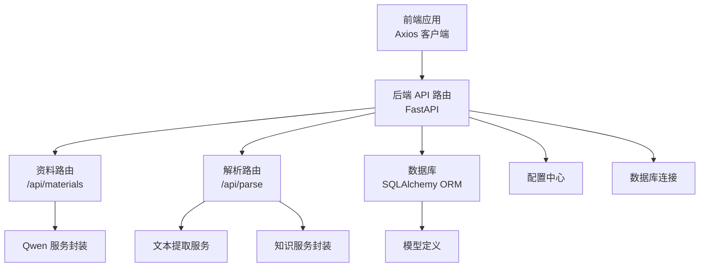
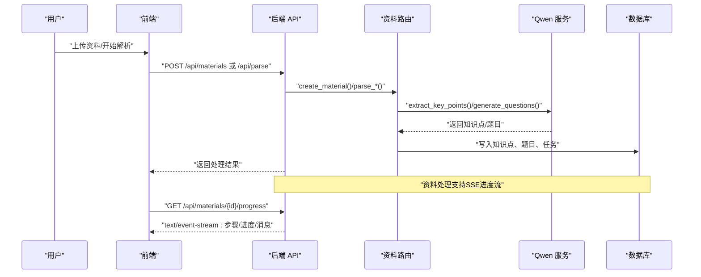
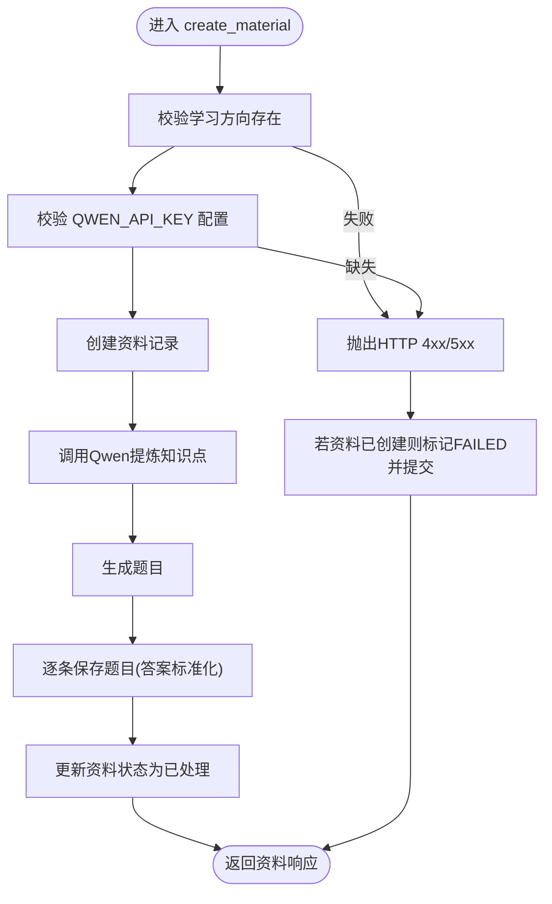
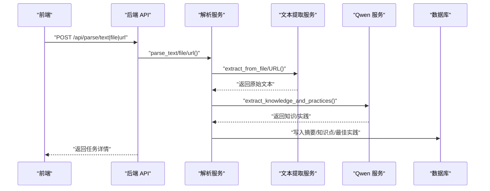
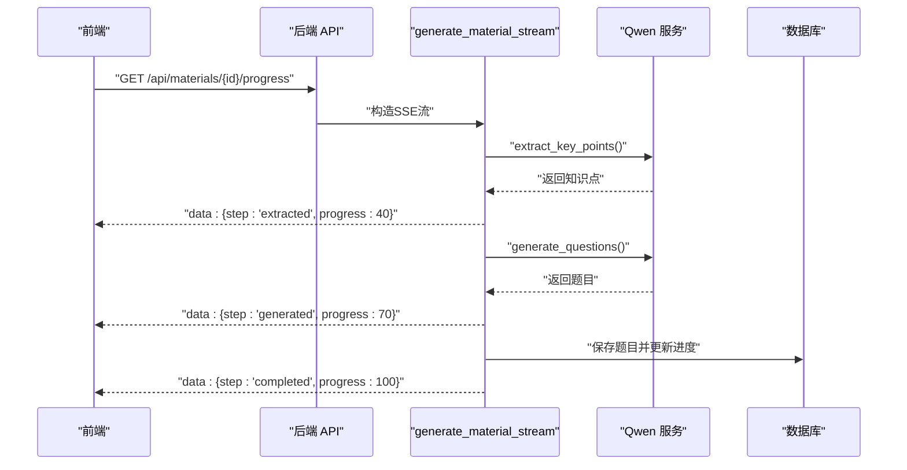
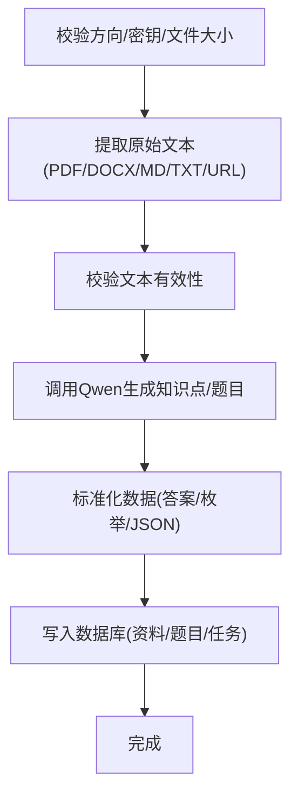
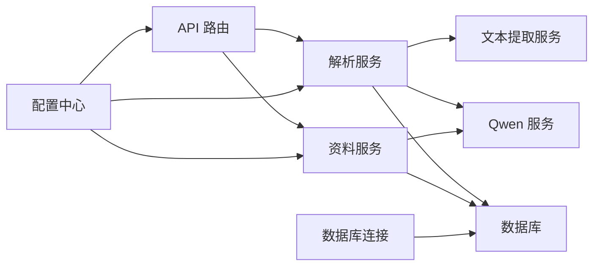
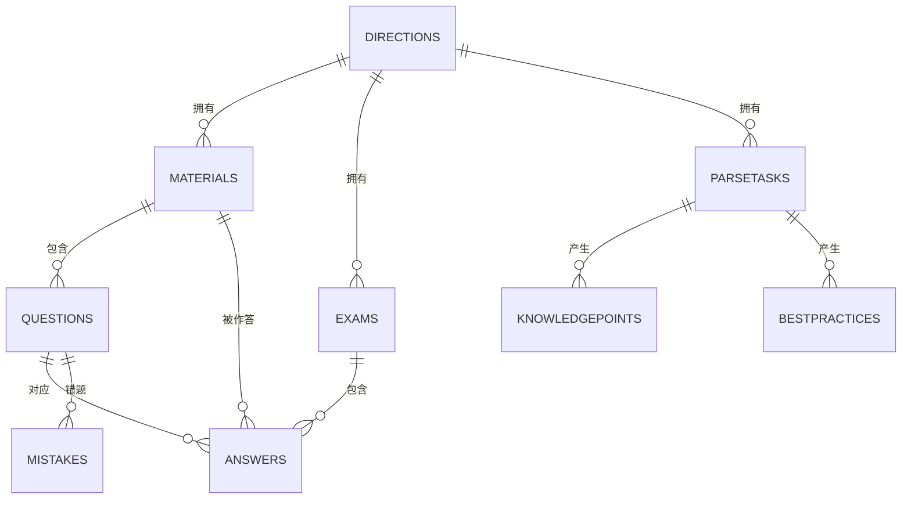

# 数据流设计

<cite>
**本文引用的文件**
- [backend/app/main.py](file://backend/app/main.py)
- [backend/app/api/materials.py](file://backend/app/api/materials.py)
- [backend/app/api/parse.py](file://backend/app/api/parse.py)
- [backend/app/services/extractor_service.py](file://backend/app/services/extractor_service.py)
- [backend/app/services/parse_service.py](file://backend/app/services/parse_service.py)
- [backend/app/services/qwen_service.py](file://backend/app/services/qwen_service.py)
- [backend/app/models/models.py](file://backend/app/models/models.py)
- [backend/app/schemas/schemas.py](file://backend/app/schemas/schemas.py)
- [backend/app/core/config.py](file://backend/app/core/config.py)
- [backend/app/core/database.py](file://backend/app/core/database.py)
- [backend/.env.example](file://backend/.env.example)
- [backend/pyproject.toml](file://backend/pyproject.toml)
- [frontend/src/api/index.js](file://frontend/src/api/index.js)
</cite>

## 目录
1. [引言](#引言)
2. [项目结构](#项目结构)
3. [核心组件](#核心组件)
4. [架构总览](#架构总览)
5. [详细组件分析](#详细组件分析)
6. [依赖关系分析](#依赖关系分析)
7. [性能与优化](#性能与优化)
8. [故障排查指南](#故障排查指南)
9. [结论](#结论)
10. [附录](#附录)

## 引言
本文件面向开发者，系统化梳理“个人学习管理系统”的数据流设计，覆盖从用户上传资料到 AI 处理再到最终用户交互的完整路径；重点阐述 SSE（服务器推送事件）在进度上报中的实现机制与实时数据传输策略；说明异步任务处理与队列管理现状及可演进方向；总结数据验证、转换与存储流程；给出错误恢复与重试机制建议；并讨论缓存策略与性能优化、数据安全与隐私保护措施。

## 项目结构
后端采用 FastAPI + SQLAlchemy 架构，按功能域拆分为 API 层、服务层与模型/模式层；前端通过 Axios 访问后端 /api 前缀接口。整体采用 SQLite 默认存储，支持通过环境变量切换至 MySQL/PostgreSQL。

图表来源
- [backend/app/main.py](file://backend/app/main.py#L1-L66)
- [backend/app/api/materials.py](file://backend/app/api/materials.py#L1-L203)
- [backend/app/api/parse.py](file://backend/app/api/parse.py#L1-L77)
- [backend/app/services/qwen_service.py](file://backend/app/services/qwen_service.py#L1-L156)
- [backend/app/services/extractor_service.py](file://backend/app/services/extractor_service.py#L1-L123)
- [backend/app/services/parse_service.py](file://backend/app/services/parse_service.py#L1-L163)
- [backend/app/models/models.py](file://backend/app/models/models.py#L1-L223)
- [backend/app/core/config.py](file://backend/app/core/config.py#L1-L34)
- [backend/app/core/database.py](file://backend/app/core/database.py#L1-L38)

章节来源
- [backend/app/main.py](file://backend/app/main.py#L1-L66)
- [backend/pyproject.toml](file://backend/pyproject.toml#L1-L29)

## 核心组件
- 应用入口与路由注册：初始化 FastAPI、CORS、数据库表创建与上传目录准备，并注册资料、解析、题目、测验、错题、方向等路由。
- 资料处理：支持同步处理（上传即刻生成题目）与 SSE 进度流（流式返回处理步骤与进度），并持久化知识点与题目。
- 知识解析：统一协调文本提取（文件/URL/纯文本）、调用大模型进行知识抽取与最佳实践归纳，并持久化结果。
- 文本提取：支持 PDF、DOCX、MD、TXT 等格式，URL 正文抓取与清洗。
- Qwen 服务：封装 dashscope 兼容接口，提供知识点提炼、题目生成、主观题评分等能力。
- 数据模型与模式：定义学习方向、资料、题目、测验、答题、错题、解析任务、知识点、最佳实践等实体与枚举。
- 配置与数据库：集中管理应用、数据库、Qwen API、上传目录与文件大小限制；统一数据库连接与会话依赖。

章节来源
- [backend/app/main.py](file://backend/app/main.py#L1-L66)
- [backend/app/api/materials.py](file://backend/app/api/materials.py#L1-L203)
- [backend/app/api/parse.py](file://backend/app/api/parse.py#L1-L77)
- [backend/app/services/extractor_service.py](file://backend/app/services/extractor_service.py#L1-L123)
- [backend/app/services/parse_service.py](file://backend/app/services/parse_service.py#L1-L163)
- [backend/app/services/qwen_service.py](file://backend/app/services/qwen_service.py#L1-L156)
- [backend/app/models/models.py](file://backend/app/models/models.py#L1-L223)
- [backend/app/schemas/schemas.py](file://backend/app/schemas/schemas.py#L1-L265)
- [backend/app/core/config.py](file://backend/app/core/config.py#L1-L34)
- [backend/app/core/database.py](file://backend/app/core/database.py#L1-L38)

## 架构总览
下图展示从用户上传资料到 AI 处理再到前端交互的端到端数据流，标注了 SSE 实时进度与关键数据节点。

图表来源
- [backend/app/api/materials.py](file://backend/app/api/materials.py#L164-L185)
- [backend/app/api/parse.py](file://backend/app/api/parse.py#L17-L77)
- [backend/app/services/qwen_service.py](file://backend/app/services/qwen_service.py#L37-L114)
- [backend/app/services/parse_service.py](file://backend/app/services/parse_service.py#L18-L56)

## 详细组件分析

### 资料上传与处理（同步与SSE）
- 同步处理流程：创建资料记录 → 调用 Qwen 提炼知识点 → 生成题目 → 保存题目 → 更新状态为已处理。
- SSE 进度流：当资料状态为待处理时，返回 text/event-stream，逐步推送“提炼/生成/保存/完成”等阶段与进度百分比；异常时标记为失败并返回错误消息。
- 数据验证与转换：校验方向存在性、API 密钥配置；对题目答案字段进行列表转字符串处理；数据库事务保证一致性。
- 错误恢复：捕获异常并回滚状态；记录日志；必要时返回 HTTP 500。

图表来源
- [backend/app/api/materials.py](file://backend/app/api/materials.py#L82-L161)

章节来源
- [backend/app/api/materials.py](file://backend/app/api/materials.py#L1-L203)

### 知识解析（文本/文件/URL）
- 统一入口：parse_text、parse_file、parse_url 分别处理纯文本、上传文件与 URL。
- 文本提取：根据来源类型调用 extractor_service，支持 PDF/DOCX/MD/TXT 与 URL 正文抓取与清洗。
- 大模型分析：调用 knowledge_service 执行知识抽取与最佳实践归纳，保存摘要、知识点与最佳实践。
- 任务状态：PENDING → PROCESSING → COMPLETED/FAILED，失败时记录错误信息。

图表来源
- [backend/app/api/parse.py](file://backend/app/api/parse.py#L17-L77)
- [backend/app/services/parse_service.py](file://backend/app/services/parse_service.py#L57-L132)
- [backend/app/services/extractor_service.py](file://backend/app/services/extractor_service.py#L30-L118)
- [backend/app/services/qwen_service.py](file://backend/app/services/qwen_service.py#L18-L36)

章节来源
- [backend/app/api/parse.py](file://backend/app/api/parse.py#L1-L77)
- [backend/app/services/parse_service.py](file://backend/app/services/parse_service.py#L1-L163)
- [backend/app/services/extractor_service.py](file://backend/app/services/extractor_service.py#L1-L123)
- [backend/app/services/qwen_service.py](file://backend/app/services/qwen_service.py#L1-L156)

### SSE 实时进度与前端交互
- SSE 实现：后端使用 StreamingResponse 返回 text/event-stream，按步骤发送 JSON 事件，前端通过 EventSource 接收。
- 进度语义：step（提炼/生成/保存/完成/错误）、progress（百分比）、message（提示）、data/material_id（附加数据）。
- 前端适配：Axios 超时设为 3 分钟，满足长耗时 AI 处理场景；前端监听事件流并更新 UI。

图表来源
- [backend/app/api/materials.py](file://backend/app/api/materials.py#L27-L80)
- [backend/app/api/materials.py](file://backend/app/api/materials.py#L164-L185)
- [frontend/src/api/index.js](file://frontend/src/api/index.js#L1-L52)

章节来源
- [backend/app/api/materials.py](file://backend/app/api/materials.py#L164-L185)
- [frontend/src/api/index.js](file://frontend/src/api/index.js#L1-L52)

### 数据验证、转换与存储
- 输入验证：方向存在性、API 密钥、文件扩展名与大小、URL 可访问性、非空校验。
- 数据转换：题目答案列表转字符串；HTML 正文清洗；多编码尝试读取文本文件。
- 存储策略：SQLite 默认，支持 MySQL/PostgreSQL；使用 SQLAlchemy ORM 映射模型，枚举类型保障数据一致性。

图表来源
- [backend/app/services/extractor_service.py](file://backend/app/services/extractor_service.py#L23-L118)
- [backend/app/api/materials.py](file://backend/app/api/materials.py#L106-L138)
- [backend/app/services/parse_service.py](file://backend/app/services/parse_service.py#L18-L56)

章节来源
- [backend/app/services/extractor_service.py](file://backend/app/services/extractor_service.py#L1-L123)
- [backend/app/api/materials.py](file://backend/app/api/materials.py#L82-L161)
- [backend/app/services/parse_service.py](file://backend/app/services/parse_service.py#L1-L163)

### 错误恢复与重试机制
- 当前实现：捕获异常、记录日志、设置失败状态并提交；资料处理失败时回滚状态；解析任务失败时记录错误信息。
- 建议增强：引入指数退避重试、失败队列与死信队列、幂等性设计（去重键）、告警通知；对网络超时与 Qwen 限流进行优雅降级。

章节来源
- [backend/app/api/materials.py](file://backend/app/api/materials.py#L144-L160)
- [backend/app/services/parse_service.py](file://backend/app/services/parse_service.py#L72-L78)

### 缓存策略与性能优化
- 当前实现：未见显式缓存层；数据库连接具备 SQLite/MySQL 的不同参数优化。
- 建议策略：热点数据（方向、题目、解析任务列表）引入 Redis 缓存；对 Qwen 接口增加本地缓存（带 TTL 与键空间隔离）；对静态资源启用 CDN；数据库查询加索引（如方向、创建时间排序）。

章节来源
- [backend/app/core/database.py](file://backend/app/core/database.py#L1-L38)
- [backend/app/models/models.py](file://backend/app/models/models.py#L63-L134)

### 数据安全与隐私保护
- 环境变量：Qwen API Key、数据库地址等敏感配置通过 .env 管理，避免硬编码。
- 传输安全：建议启用 HTTPS；CORS 在生产环境限制具体来源而非“*”。
- 数据最小化：仅保存必要的来源摘要与结构化数据；删除任务时级联清理关联知识点与最佳实践。
- 隐私合规：明确数据保留期限与删除权；对用户上传文件与 URL 内容进行脱敏与最小化处理。

章节来源
- [backend/.env.example](file://backend/.env.example#L1-L14)
- [backend/app/main.py](file://backend/app/main.py#L27-L34)
- [backend/app/services/parse_service.py](file://backend/app/services/parse_service.py#L151-L158)

## 依赖关系分析
- 组件耦合：API 层依赖服务层；服务层依赖配置与数据库；模型与模式用于数据契约；前端通过 /api 前缀访问后端。
- 外部依赖：dashscope 兼容接口、PDF/DOCX/HTML 解析库、HTTP 客户端、数据库驱动。
- 潜在风险：当前未见显式队列与后台任务框架；长耗时操作阻塞请求线程，建议引入 Celery/RQ/Redis 队列异步化。

图表来源
- [backend/app/api/materials.py](file://backend/app/api/materials.py#L1-L203)
- [backend/app/api/parse.py](file://backend/app/api/parse.py#L1-L77)
- [backend/app/services/parse_service.py](file://backend/app/services/parse_service.py#L1-L163)
- [backend/app/services/extractor_service.py](file://backend/app/services/extractor_service.py#L1-L123)
- [backend/app/services/qwen_service.py](file://backend/app/services/qwen_service.py#L1-L156)
- [backend/app/core/config.py](file://backend/app/core/config.py#L1-L34)
- [backend/app/core/database.py](file://backend/app/core/database.py#L1-L38)

章节来源
- [backend/app/api/materials.py](file://backend/app/api/materials.py#L1-L203)
- [backend/app/api/parse.py](file://backend/app/api/parse.py#L1-L77)
- [backend/app/services/parse_service.py](file://backend/app/services/parse_service.py#L1-L163)
- [backend/app/services/extractor_service.py](file://backend/app/services/extractor_service.py#L1-L123)
- [backend/app/services/qwen_service.py](file://backend/app/services/qwen_service.py#L1-L156)
- [backend/app/core/config.py](file://backend/app/core/config.py#L1-L34)
- [backend/app/core/database.py](file://backend/app/core/database.py#L1-L38)

## 性能与优化
- IO 优化：文件解析使用临时文件与多编码尝试，避免内存峰值；URL 抓取设置超时与重定向跟随。
- 网络优化：Qwen 调用设置合理超时；前端 Axios 超时 3 分钟，适配长耗时处理。
- 数据库优化：SQLite/MySQL 不同连接参数；建议为高频查询字段建立索引；批量插入题目时减少多次提交。
- 可扩展性：当前为同步处理，建议引入队列异步化（如 Celery + Redis），并配合幂等与重试策略。

章节来源
- [backend/app/services/extractor_service.py](file://backend/app/services/extractor_service.py#L30-L118)
- [backend/app/services/qwen_service.py](file://backend/app/services/qwen_service.py#L18-L35)
- [frontend/src/api/index.js](file://frontend/src/api/index.js#L3-L9)

## 故障排查指南
- 常见问题
  - API 密钥未配置：资料处理时报 500，提示设置 QWEN_API_KEY。
  - 方向不存在：资料创建时报 404。
  - 文件过大/格式不支持：文本提取阶段抛出异常。
  - URL 无法抓取/内容为空：URL 解析失败。
- 排查步骤
  - 检查 .env 中 QWEN_* 与 DATABASE_URL 配置。
  - 查看后端日志（异常被捕获并记录）。
  - 使用 GET /api/materials/{id}/progress 观察 SSE 流是否正常推送。
  - 检查数据库中资料/题目/解析任务状态是否符合预期。

章节来源
- [backend/app/api/materials.py](file://backend/app/api/materials.py#L94-L96)
- [backend/app/api/materials.py](file://backend/app/api/materials.py#L144-L160)
- [backend/app/services/extractor_service.py](file://backend/app/services/extractor_service.py#L23-L53)
- [backend/app/services/parse_service.py](file://backend/app/services/parse_service.py#L72-L78)

## 结论
本系统以 FastAPI + SQLAlchemy 为基础，实现了从资料上传到 AI 处理再到用户交互的闭环数据流；SSE 提供了良好的实时进度体验；当前以同步处理为主，建议后续引入队列与异步任务以提升吞吐与稳定性；同时完善缓存、限流与安全策略，确保系统在高并发与复杂业务场景下的可靠性与可维护性。

## 附录
- 数据模型概览（ER）

图表来源
- [backend/app/models/models.py](file://backend/app/models/models.py#L63-L223)