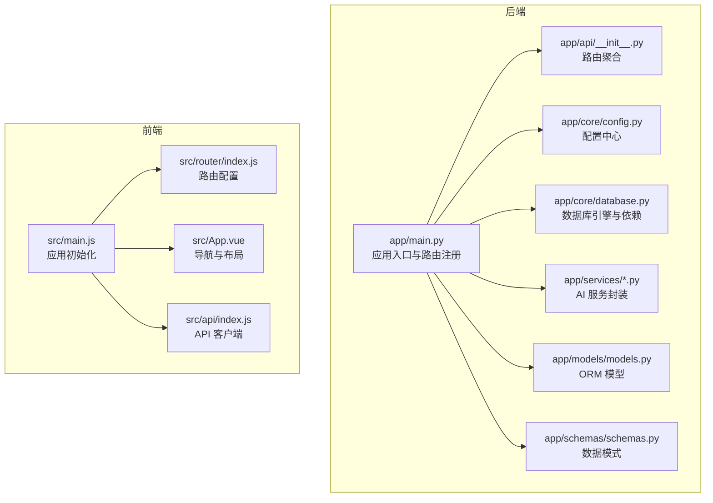
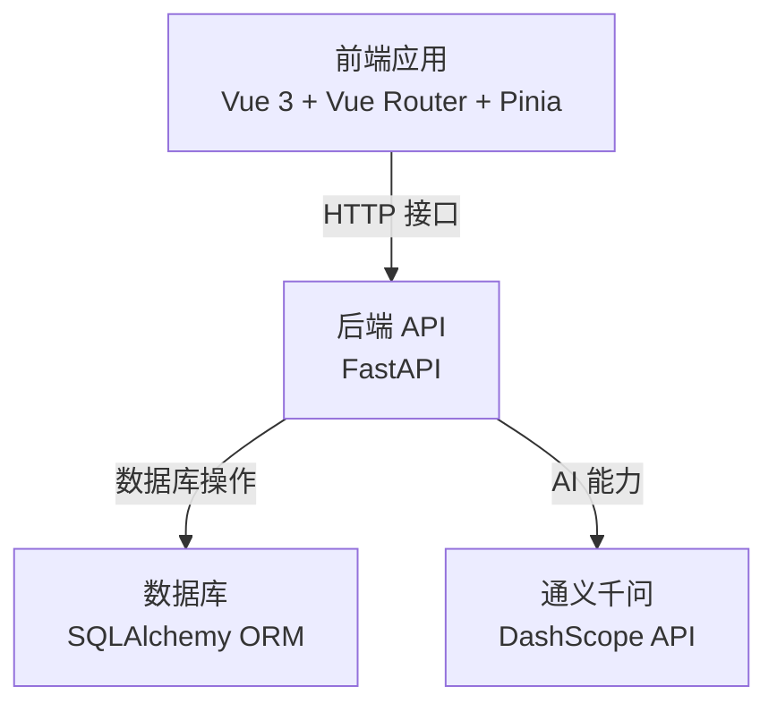
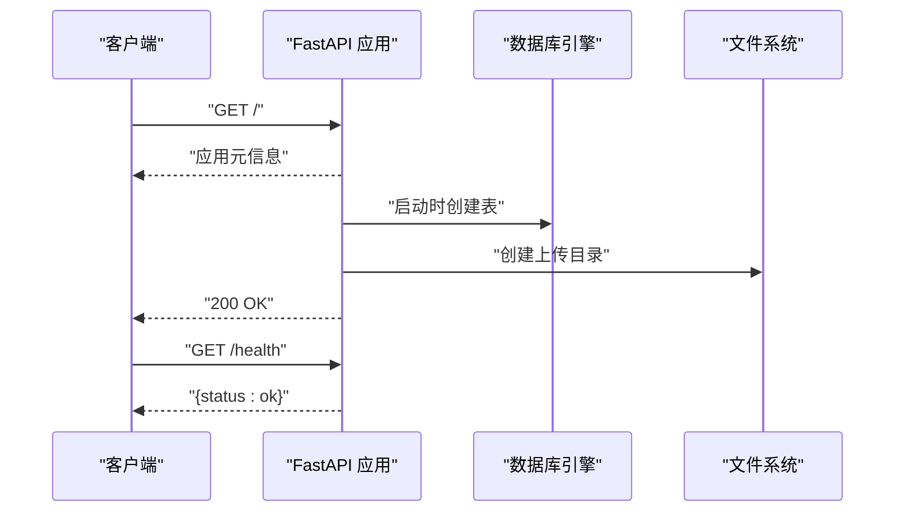
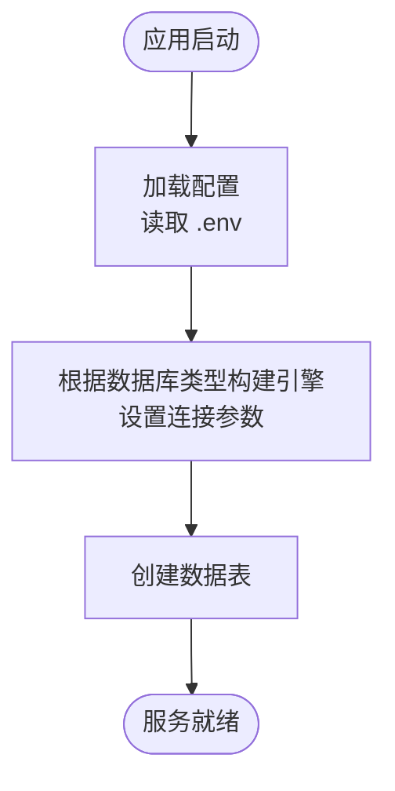
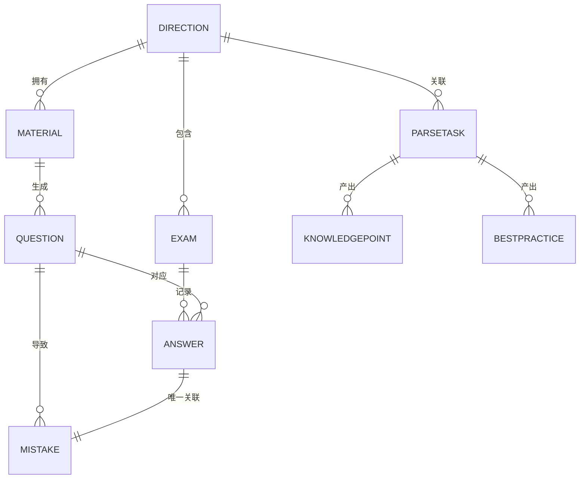
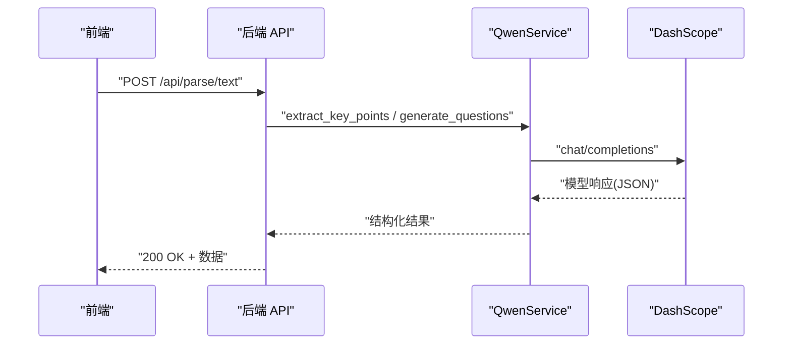
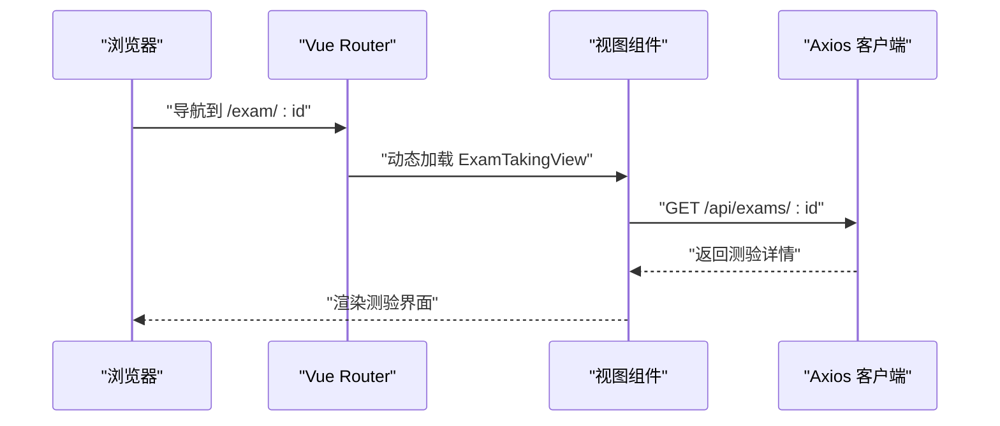
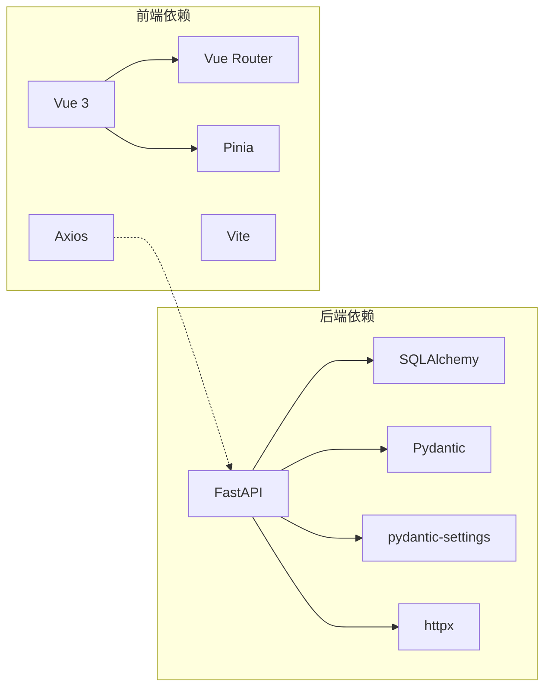
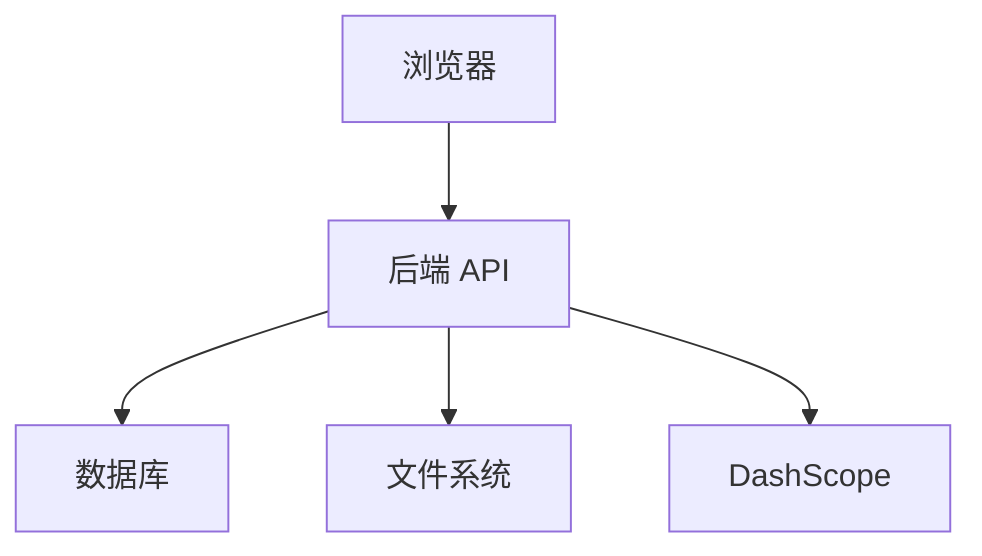

# 整体架构设计

<cite>
**本文档引用的文件**
- [backend/app/main.py](file://backend/app/main.py)
- [backend/pyproject.toml](file://backend/pyproject.toml)
- [backend/app/core/config.py](file://backend/app/core/config.py)
- [backend/app/core/database.py](file://backend/app/core/database.py)
- [backend/app/api/__init__.py](file://backend/app/api/__init__.py)
- [backend/app/models/models.py](file://backend/app/models/models.py)
- [backend/app/schemas/schemas.py](file://backend/app/schemas/schemas.py)
- [backend/app/services/knowledge_service.py](file://backend/app/services/knowledge_service.py)
- [backend/app/services/qwen_service.py](file://backend/app/services/qwen_service.py)
- [frontend/package.json](file://frontend/package.json)
- [frontend/src/main.js](file://frontend/src/main.js)
- [frontend/src/router/index.js](file://frontend/src/router/index.js)
- [frontend/src/api/index.js](file://frontend/src/api/index.js)
- [frontend/src/App.vue](file://frontend/src/App.vue)
</cite>

## 目录
1. [引言](#引言)
2. [项目结构](#项目结构)
3. [核心组件](#核心组件)
4. [架构总览](#架构总览)
5. [详细组件分析](#详细组件分析)
6. [依赖分析](#依赖分析)
7. [性能考虑](#性能考虑)
8. [故障排查指南](#故障排查指南)
9. [结论](#结论)
10. [附录](#附录)

## 引言
本项目是一个个人学习管理系统，采用前后端分离架构：后端使用 Python 的 FastAPI 框架提供 RESTful API，前端使用 Vue.js 生态（Vue 3 + Vue Router + Pinia）构建单页应用。系统围绕“学习方向-资料-题目-测验-错题”闭环展开，结合通义千问（DashScope）实现知识解析与智能出题、评分能力。

## 项目结构
系统分为两个独立子工程：
- 后端（Python/FastAPI）：负责业务逻辑、数据持久化、AI 服务集成与 API 路由组织
- 前端（JavaScript/Vue.js）：负责页面渲染、路由导航、状态管理与 API 调用

图表来源
- [backend/app/main.py](file://backend/app/main.py#L1-L66)
- [backend/app/core/config.py](file://backend/app/core/config.py#L1-L34)
- [backend/app/core/database.py](file://backend/app/core/database.py#L1-L38)
- [backend/app/api/__init__.py](file://backend/app/api/__init__.py#L1-L17)
- [backend/app/models/models.py](file://backend/app/models/models.py#L1-L223)
- [backend/app/schemas/schemas.py](file://backend/app/schemas/schemas.py#L1-L265)
- [backend/app/services/knowledge_service.py](file://backend/app/services/knowledge_service.py#L1-L114)
- [backend/app/services/qwen_service.py](file://backend/app/services/qwen_service.py#L1-L156)
- [frontend/src/main.js](file://frontend/src/main.js#L1-L12)
- [frontend/src/router/index.js](file://frontend/src/router/index.js#L1-L47)
- [frontend/src/api/index.js](file://frontend/src/api/index.js#L1-L52)
- [frontend/src/App.vue](file://frontend/src/App.vue#L1-L202)

章节来源
- [backend/app/main.py](file://backend/app/main.py#L1-L66)
- [frontend/src/main.js](file://frontend/src/main.js#L1-L12)

## 核心组件
- 应用入口与生命周期
  - 后端通过 FastAPI 应用入口集中注册路由、CORS 中间件与启动事件；启动时自动创建数据库表与上传目录
  - 前端通过 Vue 应用初始化 Pinia、Vue Router 并挂载根组件
- 配置与数据库
  - 配置模块统一读取环境变量，支持 SQLite/MySQL 等数据库切换与调试开关
  - 数据库模块提供引擎、会话工厂与依赖注入函数
- 数据模型与序列化
  - ORM 模型覆盖学习方向、资料、题目、测验、答题、错题、解析任务及知识点/最佳实践
  - Pydantic 模式用于请求/响应的数据校验与序列化
- AI 服务能力
  - 通义千问服务封装通用聊天接口，支持知识点抽取、题目生成、主观题评分
  - 知识提取服务专注于从原始文本中提炼摘要、知识点与最佳实践
- 前端路由与 API 客户端
  - Vue Router 提供多视图导航（首页、资料、题目、测验、错题）
  - Axios 客户端统一配置基础路径、超时与 Content-Type，按功能拆分 API 模块

章节来源
- [backend/app/main.py](file://backend/app/main.py#L19-L66)
- [backend/app/core/config.py](file://backend/app/core/config.py#L6-L34)
- [backend/app/core/database.py](file://backend/app/core/database.py#L20-L38)
- [backend/app/models/models.py](file://backend/app/models/models.py#L63-L223)
- [backend/app/schemas/schemas.py](file://backend/app/schemas/schemas.py#L15-L265)
- [backend/app/services/knowledge_service.py](file://backend/app/services/knowledge_service.py#L11-L114)
- [backend/app/services/qwen_service.py](file://backend/app/services/qwen_service.py#L10-L156)
- [frontend/src/router/index.js](file://frontend/src/router/index.js#L3-L47)
- [frontend/src/api/index.js](file://frontend/src/api/index.js#L3-L52)
- [frontend/src/App.vue](file://frontend/src/App.vue#L1-L202)

## 架构总览
系统采用前后端分离架构，后端提供 REST API，前端通过 Axios 调用后端接口，实现数据驱动的交互体验。后端内部通过模块化组织（路由、服务、模型、模式）实现高内聚低耦合。

图表来源
- [backend/app/main.py](file://backend/app/main.py#L19-L43)
- [backend/app/core/database.py](file://backend/app/core/database.py#L20-L38)
- [backend/app/services/knowledge_service.py](file://backend/app/services/knowledge_service.py#L19-L36)
- [backend/app/services/qwen_service.py](file://backend/app/services/qwen_service.py#L18-L35)
- [frontend/src/api/index.js](file://frontend/src/api/index.js#L3-L9)

## 详细组件分析

### 后端应用入口与生命周期
- 应用创建与中间件
  - 使用 FastAPI 初始化应用，设置标题、描述、版本与文档地址
  - 配置 CORS 中间件，开发环境允许任意来源访问
- 路由注册
  - 统一前缀 /api 注册多个业务路由（学习方向、资料、题目、测验、错题、解析）
- 生命周期事件
  - startup 事件中创建数据库表与上传目录
- 健康检查
  - 提供 /health 快速检测服务可用性

图表来源
- [backend/app/main.py](file://backend/app/main.py#L19-L66)

章节来源
- [backend/app/main.py](file://backend/app/main.py#L19-L66)

### 配置与数据库模块
- 配置模块
  - 通过 pydantic-settings 读取 .env 文件，提供应用名、调试开关、数据库连接、通义千问 API 参数、上传目录与文件大小限制
  - 使用缓存装饰器提供配置单例
- 数据库模块
  - 根据数据库类型设置连接参数：SQLite 与 MySQL/PostgreSQL 差异化配置
  - 提供引擎、会话工厂与依赖注入函数，确保请求级会话安全关闭

图表来源
- [backend/app/core/config.py](file://backend/app/core/config.py#L6-L34)
- [backend/app/core/database.py](file://backend/app/core/database.py#L20-L38)

章节来源
- [backend/app/core/config.py](file://backend/app/core/config.py#L6-L34)
- [backend/app/core/database.py](file://backend/app/core/database.py#L20-L38)

### 数据模型与序列化
- 模型层
  - 定义学习方向、资料、题目、测验、答题、错题、解析任务、知识点、最佳实践等实体及其关联关系
  - 使用枚举类型控制状态与类型字段的取值范围
- 模式层
  - 使用 Pydantic 定义请求/响应模式，支持 from_attributes 序列化 ORM 对象
  - 包含测验详情、答案、错题更新、解析任务列表与详情等复合模式

图表来源
- [backend/app/models/models.py](file://backend/app/models/models.py#L63-L223)
- [backend/app/schemas/schemas.py](file://backend/app/schemas/schemas.py#L103-L164)

章节来源
- [backend/app/models/models.py](file://backend/app/models/models.py#L63-L223)
- [backend/app/schemas/schemas.py](file://backend/app/schemas/schemas.py#L15-L265)

### AI 服务能力
- 通义千问服务
  - 封装 chat/completions 接口，支持知识点抽取、题目生成、主观题评分
  - 内置 JSON 提取与容错处理，降低大模型输出不稳定的影响
- 知识提取服务
  - 专门针对“从原始文本中提炼摘要、知识点与最佳实践”的提示词工程
  - 返回结构化的 JSON 数据，便于后续入库与前端展示

图表来源
- [backend/app/services/qwen_service.py](file://backend/app/services/qwen_service.py#L37-L114)
- [backend/app/services/knowledge_service.py](file://backend/app/services/knowledge_service.py#L51-L109)

章节来源
- [backend/app/services/qwen_service.py](file://backend/app/services/qwen_service.py#L10-L156)
- [backend/app/services/knowledge_service.py](file://backend/app/services/knowledge_service.py#L11-L114)

### 前端应用与路由
- 应用初始化
  - 创建 Vue 应用，安装 Pinia 与 Vue Router，挂载到 DOM
- 路由组织
  - 定义首页、资料管理、题目管理、测验开始/进行/结果、错题本等视图路由
  - 使用 history 模式与动态导入实现懒加载
- API 客户端
  - Axios 客户端统一配置 baseURL 为 /api，适配后端路由前缀
  - 按功能拆分模块：学习方向、资料、题目、测验、错题、解析等
- 导航与布局
  - App.vue 提供统一导航栏与主内容区，支持响应式样式与路由过渡动画

图表来源
- [frontend/src/router/index.js](file://frontend/src/router/index.js#L24-L33)
- [frontend/src/api/index.js](file://frontend/src/api/index.js#L36-L42)
- [frontend/src/App.vue](file://frontend/src/App.vue#L1-L202)

章节来源
- [frontend/src/main.js](file://frontend/src/main.js#L1-L12)
- [frontend/src/router/index.js](file://frontend/src/router/index.js#L1-L47)
- [frontend/src/api/index.js](file://frontend/src/api/index.js#L1-L52)
- [frontend/src/App.vue](file://frontend/src/App.vue#L1-L202)

## 依赖分析
- 技术栈与版本
  - 后端：FastAPI、Uvicorn、SQLAlchemy、Pydantic、Pydantic-Settings、httpx、PyMuPDF、python-docx、BeautifulSoup4、lxml 等
  - 前端：Vue 3、Vue Router、Pinia、Axios、Vite、@vitejs/plugin-vue
- 模块耦合
  - 后端路由通过聚合导出统一注册，降低入口复杂度
  - 服务层与配置/数据库解耦，便于替换与测试
  - 前端 API 客户端集中管理，便于统一拦截与错误处理

图表来源
- [backend/pyproject.toml](file://backend/pyproject.toml#L7-L22)
- [frontend/package.json](file://frontend/package.json#L11-L21)

章节来源
- [backend/pyproject.toml](file://backend/pyproject.toml#L1-L29)
- [frontend/package.json](file://frontend/package.json#L1-L23)

## 性能考虑
- 后端
  - 数据库连接池与预热参数：MySQL/PostgreSQL 设置 pool_pre_ping 与 pool_recycle，SQLite 使用线程安全连接参数
  - 异步 HTTP 客户端：AI 服务使用 httpx.AsyncClient，减少阻塞
  - 超时策略：不同场景设置合理超时（AI 处理较长），避免长时间占用资源
- 前端
  - 动态导入与路由懒加载：降低首屏体积，提升初始加载速度
  - Axios 超时配置：适配 AI 处理耗时，避免请求悬挂
- 可扩展性
  - 模块化路由与服务：新增业务模块只需添加路由与服务，不侵入现有代码
  - 配置中心：统一管理外部服务参数，便于横向扩展新能力

## 故障排查指南
- 后端
  - 数据库连接失败：检查数据库 URL 与连接参数；确认 SQLite 文件权限或 MySQL/PG 服务器可达
  - CORS 问题：确认开发环境允许任意来源；生产环境需明确白名单
  - AI 服务异常：检查 DashScope API Key、Base URL 与网络连通性；查看日志输出
- 前端
  - 路由 404：确认路由定义与路径参数；检查 history 模式部署配置
  - API 调用失败：确认 /api 前缀与后端路由一致；检查跨域与代理配置

章节来源
- [backend/app/core/database.py](file://backend/app/core/database.py#L12-L18)
- [backend/app/services/knowledge_service.py](file://backend/app/services/knowledge_service.py#L19-L36)
- [frontend/src/router/index.js](file://frontend/src/router/index.js#L41-L44)
- [frontend/src/api/index.js](file://frontend/src/api/index.js#L3-L9)

## 结论
本系统通过前后端分离架构实现了清晰的职责划分与良好的可维护性。后端以 FastAPI 为核心，配合 SQLAlchemy 与 Pydantic 形成稳定的业务层；前端以 Vue 生态为基础，提供流畅的用户体验。模块化设计与依赖注入机制保证了系统的可扩展性与可测试性。未来可在监控埋点、缓存策略、鉴权体系与容器化部署等方面进一步完善。

## 附录
- 系统边界图
  - 外部系统：浏览器（前端）、DashScope（通义千问）
  - 内部系统：后端 API、数据库、文件存储（上传目录）

图表来源
- [backend/app/main.py](file://backend/app/main.py#L19-L43)
- [backend/app/core/database.py](file://backend/app/core/database.py#L20-L38)
- [backend/app/services/knowledge_service.py](file://backend/app/services/knowledge_service.py#L19-L36)
- [frontend/src/api/index.js](file://frontend/src/api/index.js#L3-L9)