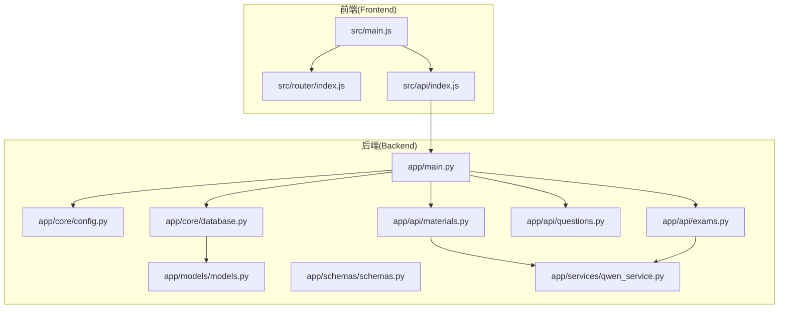
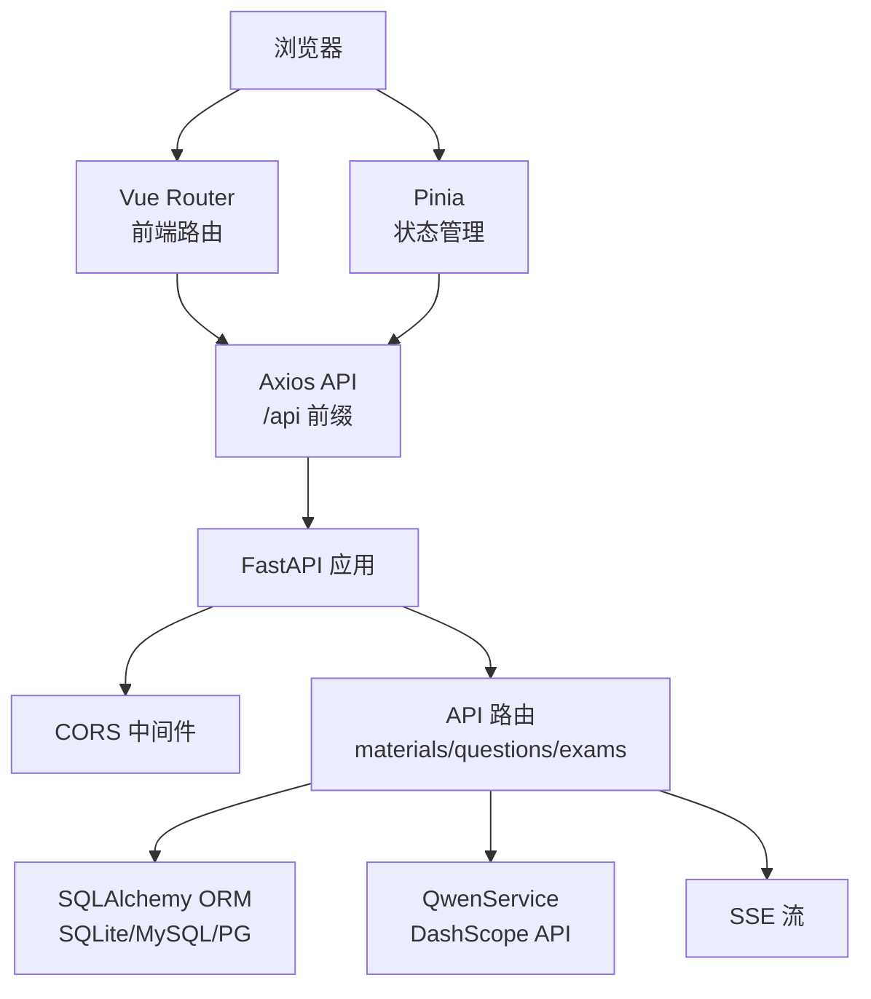
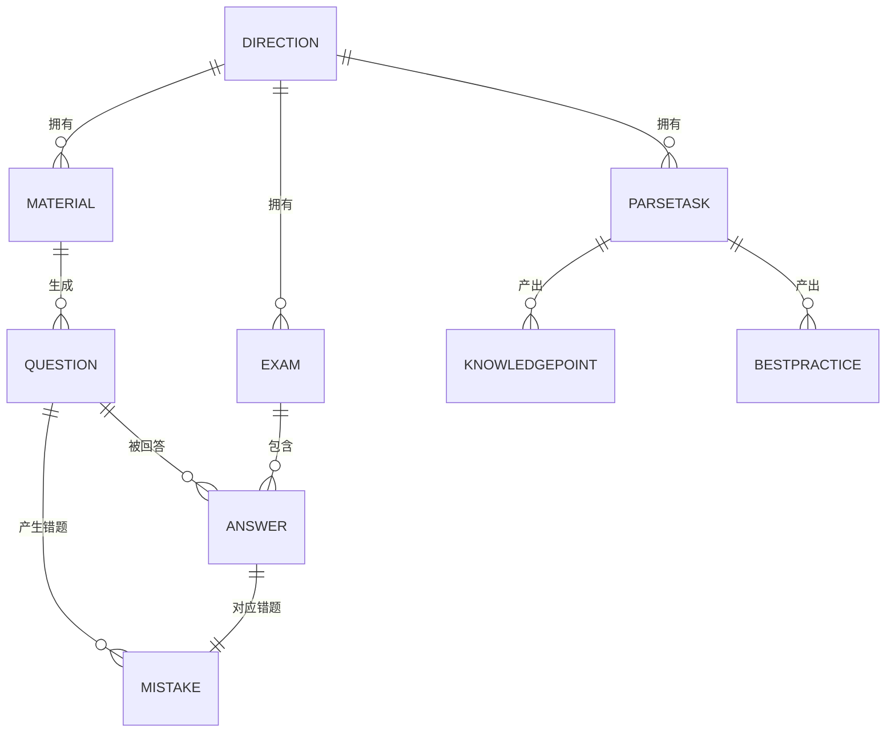
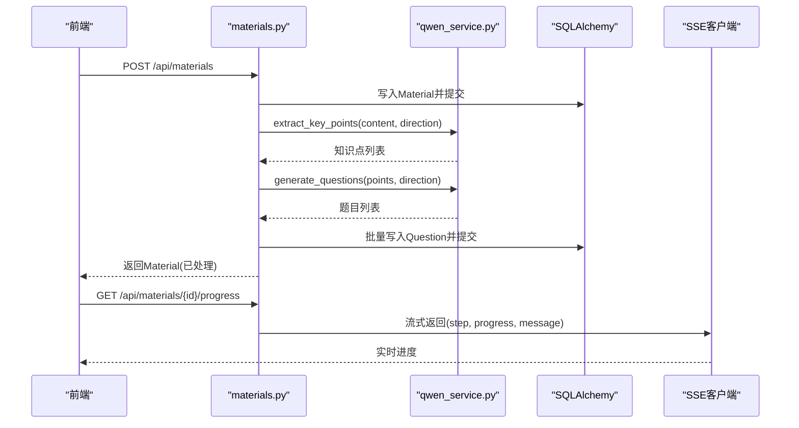
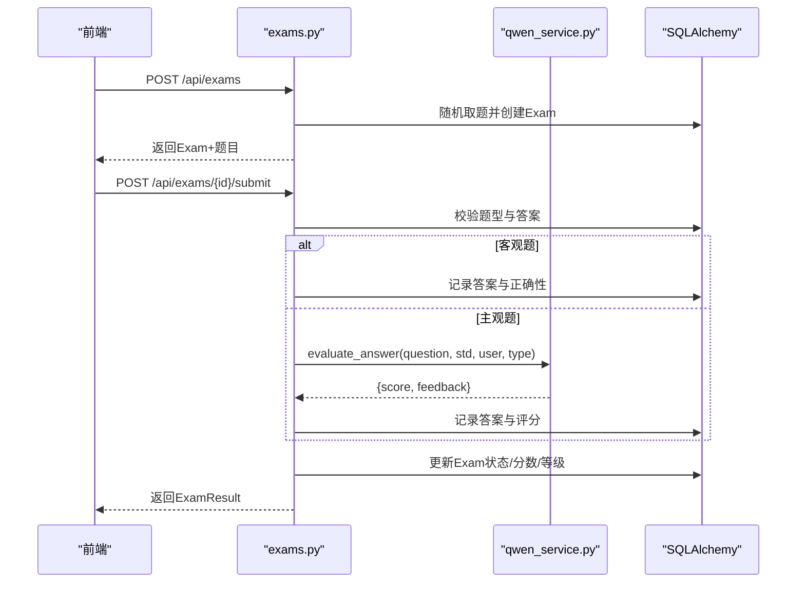
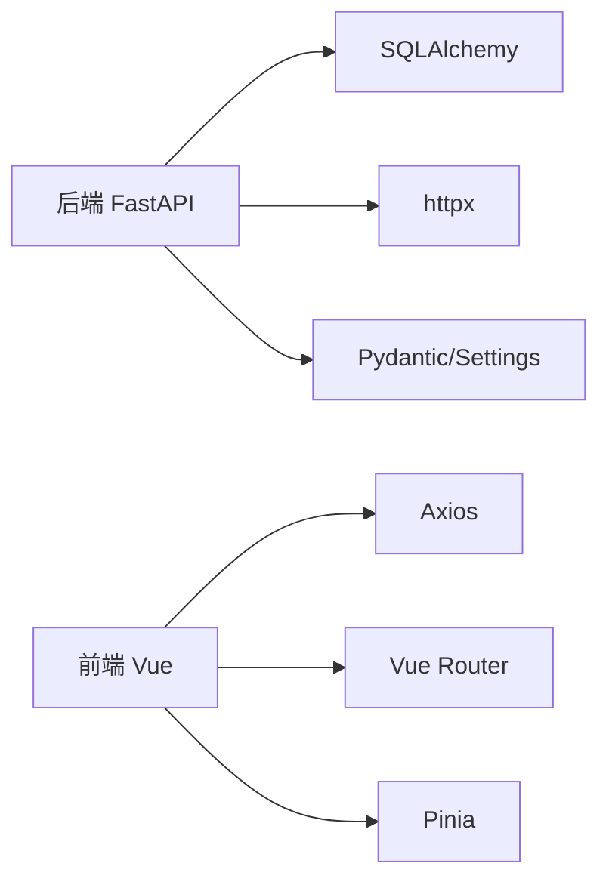

# 系统架构

<cite>
**本文引用的文件**
- [backend/app/main.py](file://backend/app/main.py)
- [backend/pyproject.toml](file://backend/pyproject.toml)
- [backend/app/core/config.py](file://backend/app/core/config.py)
- [backend/app/core/database.py](file://backend/app/core/database.py)
- [backend/app/models/models.py](file://backend/app/models/models.py)
- [backend/app/schemas/schemas.py](file://backend/app/schemas/schemas.py)
- [backend/app/api/materials.py](file://backend/app/api/materials.py)
- [backend/app/api/questions.py](file://backend/app/api/questions.py)
- [backend/app/api/exams.py](file://backend/app/api/exams.py)
- [backend/app/services/qwen_service.py](file://backend/app/services/qwen_service.py)
- [frontend/package.json](file://frontend/package.json)
- [frontend/src/main.js](file://frontend/src/main.js)
- [frontend/src/router/index.js](file://frontend/src/router/index.js)
- [frontend/src/api/index.js](file://frontend/src/api/index.js)
</cite>

## 目录
1. [引言](#引言)
2. [项目结构](#项目结构)
3. [核心组件](#核心组件)
4. [架构总览](#架构总览)
5. [详细组件分析](#详细组件分析)
6. [依赖分析](#依赖分析)
7. [性能考虑](#性能考虑)
8. [故障排查指南](#故障排查指南)
9. [结论](#结论)
10. [附录](#附录)

## 引言
本系统是一个前后端分离的个人学习管理系统，采用 FastAPI 作为后端框架，Vue 3 + Vite 作为前端框架。系统围绕“资料上传—AI解析—题目生成—测验与错题管理”的闭环展开，支持多题型、主观题 AI 评分、SSE 实时进度反馈等能力。后端通过 SQLAlchemy ORM 进行数据持久化，前端通过 Axios 发起 API 请求并与路由/状态管理集成。

## 项目结构
- 后端位于 backend/，采用 FastAPI + SQLAlchemy 架构，按功能划分为 api、core、models、schemas、services 等子包。
- 前端位于 frontend/，使用 Vue 3 + Pinia + Vue Router + Vite，通过 axios 封装统一 API 接口。
- 配置与数据库：后端通过 pydantic-settings 加载 .env，SQLAlchemy 初始化 engine 和 Base；SQLite 默认用于本地开发，亦可适配 MySQL/PostgreSQL。

图表来源
- [backend/app/main.py](file://backend/app/main.py#L1-L66)
- [backend/app/core/config.py](file://backend/app/core/config.py#L1-L34)
- [backend/app/core/database.py](file://backend/app/core/database.py#L1-L38)
- [backend/app/models/models.py](file://backend/app/models/models.py#L1-L223)
- [backend/app/schemas/schemas.py](file://backend/app/schemas/schemas.py#L1-L265)
- [backend/app/api/materials.py](file://backend/app/api/materials.py#L1-L203)
- [backend/app/api/questions.py](file://backend/app/api/questions.py#L1-L90)
- [backend/app/api/exams.py](file://backend/app/api/exams.py#L1-L240)
- [backend/app/services/qwen_service.py](file://backend/app/services/qwen_service.py#L1-L156)
- [frontend/src/main.js](file://frontend/src/main.js#L1-L12)
- [frontend/src/router/index.js](file://frontend/src/router/index.js#L1-L47)
- [frontend/src/api/index.js](file://frontend/src/api/index.js#L1-L52)

章节来源
- [backend/app/main.py](file://backend/app/main.py#L1-L66)
- [frontend/src/main.js](file://frontend/src/main.js#L1-L12)

## 核心组件
- 应用入口与路由注册：后端在主程序中初始化 FastAPI，配置 CORS，注册各模块路由，并在启动事件中创建表与上传目录。
- 配置中心：集中管理应用名、数据库连接、通义千问 API 参数、上传目录与大小限制等。
- 数据库层：SQLAlchemy 引擎与 Base，支持 SQLite/MySQL/PostgreSQL，提供 get_db 依赖注入。
- 模型与模式：models 定义实体与关系，schemas 定义 Pydantic 模式用于请求/响应校验与序列化。
- 业务 API：materials、questions、exams 提供资料、题目、测验的 CRUD 与业务流程。
- AI 服务：qwen_service 封装通义千问 API，提供知识点抽取、题目生成、主观题评分。
- 前端：main.js 初始化应用，router 定义页面路由，api 统一封装 /api 前缀的 HTTP 请求。

章节来源
- [backend/app/main.py](file://backend/app/main.py#L1-L66)
- [backend/app/core/config.py](file://backend/app/core/config.py#L1-L34)
- [backend/app/core/database.py](file://backend/app/core/database.py#L1-L38)
- [backend/app/models/models.py](file://backend/app/models/models.py#L1-L223)
- [backend/app/schemas/schemas.py](file://backend/app/schemas/schemas.py#L1-L265)
- [backend/app/api/materials.py](file://backend/app/api/materials.py#L1-L203)
- [backend/app/api/questions.py](file://backend/app/api/questions.py#L1-L90)
- [backend/app/api/exams.py](file://backend/app/api/exams.py#L1-L240)
- [backend/app/services/qwen_service.py](file://backend/app/services/qwen_service.py#L1-L156)
- [frontend/src/main.js](file://frontend/src/main.js#L1-L12)
- [frontend/src/router/index.js](file://frontend/src/router/index.js#L1-L47)
- [frontend/src/api/index.js](file://frontend/src/api/index.js#L1-L52)

## 架构总览
系统采用前后端分离架构，后端提供 RESTful API，前端通过路由驱动页面切换与状态管理，后端通过 SSE 向前端推送资料处理进度。AI 能力通过独立的 qwen_service 调用外部 DashScope 接口实现。

图表来源
- [backend/app/main.py](file://backend/app/main.py#L1-L66)
- [backend/app/api/materials.py](file://backend/app/api/materials.py#L164-L185)
- [backend/app/services/qwen_service.py](file://backend/app/services/qwen_service.py#L1-L156)
- [frontend/src/api/index.js](file://frontend/src/api/index.js#L1-L52)
- [frontend/src/router/index.js](file://frontend/src/router/index.js#L1-L47)

## 详细组件分析

### 后端应用与路由
- 初始化 FastAPI，启用 /docs 与 /redoc 文档，配置 CORS 允许开发环境跨域。
- 在 startup 事件中创建数据库表与上传目录。
- 注册方向、资料、题目、测验、错题、解析任务等路由前缀 /api。

章节来源
- [backend/app/main.py](file://backend/app/main.py#L1-L66)

### 配置与数据库
- 配置项：应用名、调试开关、数据库 URL、Qwen API 密钥/模型/base_url、上传目录与最大文件大小。
- 数据库：根据 URL 类型选择 SQLite 或 MySQL/PostgreSQL 的连接参数；SQLite 使用线程检查，其他数据库启用 pool_pre_ping 与 recycle；提供 get_db 依赖。

章节来源
- [backend/app/core/config.py](file://backend/app/core/config.py#L1-L34)
- [backend/app/core/database.py](file://backend/app/core/database.py#L1-L38)

### 数据模型与关系
- 实体枚举：资料状态、题目类型、题目评价、测验模式、评分类型、来源类型、任务状态等。
- 实体关系：Direction 与 Material/Exam/ParseTask；Material 与 Question；Question 与 Answer/Mistake；Exam 与 Answer；ParseTask 与 KnowledgePoint/BestPractice；Mistake 与 Answer/Question。
- 字段覆盖：JSON/Text/Enum/Numeric 等类型满足复杂数据存储与评分精度。

图表来源
- [backend/app/models/models.py](file://backend/app/models/models.py#L63-L223)

章节来源
- [backend/app/models/models.py](file://backend/app/models/models.py#L1-L223)

### Pydantic 模式与数据契约
- 方向：DirectionBase/Create/Response。
- 资料：MaterialBase/Create/Response。
- 题目：QuestionBase/Create/Response/RateRequest/Update。
- 测验：ExamCreate/Response/WithQuestions/Result/Submit。
- 答案：AnswerCreate/Response。
- 错题：MistakeResponse/Update。
- 解析：ParseTextRequest/ParseUrlRequest/ParseTaskResponse/TaskListResponse/KnowledgePointResponse/BestPracticeResponse。

章节来源
- [backend/app/schemas/schemas.py](file://backend/app/schemas/schemas.py#L1-L265)

### 资料 API：上传、处理与进度流
- 创建资料：校验方向存在与 Qwen API Key，同步执行知识点抽取与题目生成，保存题目并更新状态。
- 进度流：SSE 流式返回处理阶段、进度百分比与消息，支持中途断开重连。
- 删除资料：级联删除相关题目。

图表来源
- [backend/app/api/materials.py](file://backend/app/api/materials.py#L82-L161)
- [backend/app/api/materials.py](file://backend/app/api/materials.py#L164-L185)
- [backend/app/services/qwen_service.py](file://backend/app/services/qwen_service.py#L37-L114)

章节来源
- [backend/app/api/materials.py](file://backend/app/api/materials.py#L1-L203)
- [backend/app/services/qwen_service.py](file://backend/app/services/qwen_service.py#L1-L156)

### 题目 API：查询、更新、评价与删除
- 查询：支持按资料、方向、题型过滤。
- 更新：按传入字段动态更新。
- 评价：标记题目为好/坏。
- 删除：删除题目。

章节来源
- [backend/app/api/questions.py](file://backend/app/api/questions.py#L1-L90)

### 测验 API：随机抽题、提交评分与结果
- 创建测验：按方向随机抽取指定数量题目。
- 提交测验：客观题精确匹配，主观题调用 AI 评分；记录答题、错题与最终成绩与等级。
- 结果查询：完成后的测验可查询结果。

图表来源
- [backend/app/api/exams.py](file://backend/app/api/exams.py#L47-L87)
- [backend/app/api/exams.py](file://backend/app/api/exams.py#L127-L216)
- [backend/app/services/qwen_service.py](file://backend/app/services/qwen_service.py#L115-L151)

章节来源
- [backend/app/api/exams.py](file://backend/app/api/exams.py#L1-L240)
- [backend/app/services/qwen_service.py](file://backend/app/services/qwen_service.py#L1-L156)

### 前端架构与集成
- 应用初始化：创建 Vue 应用，挂载 Pinia 与 Router。
- 路由：首页、资料、题目、开始测验、答题、结果、错题页。
- API 封装：统一 baseURL 为 /api，设置较长超时以适配 AI 处理耗时。

章节来源
- [frontend/src/main.js](file://frontend/src/main.js#L1-L12)
- [frontend/src/router/index.js](file://frontend/src/router/index.js#L1-L47)
- [frontend/src/api/index.js](file://frontend/src/api/index.js#L1-L52)

## 依赖分析
- 后端依赖：FastAPI、Uvicorn、SQLAlchemy、PyMySQL/数据库驱动、Cryptography、Pydantic、Pydantic-Settings、python-dotenv、httpx、python-multipart、PDF/XML 解析库等。
- 前端依赖：Vue 3、Vue Router、Pinia、Axios、Vite、marked 等。

图表来源
- [backend/pyproject.toml](file://backend/pyproject.toml#L7-L22)
- [frontend/package.json](file://frontend/package.json#L11-L21)

章节来源
- [backend/pyproject.toml](file://backend/pyproject.toml#L1-L29)
- [frontend/package.json](file://frontend/package.json#L1-L23)

## 性能考虑
- 数据库连接池：MySQL/PostgreSQL 启用 pool_pre_ping 与 recycle，提升连接稳定性与回收效率。
- SQLite：开发默认，关闭线程检查以避免并发问题；生产建议迁移到 MySQL/PostgreSQL。
- API 超时：前端 Axios 设置较长超时，适配 AI 处理耗时。
- SSE 流：资料处理进度采用流式传输，避免长轮询带来的延迟与压力。
- 题目生成与评分：异步调用 Qwen API，避免阻塞主线程；对 JSON 解析进行容错处理，防止大模型输出异常导致中断。

## 故障排查指南
- 资料处理失败：后端捕获异常并记录日志，同时将资料状态置为失败；前端可通过进度流观察错误信息。
- API 密钥缺失：创建资料时若未配置 QWEN_API_KEY，返回 500 并提示管理员设置。
- CORS 问题：开发环境允许所有来源，生产需明确配置白名单。
- 健康检查：根路径与 /health 返回应用基本信息与运行状态，便于容器编排监控。

章节来源
- [backend/app/api/materials.py](file://backend/app/api/materials.py#L144-L160)
- [backend/app/main.py](file://backend/app/main.py#L52-L65)

## 结论
本系统以 FastAPI + Vue 3 构建，围绕“资料—题目—测验—错题”形成闭环，结合 SSE 与 AI 服务能力，提供良好的用户体验与可扩展性。通过清晰的模块划分与数据契约，系统具备良好的可维护性与演进空间。

## 附录
- 技术选型理由
  - FastAPI：高性能 ASGI 框架，自动生成 OpenAPI 文档，类型安全与依赖注入完善。
  - Vue 3 + Vite：组合式 API 与构建工具链成熟，生态丰富，适合快速迭代。
  - SQLAlchemy：ORM 易于迁移与扩展，支持多种数据库。
  - Qwen API：成熟的多模态与对话能力，适配知识点抽取与主观题评分。
- 微服务风格说明
  - 当前为单体后端，AI 服务通过 qwen_service 封装，未来可将 AI 服务容器化并以独立服务形式对外暴露，后端通过 HTTP/消息队列调用，保持耦合度可控。
- 安全设计
  - 配置项集中管理，敏感信息通过 .env 注入；生产环境建议启用 HTTPS、限制 CORS 白名单、对输入进行严格校验与限流。