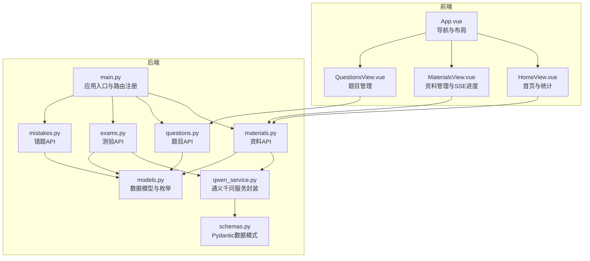
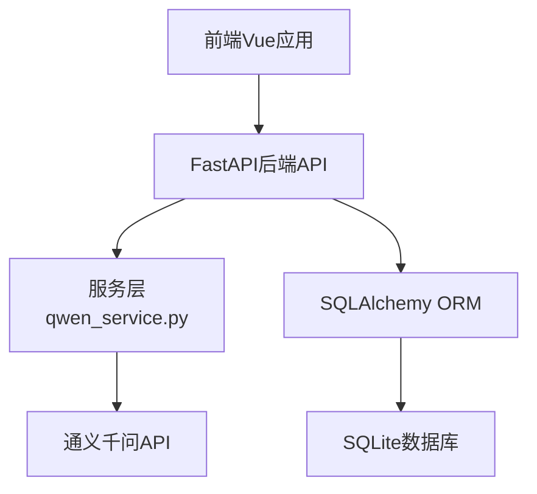
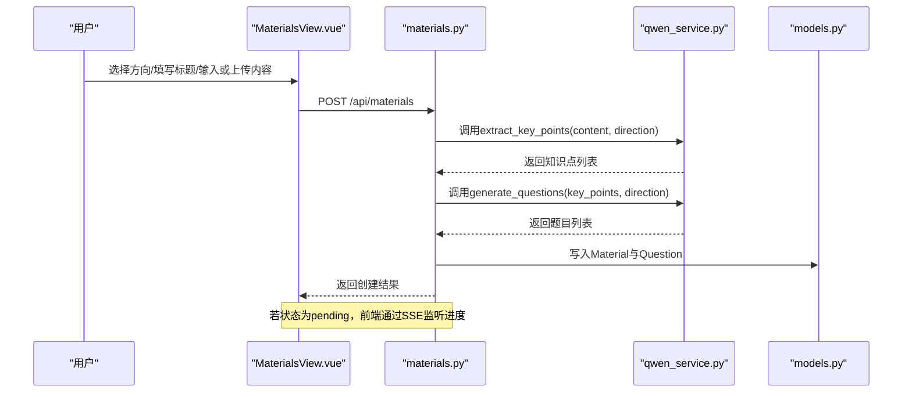
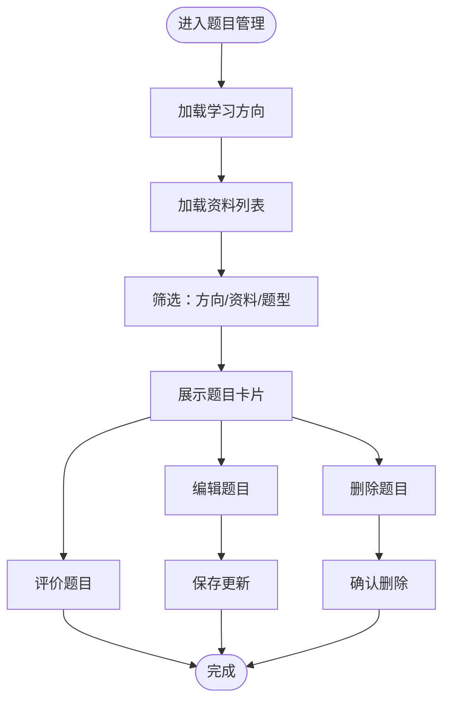
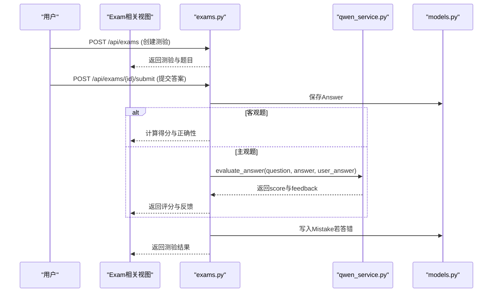
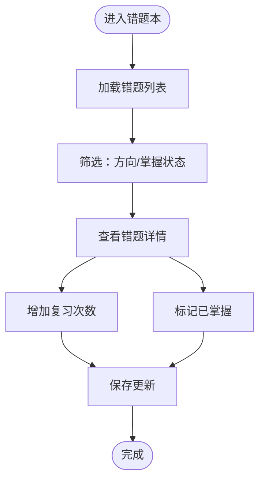
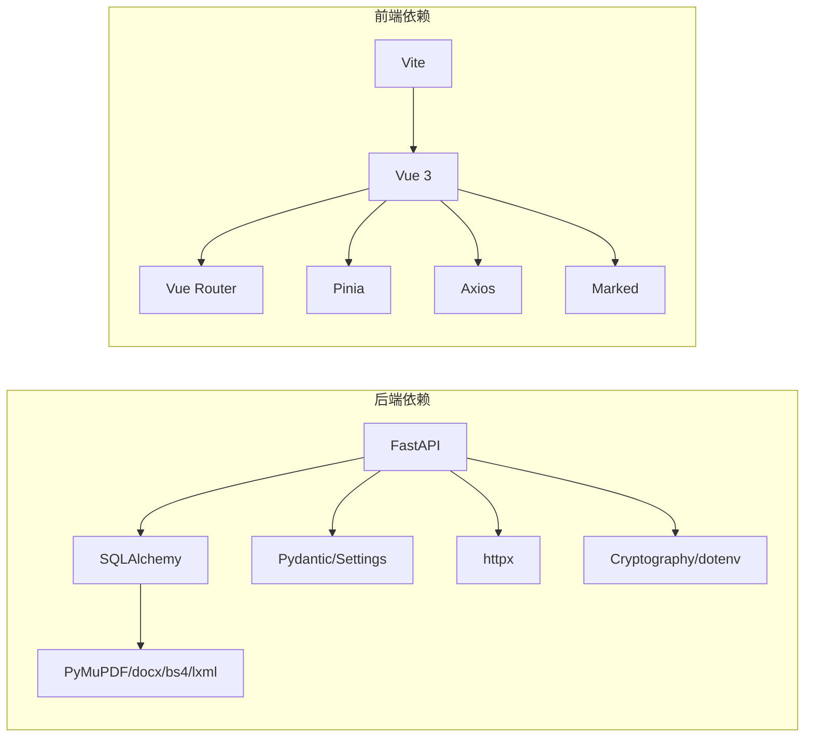

# 项目概述

<cite>
**本文档引用的文件**
- [backend/app/main.py](file://backend/app/main.py)
- [backend/app/api/materials.py](file://backend/app/api/materials.py)
- [backend/app/api/questions.py](file://backend/app/api/questions.py)
- [backend/app/api/exams.py](file://backend/app/api/exams.py)
- [backend/app/api/mistakes.py](file://backend/app/api/mistakes.py)
- [backend/app/services/qwen_service.py](file://backend/app/services/qwen_service.py)
- [backend/app/models/models.py](file://backend/app/models/models.py)
- [backend/app/schemas/schemas.py](file://backend/app/schemas/schemas.py)
- [backend/pyproject.toml](file://backend/pyproject.toml)
- [frontend/src/App.vue](file://frontend/src/App.vue)
- [frontend/src/views/HomeView.vue](file://frontend/src/views/HomeView.vue)
- [frontend/src/views/MaterialsView.vue](file://frontend/src/views/MaterialsView.vue)
- [frontend/src/views/QuestionsView.vue](file://frontend/src/views/QuestionsView.vue)
- [frontend/package.json](file://frontend/package.json)
</cite>

## 目录
1. [引言](#引言)
2. [项目结构](#项目结构)
3. [核心组件](#核心组件)
4. [架构总览](#架构总览)
5. [详细组件分析](#详细组件分析)
6. [依赖关系分析](#依赖关系分析)
7. [性能考虑](#性能考虑)
8. [故障排除指南](#故障排除指南)
9. [结论](#结论)
10. [附录](#附录)

## 引言
本项目是一个个人学习管理系统，旨在帮助用户高效管理学习资料、自动生成智能题目、进行在线测验并智能管理错题。系统通过AI能力（通义千问）实现从“资料提炼—题目生成—智能评分—错题沉淀”的闭环，提升学习效率与个性化复习质量。

系统面向两类用户群体：
- 初学者：通过直观的界面完成资料上传、查看题目、参与测验、复习错题等操作。
- 开发者：具备清晰的后端API、数据模型、前端组件与集成方案，便于二次开发与扩展。

## 项目结构
项目采用前后端分离架构：
- 后端：基于FastAPI，提供RESTful API，负责业务逻辑、数据库访问与AI服务集成。
- 前端：基于Vue 3 + Vue Router + Pinia，提供学习方向、资料管理、题目管理、测验与错题本等视图。

图表来源
- [backend/app/main.py](file://backend/app/main.py#L1-L66)
- [backend/app/api/materials.py](file://backend/app/api/materials.py#L1-L203)
- [backend/app/api/questions.py](file://backend/app/api/questions.py#L1-L90)
- [backend/app/api/exams.py](file://backend/app/api/exams.py#L1-L240)
- [backend/app/api/mistakes.py](file://backend/app/api/mistakes.py#L1-L90)
- [backend/app/services/qwen_service.py](file://backend/app/services/qwen_service.py#L1-L156)
- [backend/app/models/models.py](file://backend/app/models/models.py#L1-L223)
- [backend/app/schemas/schemas.py](file://backend/app/schemas/schemas.py#L1-L265)
- [frontend/src/App.vue](file://frontend/src/App.vue#L1-L202)
- [frontend/src/views/HomeView.vue](file://frontend/src/views/HomeView.vue#L1-L720)
- [frontend/src/views/MaterialsView.vue](file://frontend/src/views/MaterialsView.vue#L1-L881)
- [frontend/src/views/QuestionsView.vue](file://frontend/src/views/QuestionsView.vue#L1-L554)

章节来源
- [backend/app/main.py](file://backend/app/main.py#L1-L66)
- [frontend/src/App.vue](file://frontend/src/App.vue#L1-L202)

## 核心组件
- 学习方向（Direction）：用于组织学习主题，作为资料与测验的分类维度。
- 学习资料（Material）：支持文本或Markdown文件上传，系统自动提炼知识点并生成题目。
- 题目（Question）：涵盖单选、多选、判断、简答等题型，支持难度标注与用户评价。
- 测验（Exam）：按方向随机抽取题目组成测验，支持定时/非定时模式与百分制/等级制评分。
- 答题记录（Answer）：记录用户的作答、正确性、得分与AI反馈。
- 错题（Mistake）：自动收集答错题目，支持标记掌握状态与复习次数。
- 通义千问服务（QwenService）：封装AI能力，提供知识点提炼、题目生成与主观题评分。

章节来源
- [backend/app/models/models.py](file://backend/app/models/models.py#L63-L223)
- [backend/app/services/qwen_service.py](file://backend/app/services/qwen_service.py#L1-L156)

## 架构总览
系统采用分层架构：
- 表现层：Vue前端组件负责用户交互与状态管理。
- 控制层：FastAPI路由处理请求，调用服务层。
- 服务层：封装业务逻辑与外部AI服务调用。
- 数据访问层：SQLAlchemy ORM映射数据库模型。
- 数据存储：本地SQLite数据库（personal_study.db），配合上传目录。

技术栈概览
- 后端：FastAPI、SQLAlchemy、Pydantic、Pydantic Settings、httpx、PyMuPDF、python-docx、BeautifulSoup4、lxml。
- 前端：Vue 3、Vue Router、Pinia、Axios、Marked。
- AI服务：通义千问API（需配置QWEN_API_KEY）。

图表来源
- [backend/app/main.py](file://backend/app/main.py#L1-L66)
- [backend/app/services/qwen_service.py](file://backend/app/services/qwen_service.py#L1-L156)
- [backend/app/models/models.py](file://backend/app/models/models.py#L1-L223)
- [backend/pyproject.toml](file://backend/pyproject.toml#L1-L29)
- [frontend/package.json](file://frontend/package.json#L1-L23)

## 详细组件分析

### 资料管理模块（AI驱动的资料处理流程）
资料管理是系统的核心入口之一，支持上传文本或Markdown文件，系统通过AI自动提炼知识点并生成题目，同时提供SSE流展示处理进度。

图表来源
- [backend/app/api/materials.py](file://backend/app/api/materials.py#L82-L161)
- [backend/app/services/qwen_service.py](file://backend/app/services/qwen_service.py#L37-L114)
- [backend/app/models/models.py](file://backend/app/models/models.py#L78-L114)
- [frontend/src/views/MaterialsView.vue](file://frontend/src/views/MaterialsView.vue#L301-L376)

章节来源
- [backend/app/api/materials.py](file://backend/app/api/materials.py#L1-L203)
- [backend/app/services/qwen_service.py](file://backend/app/services/qwen_service.py#L1-L156)
- [frontend/src/views/MaterialsView.vue](file://frontend/src/views/MaterialsView.vue#L1-L881)

### 题目管理模块（题型、难度与评价）
题目管理支持按方向、资料与题型筛选，提供编辑、删除与“好题/待优化”评价功能，便于持续优化题库质量。

图表来源
- [backend/app/api/questions.py](file://backend/app/api/questions.py#L11-L90)
- [frontend/src/views/QuestionsView.vue](file://frontend/src/views/QuestionsView.vue#L156-L287)

章节来源
- [backend/app/api/questions.py](file://backend/app/api/questions.py#L1-L90)
- [frontend/src/views/QuestionsView.vue](file://frontend/src/views/QuestionsView.vue#L1-L554)

### 在线测验模块（智能评分与错题沉淀）
测验模块支持随机抽题、定时/非定时模式与百分制/等级制评分；主观题由AI评分并给出反馈，答错题目自动加入错题本。

图表来源
- [backend/app/api/exams.py](file://backend/app/api/exams.py#L47-L240)
- [backend/app/services/qwen_service.py](file://backend/app/services/qwen_service.py#L115-L151)
- [backend/app/models/models.py](file://backend/app/models/models.py#L116-L168)

章节来源
- [backend/app/api/exams.py](file://backend/app/api/exams.py#L1-L240)
- [backend/app/services/qwen_service.py](file://backend/app/services/qwen_service.py#L1-L156)
- [backend/app/models/models.py](file://backend/app/models/models.py#L1-L223)

### 错题管理模块（复习跟踪与掌握状态）
错题模块支持按方向与掌握状态筛选，提供复习次数统计与手动标记掌握状态，形成个性化复习计划。

图表来源
- [backend/app/api/mistakes.py](file://backend/app/api/mistakes.py#L11-L90)
- [backend/app/models/models.py](file://backend/app/models/models.py#L155-L168)

章节来源
- [backend/app/api/mistakes.py](file://backend/app/api/mistakes.py#L1-L90)
- [backend/app/models/models.py](file://backend/app/models/models.py#L155-L168)

## 依赖关系分析
- 后端依赖
  - Web框架：FastAPI、Uvicorn
  - 数据库：SQLAlchemy、PyMySQL
  - 安全与配置：Cryptography、Pydantic Settings、python-dotenv
  - 文件解析：PyMuPDF、python-docx、BeautifulSoup4、lxml
  - HTTP客户端：httpx
  - AI服务：通义千问API（需配置QWEN_API_KEY）

- 前端依赖
  - 框架：Vue 3、Vue Router、Pinia
  - 工具：Axios、Marked
  - 构建：Vite

图表来源
- [backend/pyproject.toml](file://backend/pyproject.toml#L1-L29)
- [frontend/package.json](file://frontend/package.json#L1-L23)

章节来源
- [backend/pyproject.toml](file://backend/pyproject.toml#L1-L29)
- [frontend/package.json](file://frontend/package.json#L1-L23)

## 性能考虑
- SSE进度流：资料处理阶段通过Server-Sent Events实时反馈进度，避免长时间等待。
- 异步AI调用：通义千问服务采用异步HTTP客户端，降低阻塞风险。
- 数据库事务：批量写入与事务提交减少锁竞争，提高并发稳定性。
- 前端懒加载：组件按需渲染，减少首屏压力。
- 建议
  - 对高频查询建立索引（如方向、状态、创建时间）。
  - 限制单次测验题目数量，避免超大数据量。
  - 对AI调用设置超时与重试策略，增强鲁棒性。

## 故障排除指南
- API密钥未配置
  - 现象：上传资料时报错提示未配置QWEN_API_KEY。
  - 处理：在后端环境变量中设置QWEN_API_KEY与QWEN_MODEL、QWEN_BASE_URL。
  - 参考：资料上传接口在创建资料时会校验API密钥。
- SSE连接异常
  - 现象：资料处理进度不更新或断开。
  - 处理：检查后端CORS配置与网络连通性；前端组件会在错误时自动刷新页面。
- 测验提交失败
  - 现象：提交答案后无法获取结果或重复提交。
  - 处理：确保测验状态为进行中；检查后端评分逻辑与AI服务可用性。
- 数据库初始化
  - 现象：首次运行缺少表或上传目录。
  - 处理：后端启动时自动创建表与上传目录，确认权限与路径存在。

章节来源
- [backend/app/api/materials.py](file://backend/app/api/materials.py#L82-L161)
- [frontend/src/views/MaterialsView.vue](file://frontend/src/views/MaterialsView.vue#L341-L376)
- [backend/app/api/exams.py](file://backend/app/api/exams.py#L127-L240)
- [backend/app/main.py](file://backend/app/main.py#L45-L49)

## 结论
本项目通过“资料—题目—测验—错题”的完整闭环，结合AI能力实现智能化学习体验。后端以FastAPI与SQLAlchemy构建稳定的数据层，前端以Vue提供流畅的交互体验。系统具备良好的扩展性与可维护性，适合个人学习与教学辅助场景。

## 附录
- 项目背景与应用场景
  - 个人学习：快速整理资料、自动生成题目、智能测验与错题复习。
  - 教学辅助：教师可基于学科方向生成题库，支持课堂练习与课后作业。
  - 知识沉淀：通过错题本与知识点提炼，形成个性化的知识体系。
- 预期收益
  - 提升学习效率：自动化生成题目与即时反馈。
  - 降低人工成本：AI驱动的资料处理与主观题评分。
  - 强化薄弱环节：基于错题的精准复习与掌握追踪。